안녕하세요😃 메쉬코리아 플랫폼실 최제필입니다 :)
이번 글에서는 **Kubernetes(이하 `k8s`)에 배포되어 운영하는 여러 MSA를 위해 도입한 CI/CD 도구 및 방법론**에 대해 공유하고자 합니다!


- CI (Continuous Integration)란?
  + '지속적인 통합'이란 의미로, 애플리케이션의 새로운 코드 변경 사항이 정기적으로 build 및 test 되어 공유 repository에 통합되는 것.

- CD(Continuous Delivery or Continuous Deploy) 란?
  + '지속적인 배포'란 의미로, 개발자들이 애플리케이션에 적용한 변경 사항이 bug test를 거쳐 repository에 자동으로 업로드되는 것.

즉 CI/CD란 개발 단계를 자동화하여 보다 짧은 주기로 배포하는 전략을 말하는데요. CI/CD 방법론을 적용하면 개발의 편의성이 증가하고, 소스코드 변경부터 배포까지의 작업을 자동화할 수 있기 때문에 수작업으로 할 때의 불편함을 줄일 수 있습니다.

# 기존 CI/CD Pipeline에는 어떤 문제점들이 있었을까?
Mesh Korea의 대부분의 MSA는 JAVA 기반의 기술 스택으로 구성되어 있으며, CI/CD Pipeline을 위해 Bamboo, Spinnaker를 사용하고 있습니다.

CI/CD 적용을 위해 개발자가 Bamboo Job / Spinnaker application을 설정해야 하며, 특히 CI <-> CD tool이 연동되어 있지 않아 Bamboo CI에서 빌드 된 Docker image tag를 복사하여 spinnaker에 손으로 입력해야 하는 등 불편한 점이 많았습니다🤦

`Spinnaker`는 멀티 클러스터 / 클라우드 배포 등 강력한 기능을 지닌 CD Workflow platform이지만 Mesh Korea의 Kubernetes 숙련도, 단일 Cloud 환경 사용 등 저희가 원하는 기능보다 훨씬 복잡하고 많은 기능을 사용하기 힘든 오버 엔지니어링이라고 판단하였고, 새로운 도구들을 도입하기로 했습니다.


그럼 지금부터 본격적인 CI/CD 도구 및 방법론 도입기, 시작하겠습니다!


>다음과 같은 순서로 진행되니 참고 부탁드립니다.
>- Jenkins CI
>- Argo CD
>- CI/CD 도입 및 이전을 위한 자동화 방식


---

# Jenkins CI

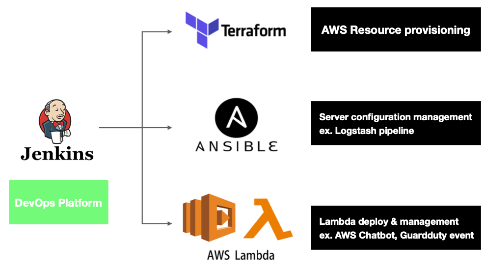

Mesh Korea의 DevOps를 위한 여러 플랫폼들은 Jenkins CI와 연동되며 k8s cluster에서 실행됩니다. **IaC**(Infrastructure as Code)를 위한 `Terraform`, `Ansible`, `Packer` 등 Pipeline 실행 시 Pod 내 바이너리가 설치된 컨테이너에서 실행됩니다.

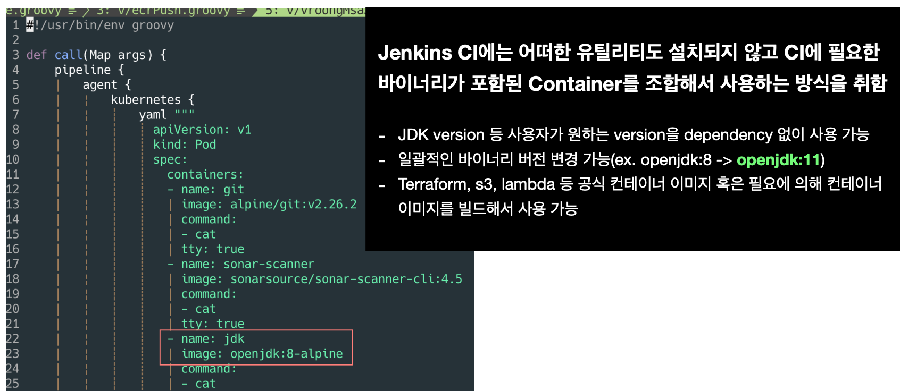

실행되는 모든 CI Pipeline은 `Jenkinsfile`에 스크립트를 작성하여 실행합니다. CI에 필요한 모든 바이너리는 Jenkins에 설치하는 것이 아닌, **필요한 Container를 지정하여 Pod로 구성하여 독립적으로 실행**합니다. 해당 내용을 MSA의 CI Pipeline으로 적용하기 위해 아래와 같은 내용을 진행하였습니다.

## 공용 CI Pipeline 개발 및 적용

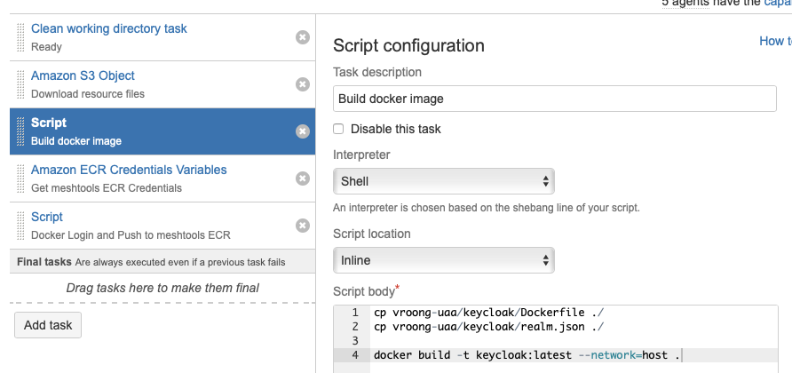

기존 Bamboo에 적용된 Java 기반 서비스의 CI Pipeline은 아래와 같은 형식을 따릅니다.

> Git checkout > Gradle build > Docker build > Docker push

Jenkins에서 해당 CI Pipeline을 공용으로 사용하기 위해 필요한 Container와 단계별 실행해야 하는 스크립트가 포함된 `groovy` 코드를 작성합니다.

```groovy
# vroongMsaJavaPipeline.groovy

#!/usr/bin/env groovy

def call(Map args) {
    pipeline {
        agent {
            kubernetes {
                yaml """
                    # Pod로 구성할 Container 정보
                """
            }
        }

        options {
            timeout(time: 1, unit: 'HOURS')
        }

        environment {
            ...
        }

        stages {
            stage('Init') {
                ...
            }

            stage('Check the docker image') {
                ...
            }

            stage('Gradle build') {
                ...
            }

            stage('Code review') {
                parallel {
                    stage('unit test') {
                        ...
                    }

                    stage('sonarqube') {
                        ...
                    }
                }
            }

            stage('Docker') {
                parallel {
                    stage('ecr login') {
                        ...
                    }

                    stage('docker build') {
                        ...
                    }
                }
            }

            stage('ECR push') {
                ...
            }

            stage('Choose the environment') {
                ...
            }

            stage('ArgoCD trigger') {
                ...
            }
        }
    }
}
```

해당 Jenkins script(groovy)는 Jenkins에 등록된 모든 프로젝트에서 공용으로 사용하기 위해 `Shared library`에 등록합니다.

> 관련 링크: [https://www.jenkins.io/doc/book/pipeline/shared-libraries/](https://www.jenkins.io/doc/book/pipeline/shared-libraries/)

MSA를 위한 CI Pipeline에서 위에서 작성한 공용 Jenkins script를 사용하기 위해 프로젝트 상위에 `Jenkinsfile`을 작성하여 Shared library에 등록된 Script 이름과 필요한 arguments를 지정합니다.

```groovy
@Library('meshkorea') _

vroongMsaJavaPipeline(
    team: 'baseserver',
    ecrRepoName: 'vroong/cumock',
    argoAppName: 'vroong-cumock',
    gradleBuildArguments: '-x test'
    dockerBuildArguments: 'copyJMXExporter'
)
```

Jenkins는 특정 Event가 발생했을 때, 프로젝트 내 `Jenkinsfile`을 읽고 `vroongMsaJavaPipeline` 라는 script를 Shared library에서 찾아 실행합니다. 사용자는 CI를 적용하기 위해 프로젝트에 Jenkinsfile만 추가하면 되는 환경이 조성됩니다. 또한 DevOps에선 CI Pipeline에 새로운 기능(ex. E2E test)을 추가할 때 `Shared library`에 등록된 공용 스크립트만 수정, 업데이트하면 됩니다.

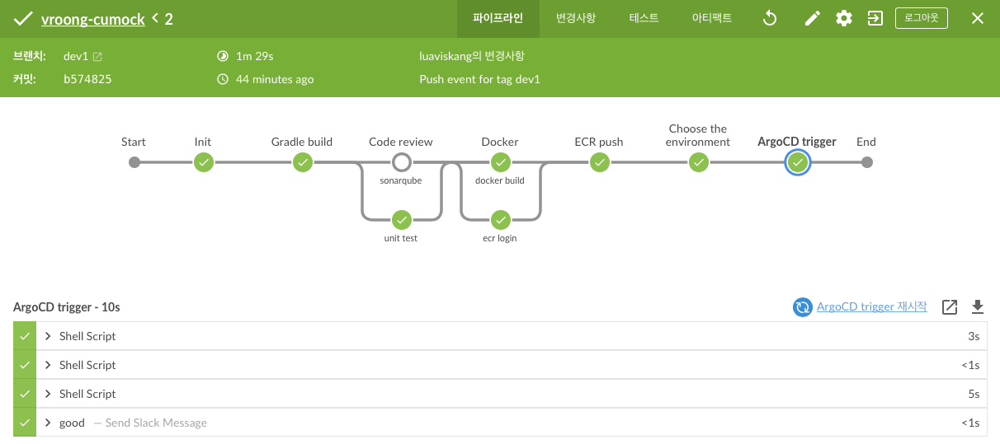

## 특정 Event에만 작동

Bamboo에 적용된 CI Pipeline을 Jenkins로 옮길 때 고민했던 내용은 **자동화** 측면이었습니다.

기존에 정형화된 Git branch 관리 방식이 없다 보니 팀마다 관리하는 방식이 제각각이었습니다. 특정 Event(ex. master branch에 push)가 발생하였을 때 webhook을 통해 Jenkins job을 triggering 하는 게 일반적인 CI 자동화 방식입니다. 다만 저희는 [Git-flow](https://www.atlassian.com/git/tutorials/comparing-workflows/gitflow-workflow) 등 브랜치 관리 방식을 모든 팀에 일괄 적용하기엔 부담이 컸으며, **Production 환경에 배포한 내용을 qa 환경에 추후에 Sync를 맞추는 등의 내용**이 필요했습니다. 또한 팀마다 프로덕트 버전 네이밍 규칙이 다르다 보니 개발자, QA 등 버전명에 대한 혼동이 발생하는 경우가 종종 있습니다.

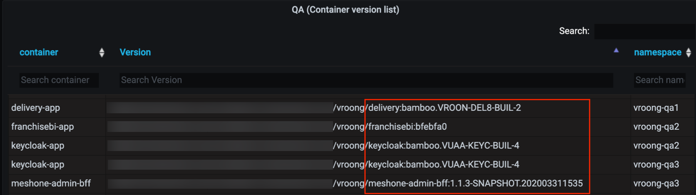

이 문제를 해결하기 위해 각 팀에서 사용하는 `Git branch 관리 방식은 동일하게 유지`하되, CI 자동화를 위해 **Git tag가 push** 될 때 event를 감지하여 CI Pipeline이 자동으로 실행하도록 적용하였습니다.

```groovy
when {
    anyOf {
        buildingTag()
        changeRequest()
        triggeredBy 'UserIdCause'
    }
}
```

### buildingTag

`Git tag`가 있을 때만 Stage의 내용이 실행됩니다. 내용은 생략됐지만 tag명이 [유의적 버전](https://semver.org/lang/ko/)의 Convention을 따를 때만 실행됩니다.

```groovy
environment {
    // Docker environment
    DOCKER_TAG = "${env.BRANCH_NAME}-${env.GIT_COMMIT[0..7]}"
    DOCKER_IMAGE_ORIGIN_NAME = "${env.JOB}:${DOCKER_TAG}"
    DOCKER_IMAGE_REMOTE_NAME = "${env.ECR_URL}/${args.ecrRepoName}:${DOCKER_TAG}"
}

container('docker') {
    sh "docker build -t ${env.DOCKER_IMAGE_ORIGIN_NAME} ${env.DOCKERFILE_PATH}"
    sh "docker tag ${env.DOCKER_IMAGE_ORIGIN_NAME} ${env.DOCKER_IMAGE_REMOTE_NAME}"
}
```

빌드 된 모든 Docker image는 ECR에 Push 되며 Image의 tag는 자동으로 `{Git tag name}-{Git short hash}` (ex. **1.1.0-df0423**) 형태로 기입됩니다.

### changeRequest

Pull request event가 감지됐을 때 Stage의 내용이 실행됩니다. PR 발생 시 Sonarqube 연동을 위해 sonar-scanner-cli라는 Container를 통해 연동된 Sonarqube에 **코드 정적 분석** 및 `Github Pull Request decoration`을 요청합니다.

```groovy
stage('sonarqube') {
    when {
        changeRequest()
    }

    steps {
        container('sonar-scanner') {
            withSonarQubeEnv('SonarQube Server') {
                sh """
sonar-scanner \
  -Dsonar.projectName=${env.JOB} \
  -Dsonar.projectKey=meshkorea_${env.JOB} \
  -Dsonar.language=java \
  -Dsonar.sources=src/main/java \
  -Dsonar.java.binaries=build/classes \
  -Dsonar.scm.provider=git \
  -Dsonar.projectBaseDir=${env.WORKSPACE} \
  -Dsonar.host.url=${env.SONAR_HOST_URL} \
  -Dsonar.login=${env.SONAR_AUTH_TOKEN} \
  -Dsonar.issuesReport.console.enable=true \
  -Dsonar.pullrequest.github.repository=meshkorea/${env.JOB} \
  -Dsonar.pullrequest.key=${env.CHANGE_ID} \
  -Dsonar.pullrequest.base=${env.CHANGE_TARGET} \
  -Dsonar.pullrequest.branch=${env.CHANGE_BRANCH}
"""
            }
        }
    }
}
```

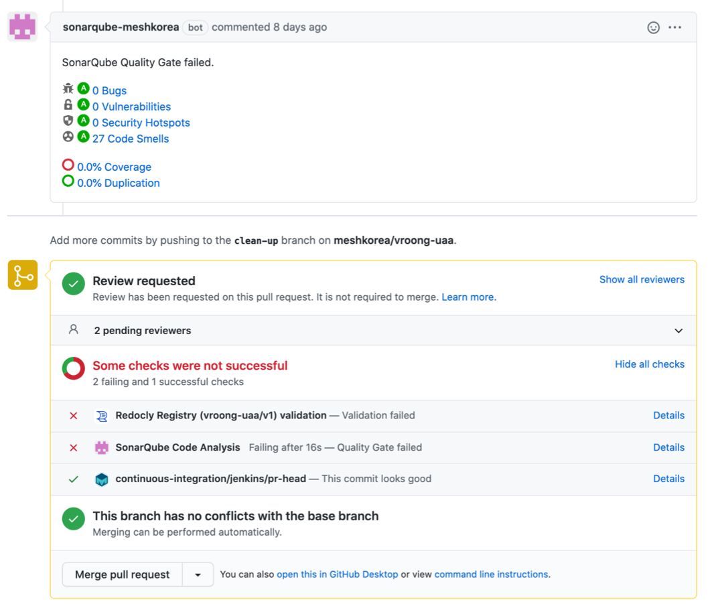

### triggeredBy 'UserIdCause'

Manual 실행 방식입니다. 사용자가 수동으로 Pipeline 실행 시 ECR에 push 된 Docker image가 있을 경우 Build 과정을 스킵하고 `다른 환경에 배포(Sync)` 할 수 있도록 구성하였습니다.

여러 Event 별로 실행해야 하는 내용들을 적용하고 Jenkinsfile에 들어가는 argument를 통해 **최대한 사용하기 쉽고 확장성을 가진 공용 CI Pipeline을 개발**하였습니다. 특히 `Git tag push`를 통해 버전 네이밍 Convention을 통합하고 `CI 자동화`를 적용했다는 점은 굉장히 유의미했습니다. 다만 앞으로 고려해야 할 점은 사용자가 통합 CI의 기능 외 별도의 기능이 필요한 경우(ex. E2E test), 직접 Jenkinsfile을 작성하여 적용해야 합니다. 이 점은 사용자/서비스별 customization이 용이하도록 해야 하는 숙제이기도 합니다.

위에서 `배포(Sync)`를 언급하였습니다. Mesh Korea의 대부분의 서비스는 EKS(MSA), Elastic Beanstalk(EC2), S3(web frontend)에 배포됩니다. 여기서 EB, S3는 Jenkins에서 고도화된 plugin들이 많아 적용하기 어렵지 않습니다. 집중했던 내용은 EKS에 배포되는 MSA를 위한 `CD Tool`입니다.

---

# Argo CD

그동안 [EKS](https://aws.amazon.com/ko/eks/?whats-new-cards.sort-by=item.additionalFields.postDateTime&whats-new-cards.sort-order=desc&eks-blogs.sort-by=item.additionalFields.createdDate&eks-blogs.sort-order=desc)(Elastic Kubernetes Service)에 MSA를 운영하면서 가장 까다로웠던 점은 **인프라 변경 사항에 대한 추적**입니다. 저희는 `개발자가 오너쉽을 갖고 서비스 개발 및 운영`까지 전담하는 경우가 많습니다. 다행이었던 점은 Application code와 Kubernetes manifest code가 repo 단위로 분리되어 Git history를 통해 manifest 변경 사항에 대해 추적이 가능한 점입니다. 다만 개발자가 서비스 개발에만 집중하기도 벅찬 환경에서 manifest까지 작성하고 수정하는 건 생산성 감소와 직결되며 `잦은 휴먼 에러`를 발생할 수 있는 요인이라고 판단하였습니다. 특히 manifest code는 중복되는 코드가 너무도 많기에 CD Tool 도입 전, 앞서 언급된 문제를 해결해야 했습니다.

## Helm chart

[Helm](https://helm.sh)은 복잡한 k8s application을 관리, 정의할 수 있는 강력한 도구 중 하나입니다. Deployment, Ingress, ServiceAccount 등 개발자가 manifest를 직접 작성하지 않고 Workload를 구성할 수 있도록 **공용으로 사용할 수 있는 Helm chart**를 구성하였습니다.

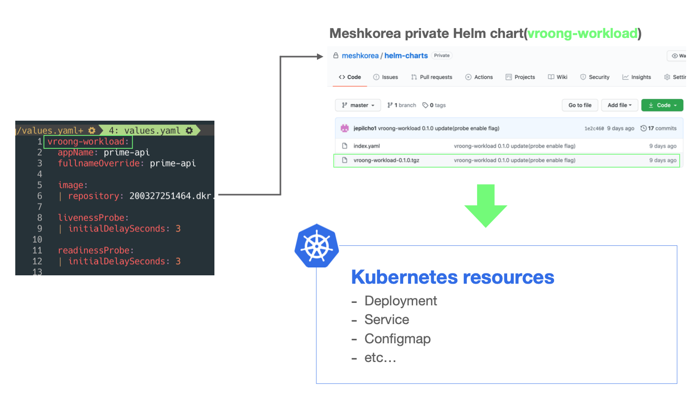

`vroong-workload` 라는 공용 Helm chart를 통해 개발자는 `values.yaml`에 필요한 내용을 기입하여 manifest 작성 없이 k8s resource(workload)를 구성합니다. Helm chart repositiory 관리를 위해 [Chartmusiem](https://chartmuseum.com), [Harbor](https://goharbor.io) 등을 검토하였지만 관리해야 하는 Chart가 아직 많지 않아 `Github private repository를 만들고 차트 저장소로 사용`했습니다.

해당 Chart를 통해 DevOps에선 중복되는 manifest code를 줄일 수 있고 무엇보다 기능 도입 시 공용 Chart에 내용을 업데이트하면 됩니다. 특히 앞으로 계획 중인 `Blue/green`, `canary deployment`는 Argo CD에선 `CRD(Custom Resource Definition)`로 제공하고 있습니다. 만약 Helm을 사용하지 않은 상황에서 적용해야 한다면 모든 manifest가 저장된 repository에 업데이트를 해야 하지만 **공용 Chart만 업데이트하고 개발자들에게 특정 차트 버전으로 업데이트**를 부탁드리면 됩니다.

### GitOps

Mesh Korea의 DevOps는 `IaC(Infrastructure as Code)`로 인프라에 대한 생성, 변경, 삭제 등 코드로 인프라를 관리하는 데 익숙합니다. 특히 Code 기반으로 k8s resource를 관리하길 희망했고, CD Tool을 검토할 때 아래와 같은 기능이 필요했습니다.

- Code로 k8s resource를 생성, 변경 등 관리에 용이
- k8s resource에 대한 시각화
- RBAC, LDAP 등 권한 분리에 대한 기능 제공

특히 **GitOps**에 집중하였습니다. GitOps란 용어 자체는 [Weaveworks](https://www.weave.works/blog/gitops-operations-by-pull-request) 에서 창안되었습니다. GitOps는 특정 도구가 아닌 **방법론**에 가깝습니다. GitOps의 메인은 `코드로 표현한 환경`, 즉 Git 저장소에 저장된 k8s manifest와 같은 파일을 사용하여 선언적으로 기술한다는 개념입니다.

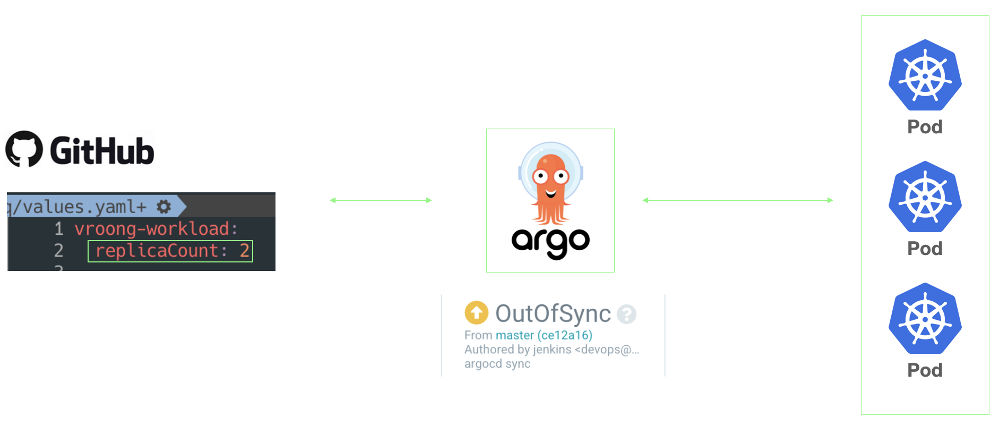

GitOps 구현체 중 하나인 `Argo CD`를 통해 도식화하였습니다. Git에 저장된 `values.yaml`에 replicaCount를 2로 설정 후 Push합니다. Argo CD는 해당 Repository의 변경 사항을 확인하고 k8s Cluster 내 구성된 resource와 비교합니다. Code와 k8s resource 상황이 다르니 상태는 `OutOfSync`로 표기됩니다. Code에 맞게 상태를 업데이트하기 위해 자동 혹은 수동으로 k8s resource를 변경합니다. 이를 **Synchronize** 라고 합니다.

이처럼 Code로 사용자가 원하는 배포 상태를 선언하면 실제 배포 환경을 그에 맞게 유지되고 있는지 체크하고 업데이트하는 배포 주체, 즉 **GitOps 구현체인 Argo CD를 CD Tool로 도입**하였습니다. 해당 도구를 통해 저희는 아래와 같은 이점을 가질 수 있었습니다.

- **Git을 이용한 배포 버전 관리**
    - `Argo CD`를 통해 k8s에 서비스 배포를 위해선 Git repository에 배포에 관한 모든 내용이 **선언**되어야 합니다. 업데이트를 위해선 Code를 변경하고 commit & push를 해야 하므로 `모든 배포 내역이 Git에 기록`됩니다. 이를 기반으로 **변경 사항에 대한 추적, 롤백(Git revert)** 이 용이해졌습니다.
- **배포 자동화**
    - `Git의 변경이 발생하면 배포 주체인 Argo CD가 k8s cluster 내 resource 상태와 비교 후 자동으로 Synchronize`를 진행합니다. 기존처럼 배포를 명령하는 것이 아닌 **선언적 방식**을 취함으로써 `휴먼 에러를 줄이고 지속적 배포`를 가능하게 합니다. 다만 Production 환경에서 Auto sync가 활성화되면 담당자가 Git에 잘못된 Code를 Push했을 때 바로 Sync되어 이슈가 발생할 여지가 있으므로 상용 환경은 LDAP + RBAC을 통해 권한이 있는 담당자만 수동으로 Sync 할 수 있도록 허용하였습니다.

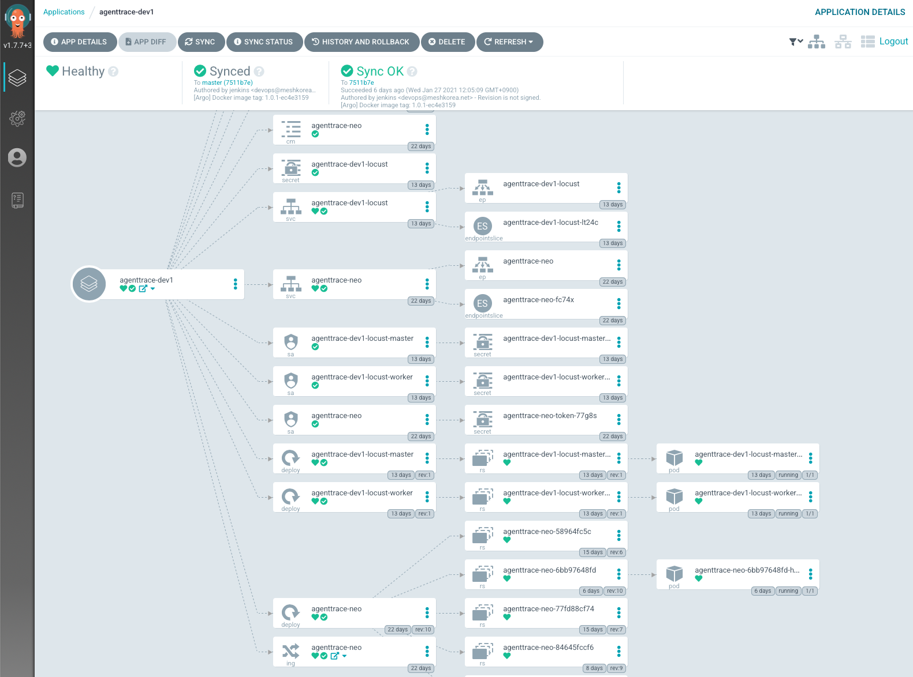

무엇보다 화면처럼 Argo application 별로 관리되는 `k8s resource에 대한 시각화`입니다. 위에서 언급된 것 처럼, 공용 Helm chart를 사용하여 사용자가 필요한 values.yaml만 지정하여 resource에 대해 원하는 배포 상황을 선언합니다. helm cli도 훌륭한 도구이지만 chart에 구성되는 resource를 한눈에 파악하기 어렵습니다. Argo CD에선 구성되는 Kubernetes resource를 파악하기 용이하며 Ingress - service - pod로 연결되는 selector 등 UI를 통해 확인하기 좋았습니다.

### Application

기존 MSA 들은 두 개의 Git 저장소를 사용하였습니다. 애플리케이션 소스 코드를 관리하는 app 저장소와 kubernetes manfest 코드를 관리하는 manifests 저장소입니다. CD tool을 Argo CD로 이전하기 위해 Argo application이 바라봐야 하는 values.yaml을 관리하는 `helm-values` 라는 Git repository를 생성합니다.

```yaml
├── dev1
│   ├── Chart.yaml
│   ├── requirements.yaml
│   └── values.yaml
├── prod
│   ├── Chart.yaml
│   ├── requirements.yaml
│   └── values.yaml
├── qa1
│   ├── Chart.yaml
│   ├── requirements.yaml
│   └── values.yaml
└── values.yaml
```

환경(dev, qa...)별 Directory 내 values.yaml, Chart.yaml, requirements.yaml이 포함되며 Argo CD application 별로 `환경에 맞는 Directory 내 파일`을 바라보고 있습니다.

```yaml
# requirements.yaml
dependencies:
  - name: vroong-workload
    version: 0.2.0
    repository: https://raw.githubusercontent.com/meshkorea/helm-charts/master/

# /values.yaml
vroong-workload:
  service:
    annotations:
      service.beta.kubernetes.io/aws-load-balancer-backend-protocol: http

# dev1/values.yaml
service:
    annotations:
      external-dns.alpha.kubernetes.io/hostname: dev1.meshdev.io
```

`requirements.yaml`은 Helm sub chart 형태로 Mesh Korea 차트 저장소인 Github private repository를 바라보고 있습니다. 전 환경에서 적용해야 할 Chart value를 위해 root에 있는 values.yaml과 특정 환경의 디렉토리 내 values.yaml을 선언합니다. Argo Application은 환경별로 생성되며 두 개의 values.yaml을 조합하여 아래와 같은 `Desired manifest` 로 선언됩니다.

```yaml
# Example. (Service) prime-api-dev1

apiVersion: v1
kind: Service
metadata:
  annotations:
    service.beta.kubernetes.io/aws-load-balancer-backend-protocol: http # dev1/values.yaml
    external-dns.alpha.kubernetes.io/hostname: dev1.meshdev.io # values.yaml
...
```

예를 들어 `Service(Type: Loadbalancer)`는 EKS에 구성되며 Control plane의 Cloud-controller-manager에 의해 ELB로 구성됩니다. 전 환경에서 ELB의 backend protocol은 동일하게 http로 구성되므로 root의 values.yaml에 작성하여 전 환경에 적용하며, dev1 환경에서만 특정 DNS로 묶어주기 위해 dev1/values.yaml에 작성합니다.

## 배포하기

이제부터 저희 k8s resource는 `선언적 배포 방식`으로 **Argo CD에 의해 관리, 제어**됩니다. Git 저장소의 코드 수정은 리소스를 변경하기 위해 사용되지만 초기 세팅 이후 업데이트할 일은 그리 많지 않을 겁니다. 다만 빈번히 발생되는 건 Deployment, Statefulset 등 manifest의 `Container image tag 변경` 입니다. helm-values에선 각 환경별 values.yaml에 `image.tag` 값으로 관리됩니다.

Jenkins CI에서 application code 변경(Git tag push)이 감지되면 자동으로 CI Pipeline이 실행되고 Docker image build 이후 ECR에 push까지 완료됩니다. 완료되면 Slack에 Image tag가 포함된 alert가 발생되며 개발자는 해당 값을 복사하여 helm-values의 원하는 환경의 values.yaml 내 image.tag를 업데이트하여 push하면 되지만, 굉장히 번거로운 과정이라고 판단하였습니다.

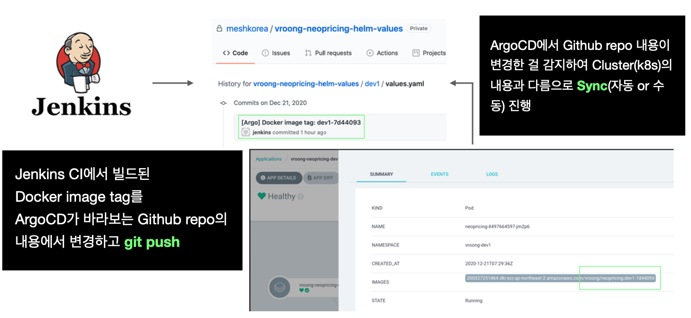

이 과정을 자동화하기 위해, Jenkins가 ECR에 push 한 Docker image tag를 Argo CD가 바라보는 helm-values git repo 내 `image.tag` 값을 업데이트합니다. dev/qa 환경은 Auto sync가 활성화되어 Argo CD가 변경이 감지되면 자동으로 synchronize를 진행하지만, 상용 환경은 이슈가 발생할 수도 있어 권한을 가진 사용자만 Argo CD app 화면에서 Sync 버튼을 누를 수 있도록 구성되었습니다.

---

# Jenkins + Argo CI/CD Pipeline 정리

Jenkins CI와 Argo CD가 연동되는 CI/CD Pipeline에서 단계별로 실행되는 내용에 대해 소개합니다.


- **Init**
    - Git checkout, argocd-cli init, env 등 CI/CD Pipeline을 실행하기 위해 필요한 내용들을 진행합니다.
- **Check the docker image**
    - Jenkins pipeline을 사용자가 수동으로 실행할 경우만 진행됩니다. ECR에 이미 push 된 Docker image가 있는지 확인 후 `Choose the environment` 단계로 이동합니다.
- **Gradle build**
    - Gradle build script가 실행됩니다. openjdk:8-alpine 또는 corretto:11-alpine container에서 jdk version에 맞게 실행됩니다.
- **Code review**
    - `sonarqube`
        - Pull request event에서만 실행됩니다. 코드 정적 분석을 위해 sonarqube에 triggering 이후 분석 결과와 함께 Github pr decoration이 진행됩니다.
    - `unit test`
        - JUnit 등 단위테스트가 실행됩니다.
- **Docker**
    - `docker build`
        - docker build ... 라는 script가 실행되며 docker image build를 진행합니다.
    - `ecr login`
        - build 된 docker image를 업로드하기 위해 ECR(private) docker login을 진행합니다.
- **ECR push**
    - docker build 단계에서 build 된 docker image를 ECR에 push 합니다. 완료되면 로컬에 있는 이미지를 삭제합니다.
- **Choose the environment**
    - Argo CD가 바라보는 helm-values 레포 내 values.yaml의 image.tag 값을 업데이트하기 위해 환경을 선택합니다.
    - 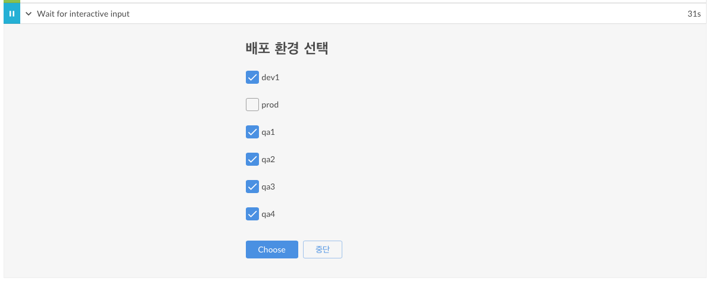
- **ArgoCD trigger**
    - Choose the environment 단계에서 선택된 환경의 values.yaml을 업데이트 이후 git push를 진행합니다. 스크립트는 아래와 같습니다.
```groovy
...
args.argocdTargetEnvironment.each { environment ->
    sh """
        ...
        sed -i 's/tag:.*/tag: ${env.DOCKER_TAG}/g' ${environment}/values.yaml && \
        ...
        git commit -m '[Argo] Docker image tag: ${env.DOCKER_TAG}' && \
        git push -u origin master
    """
}

sh """
    ...
    git commit -m '[Argo] Docker image tag: ${env.DOCKER_TAG}' && \
    git push -u origin master
"""
...
```

CI/CD Pipeline이 성공적으로 수행되면 아래와 같이 Slack에 alert가 발생합니다. `누가` 실행했는지, `성공/실패/중단` 여부, `Docker image tag`, `선택한 argo 환경` 등 메세지만 보고 배포 상황에 대해 판단할 수 있도록 제공합니다.

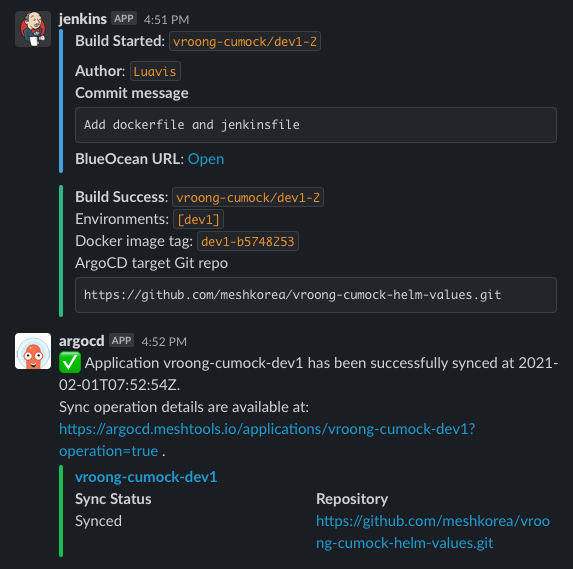

---

# CI/CD Pipeline을 적용하기 위한 자동화 과정

신규 및 기존 프로젝트에 변경되는 CI/CD Pipeline을 적용하기 위해 아래와 같은 작업이 필요합니다.
- `Jenkinsfile` 작성 후 프로젝트에 추가
- helm-values git repository 생성
- Argo 환경별 application 생성
- Sonarqube project 생성

이건 꽤나 귀찮은 작업입니다. 특히 저희는 서비스별로 `dev`, `qa1~4`, `prod` 환경이 필요합니다. 만약 이전해야 하는 서비스가 10개라고 가정한다면 하나의 서비스당 6개의 `Argo app`이 필요하고 총합 60개를 생성해야 합니다.
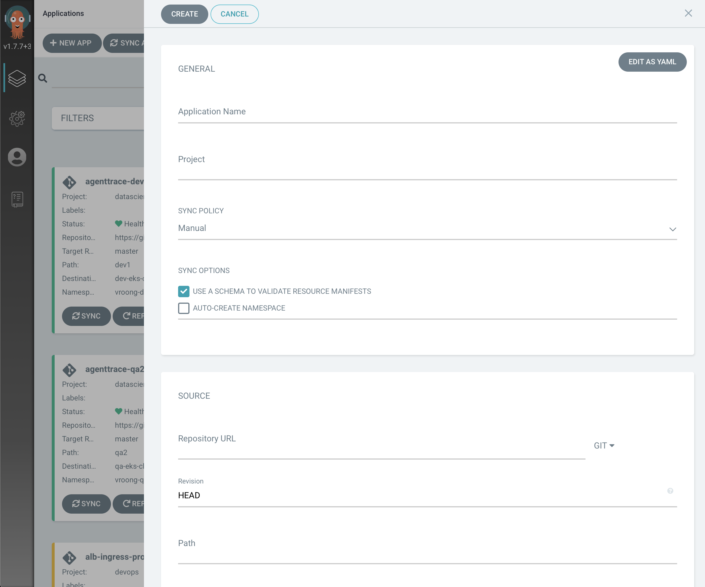
Argo CD는 application 생성 시 화면처럼 UI에서 생성하는 방법과 `선언적 방식`을 제공합니다.
```yaml
# app.yaml

apiVersion: argoproj.io/v1alpha1
kind: Application
metadata:
  name: ARGOCD_APP_NAME
  annotations:
    recipients.argocd-notifications.argoproj.io: slack:TEAM-build-alerts
spec:
  destination:
    name: CLUSTER_NAME
    namespace: NAMESPACE_TARGET
    server: ''
  source:
    path: ENVIRONMENT_TARGET
    repoURL: ARGOCD_GIT_REPO_URL
    targetRevision: master
    helm:
      valueFiles:
        - ../values.yaml
        - values.yaml
  project: ARGOCD_PROJECT_NAME
  syncPolicy:
    automated: null
```

```bash
# app.yaml 파일로 Argo application 생성

$ argocd login $ARGOCD_URL --grpc-web --username $USERNAME --password $PASSWORD
$ argocd app create -f ./app-${target_val}.yaml
```

꽤나 많은 서비스의 CI/CD Pipeline을 이전해야 하고 신규 서비스에 적용 시 관리 이슈를 줄이기 위해 `Jenkins CI`를 통해 자동화하기로 합니다.

## argo-repo-initialize

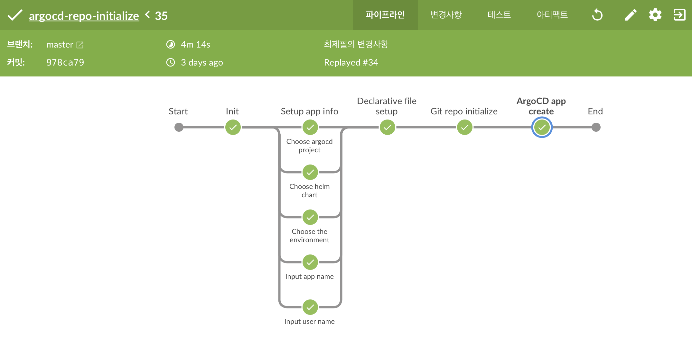

- `Setup app info`
    - argo app을 생성 시 필요한 내용을 수동으로 입력
    - 요청자, 환경, Helm chart 등
- `Declarative file setup`
    - 앞서 입력한 내용대로 `app-{environment}.yaml` 생성
- `Git repo initialize`
    - 해당 파이프라인을 통해 생성되는 Argo app이 바라봐야 하는 Github repo(`helm-values`) 생성 및 초기화
    - [github-cli](https://github.com/cli/cli) 사용
- `ArgoCD app create`
    - 선언된 `app.yaml`을 `argocd app create -f ./app-${target_val}.yaml` 명령어를 실행하여 Argo app 생성

해당 파이프라인이 성공적으로 수행되면 아래와 같은 alert가 발생합니다.
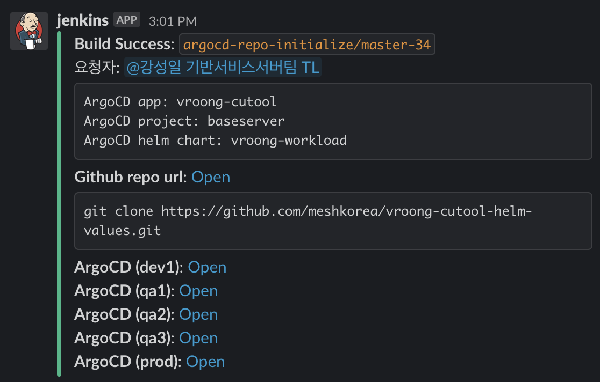

---

# 마치며

이렇게 CI/CD 도구 및 방법론 도입기가 끝이 났습니다!
처음 이 프로젝트를 시작했던 이유는 CI/CD 자동화였는데요. 문제 해결을 위해 단순히 기존 Bamboo + Spinnaker를 잘 연결하고 끝낼 수도 있었지만 그러기엔 쌓여있는 기술 부채가 많았습니다. 직면했던 문제만이 아닌 근본적인 이슈를 해결하기 위해 파이프라인 코드를 통합하고 k8s workload를 위해 공용 helm chart를 만들고 연결하기 위해 새로운 도구들을 도입하였습니다.

`배포`는 조직의 기술적 스펙트럼을 넓힐 수 있는 가장 강력한 수단이라고 생각합니다! 검증된 코드를 손 쉽게 배포하고 롤백할 수 있는 환경은 비즈니스의 요구 사항에 따라 사용자들에게 빠르게 가치를 전달할 수 있게 됩니다. 기술 부채를 해결하기 위해 다양한 도구 및 방법론을 도입하며 우려했던 부분은 업무 프로세스에 대한 변경이었습니다. 배포 방식이 달라진다는 건 사용자들의 업무 방식이 바뀐다는 것이고, 이는 반발심을 부를 수도 있기 때문입니다. 하지만 기존 프로세스를 유지하며 해결하기엔 ❗ 엄청난 고통이 따라올 수 있음을 직감😱 ❗ 했기 때문에 새로운 도구와 방법론을 도입하게 됐습니다.

더불어 DevOps는 단순히 도구 도입에서 끝나면 안된다고 생각합니다. **상황과 환경에 맞게 도구를 선택하는 것도 중요하지만 사용자들의 편의성 또한 고려**되어야 합니다. 그래서 이번 프로젝트를 진행하며 많은 분들과 인터뷰를 진행하였고, 방법론을 적용하면서 의견 취합 역시 활발하게 진행했습니다!
DevOps의 고객은 조직의 엔지니어이기때문에 불편한 점에 대한 의견을 경청하고, 다양한 도구와 방법론으로 개선해야합니다. 멋진 도구는 아름답지만 사용하기 어렵다면 그 의미는 퇴색되기 마련입니다. 때문에 지속적인 온보딩과 세션을 진행하고, 피드백을 통해 조직에서 좀 더 사용하기 좋은 방법을 고민하고 적용해서 발전시켜야합니다. 그런 의미로 이번 프로젝트를 위해 도와주셨던 많은 분들께 이 글을 통해 감사 인사를 전합니다! 🙇‍♂️

## 메쉬코리아는 채용 중!
현재 Mesh Korea의 플랫폼실은 소규모 인원으로 많은 영역을 커버하고 있는데요. 인력 자원이 부족하다보니 IaC 등을 활용해서 지속적으로 자동화하여 관리 비용을 줄이려는 노력을 하고 있습니다👨‍💻 플랫폼실은 `AWS`, `Kubernetes`, `Database`, `Automatic Test` 등 분야와 영역을 막론하고 좀 더 좋은 방식에 대해 고민하고 적용하는 조직으로, 이러한 여정을 함께하고 같이 성장하실 분들을 기다리고 있습니다! 메쉬코리아의 문은 언제나 열려있으니 많은 지원 부탁드립니다 :)
긴 글 읽어주셔서 감사합니다!
