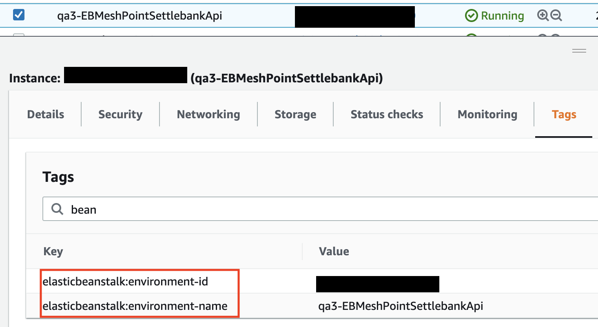

안녕하세요! 메쉬코리아 플랫폼실에서 DevOps를 담당하고 있는 백수현입니다. 이번에 AWS Tag 적용 가이드와 활용 방안에 대해 공유해 드리고자 글을 작성하게 되었습니다.

여러분은 Tagging을 어떻게 이용하고 계신가요?

그 전에, **Tagging을 해야 하는 이유**는 무엇일까요? 🤔

Tag를 일상에 비유해보겠습니다. 평소 특정 인물을 가리킬 때는 이름이나 별명으로 부르기도 하고, 회사 내부에서는 팀으로 그룹을 지어 구분하기도 하는데요. 만약 이렇게 하지 않는다면 10-20명 정도는 구분할 수 있겠지만, 10,000-20,000명이라면? 네, 불가능하다고 봐야합니다. 이걸 Tag에 적용해 보면, 리소스의 이름은 name, 별명은 custom으로 대입할 수 있고, 그룹은 application으로 볼 수 있습니다. 일상에서도 볼 수 있듯 수많은 리소스를 구분하기 위해서는 Tagging이 필요합니다.

AWS를 사용하면서 Tagging의 필요성을 느끼는 순간에는 이미 너무 많은 리소스를 사용하는 경우가 많습니다. 인프라 담당자들은 막막함과 작업량의 방대함 때문에 모른 척하거나, 시작 방법을 잘 몰라서 헤매기도 하는데요🤦‍♂️ 결국 작업 일정으로 인해 우선순위가 낮다는 이유로 미루다 보면?


더 많은 짐이 되어(!) 돌아오게 됩니다. _(이때 늦었다고 생각하면 정말 늦은 것…)_

저 역시 같은 상황에 놓이고 하나하나 시행착오를 겪다 보니, 정답은 아니지만 메쉬코리아만의 기준을 가지고 Tagging을 이용해 많은 작업을 하게 되었는데요. 이 글을 통해 저와 같은 상황에 놓인 분들께 조금이나마 도움이 되었으면 하는 마음에 노하우를 공유 드리려고 합니다!

> 글은 총 2부로 나누어서 작성할 예정입니다. 1부에서는 **Tag를 이제 시작하는 분들을 대상**으로 **어떻게 대량으로 Tagging을 진행했는지**, 2부에서는 1부에서 적용한 Tag를 어떻게 활용했는지 공유할 예정이니 참고 부탁드립니다 :)


## 판도라의 상자를 열어보니...

Tagging을 하기 위해 먼저 어떤 리소스들을 얼마나 사용하고 있는지 먼저 Config를 통해 확인해봤습니다. 4개의 AWS 계정에 약 14,000개의 리소스를 사용하고 있었습니다.


우선 모든 리소스를 Tagging 하는 건 너무 힘들겠다는 생각에 현실적인 목표를 정했습니다.

## Tagging의 목표 설정 : 비용을 기준으로 Tagging Coverage를 80%로 높인다.

Tagging이 필요했던 가장 큰 이유는 어디서 비용이 많이 발생하고 어떤 Application에서 비용이 증가했는지 파악이 안 돼서, 비용 절감을 어디서 어떻게 해야 하는지 판단하기 어려웠습니다. 그래서 비용을 기준으로 잡고 Cost Explorer를 통해 비용을 많이 사용하고 있는 리소스들을 대상으로 시작했습니다.

## 효율적인 Tagging을 위해

Tagging을 Console에서 작업하는 건 비효율적이라 생각했고, 사용 중인 리소스를 CSV로 내려받아 CSV 파일을 업데이트하고, CSV 파일에 업데이트한 내용을 스크립트로 Tagging하는 프로세스를 구성하기로 했습니다.

1. Config Advanced queries를 이용해 리소스 리스트를 뽑는다.
    - Advanced queries는 리소스에 적용된 Tag 값, Meta 정보들을 query를 이용해 가지고 올 수 있습니다.

        

        

2. 관리형 리소스를 이용해 Tagging을 한다.
    - Beanstalk, EMR, EKS 같은 관리형 서비스들은 Instance, SecurityGroup, EBS 등을 만듭니다. 이렇게 생성된 리소스는 아래 그림과 같이 기본적으로 할당되는 관리형 리소스의 Tag가 있습니다. 리스트를 뽑을 때는 이런 리소스는 제외하고, 관리형 리소스의 Tag를 업데이트할 때 Tag를 복사했습니다.

        

3. 연결 리소스를 이용해 Tagging을 한다.
    - Instance
    EBS Volume, Elastic IP, Network interface가 연결되어 있으면 연결 리소스에 Instance Tag를 복사합니다.
    - RDS

        스냅샷에 RDS Tag를 복사합니다. RDS의 경우 스냅샷에 Tag 복사 옵션이 있어 RDS Tag를 복사할 수 있습니다.

이 정도의 계획이면 효율적으로 Tagging을 할 수 있는 준비가 됩니다. 이제 어떤 Tag 값을 Tagging을 할지 정의했습니다.

## Tagging 정책 세우기

- Tag Key prefix 정의
    - 키 값을 정할 때 가장 중요한 것이 prefix라고 생각했습니다. 저희 부서에서 정하는 기준이 모든 부서에 적용될 예정이기 때문에, 키값이 이미 사용 중인 key들과 중복되어서는 안 되며, Tag의 수도 많아 가독성까지 고려해야 했기 때문에 prefix가 꼭 필요하다고 판단했습니다.

        ```
          id : 필수 Tag의 prefix
          cost : 비용 모니터링을 위한 Tag의 prefix
          custom : 리소스 담당자가 임의로 정의한 Tag의 prefix
        ```

- Tag Key 정의
    - 키의 경우 id-name, id-application, id-owner, id-team 등 identity를 확인 가능한 내용으로 내부적으로 정의했습니다. 메쉬코리아에서 정의한 키 중에 특이한 것 한 가지만 살펴보면,
        - id-lifecycle 서비스를 운영하다 보면 같은 application에서도 비용을 분리하고 싶을 때가 있습니다. 삭제될 서비스, 비용 패턴이 안정적인 서비스, 신규 서비스, PoC 단계의 서비스로 네 단계로 구분해서 사용패턴에 따라 비용을 효과적으로 관리했습니다. 여기까지 준비가 됐다면, 마지막으로 Tagging을 위해 Infra를 어떻게 구성했는지 살펴보겠습니다.

## Tagging을 위한 Infra 구성

AWS 리소스를 관리하는 방법으로 Terraform을 주로 사용하는데 여기서는 Terraform을 이용한 방법과 그렇지 않은 방법 두 가지 방법으로 나눠 살펴보겠습니다.

- Terraform을 통해 리소스를 관리하지 않는 경우
    - 구성도

        

    - 구성 개요
        - Cloud Watch Timebased event : 일정 주기로 Lambda를 실행한다.
        - Lambda
            - Config Advanced queries API를 이용해서 리소스 리스트를 불러온다.
                - 모든 리소스에 Tagging이 어느 정도 진행됐다면 Tag가 달리지 않은 리소스만 리스트로 뽑아 전달한다.
            - Config에서 지원하지 않는 리소스는 개별 API를 이용해서 불러온다.
            - 리소스 리스트를 CSV 파일로 만들어 Slack으로 전달한다.
        - User
            - CSV 파일에 Tag 값을 업데이트한다.
        - Python 모듈
            - User가 업데이트한 파일을 읽고 Resource Group을 이용해서 Tagging을 진행한다.
            - Resource Group에서 지원하지 않는 리소스는 개별 API를 통해서 업데이트한다.
    - 추가적인 고려사항
        - Cloud Front
            - Advanced queries에서 Tag를 확인할 수 없어서 CloudFront API를 이용해 추가로 가져왔습니다.
            - ID 값으로는 리소스를 구분하기가 어려워 configuration.aliasICPRecordals 컬럼에서 cname으로 구분을 했습니다.
        - 그 외에 Kinesis, EMR, Workspace 등 몇몇 Config에서 지원하지 않는 리소스는 따로 리스트를 불러와 처리했습니다.
        - KMS의 경우 AWS managed Key는 Tagging을 할 수 없어 제외합니다.
- Terraform으로 관리하는 경우
    - 고민

        Terraform은 많은 고민이 있었습니다. Terraform repo 수, Application 수, 조직 변경의 빈도가 높아 Tag도 주기적으로 변경을 해주어야 했습니다.

    - 결론!

        그래서 Tag의 중앙 관리가 필요하다고 생각했습니다. 먼저 변동성이 있는 Tag와 변동성이 없는 Tag를 분류하고 기준이 되는 값으로 Tag를 구성했습니다. 예를 들면 application Tag를 기준으로 owner, team을 같이 다는 식으로 구성했습니다. 그러면 application은 변동이 없지만, 퇴사나 조직변경으로 인해 owner, team Tag가 변경되면 모듈에서만 업데이트하고 모든 repo에 적용했습니다.

    - 구성

        구성을 보면 repo에서 모듈 선언은 아래와 같이 terraform_repo_name만 변수로 넘겨줬습니다. terraform_repo_name은 TerraformRepo Tag를 통해 어떤 repo에서 리소스가 관리되는지 보여주기 위함입니다.

        ```
        module "common_tags" {
        source  = "app.terraform.io/meshkorea/module-common-tag/aws"
        version = "0.0.2"
        terraform_repo_name = "https://github.com/meshkorea/devops-resource"
        }
        ```

        모듈에서는 모든 케이스의 Tag를 만들어 Output으로 보내줬습니다.

        ```
        ## 모듈 코드
        locals {
            default_tags = {
                "Terraform":"managed"
                "id-expire":"never"
                "id-lifecycle":"stable"
            }
            default_security_level = {
                "lv1" : {
                    "id-securitylevel":"lv1"
                }
                "lv2" : {
                    "id-securitylevel":"lv2"
                }
                "lv3" : {
                    "id-securitylevel":"lv3"
                }

            }

            default_application = {
                "vroong-web":{
        						"cost-application":"vroong-web",
        						"cost-servicegroup":"Vroong",
        						"id-owner":"xxxx",
        						"id-team":"wf",
        						"id-ownerteam":"wf"
        				}
                "vroong-lastmile":{
        						"cost-application":"vroong-lastmile",
        						"cost-servicegroup":"Vroong",
        						"id-owner":"xxxx",
        						"id-team":"2sv",
        						"id-ownerteam":"2sv"
        				}
            }
            default_environment = {
                "dev" : {
        						"id-environment":"dev",
        						"id-stage" : "Development"
        				}
                "demo" : {
        						"id-environment":"demo",
        						"id-stage" : "Production"
        				}
                "production" : {
        						"id-environment":"production",
        						"id-stage" : "Production"
        				}
                "qa" : {
        						"id-environment":"qa",
        						"id-stage" : "Verification"
        				}
            }

            # 여기서 모든 케이스를 조합해 json 형태로 말아준다.
            output_value = {
            for environment_key, environment_val in local.default_environment:
                environment_key => {
                    for application_key, application_val in local.default_application:
                        application_key => {
                        for security_level_key, security_level_val in local.default_security_level:
                            security_level_key => merge(environment_val,application_val,security_level_val,local.default_tags,{"TerraformRepoName" :  var.terraform_repo_name})
                    }
                }
            }
        }
        # 말아 둔 모든 케이스를 Output으로 생성한다.
        output "tags" {
            description = "default tag value"
            value = local.output_value
        }
        ```

        실제 repo에서 사용할 때는 아래와 같이 몇 개의 변동성이 없는 값들로 Tagging을 했습니다.

        ```jsx
        module.common_tags.tags.[environment].[application].[security_level]
        ```

        예외 케이스의 경우 merge를 이용해 개별 적용을 했습니다.

## 관리를 위한 작업

- Tag Policy를 이용한 Value 값 제어
    - 소개: Tag Policy는 Tag의 키값에 대해 허용 값을 설정할 수 있고, 대소문자 오기입을 방지할 수 있습니다.
    - 추가적인 고려사항: Policy 정책의 길이 제한과 하나의 계정에 적용할 수 있는 Policy 수가 제한이 있어 잘 조합해 사용해야 한다.
- SCP를 사용한 리소스 생성 시 필수태그가 없으면 생성을 제한. 이 기능의 경우 부분적으로만(instance, volume) 적용할 수 있다.

## 성과와 앞으로 유지


이 그래프는 비용대비 team Tagging 현황입니다. 6월 0%에 가까웠던 Tagging이 12월에는 Guardduty, Config등 Tagging을 할 수 없는 리소스를 제외한다면 90% 이상의 Tagging률을 기록했습니다. 또한, 초기 Tagging을 위해 리소스 history를 파악하는 과정에서 수백 개의 리소스들을 정리하면서 약 3,500 USD의 비용을 절감했습니다. 그리고 Tagging이 적용되지 않은 리소스를 매일 받아보면서 신규로 생성되는 리소스에 대해 지속적인 Tagging을 하고 있습니다.

## 마치며

지금까지 Tagging을 진행하며 얻은 경험을 공유해보았습니다😊 많은 도움이 되셨나요?
Tagging을 하면서 **가장 어려웠던 점은 리소스의 history 파악**이었습니다. 예외 케이스도 발생하고 파악이 안 되는 리소스도 찾게 되고, 어려운 점이 정말 많았어서 7월부터 11월까지 약 5개월의 시간이 결렸습니다😂 이 기간 동안 Tagging을 'Tag만 다는 귀찮은 작업'이라고만 생각했다면 성과도 없어 보이고... 힘들고 지루한 작업...이 됐었겠지만! **Tag를 이용해 리소스 사용 패턴들을 파악하고 담당자들의 관리에 대한 불편한 점들을 들으면서, 관리의 자동화 item을 하나하나 만들어갔기 때문에 그 어느 때보다 뜻깊은 작업**이 될 수 있었습니다. Tagging은 처음 시작하는 게 어렵고 막막할 수 있습니다. 하지만 그 후에 얻는 편리함은 그보다 훨씬 크다고 장담할 수 있으니, 주저하지 마시길 바랍니다! 이 글이 Tagging을 시작하는 분들에게 도움이 되길 바라며, 다음 편에서 `Tag를 어떻게 활용 했는지(업무 자동화, 비용 절감)`에 대해 공유해 드리도록 하겠습니다. 다음 글도 많은 기대 부탁드립니다! 감사합니다🙇‍♂️
