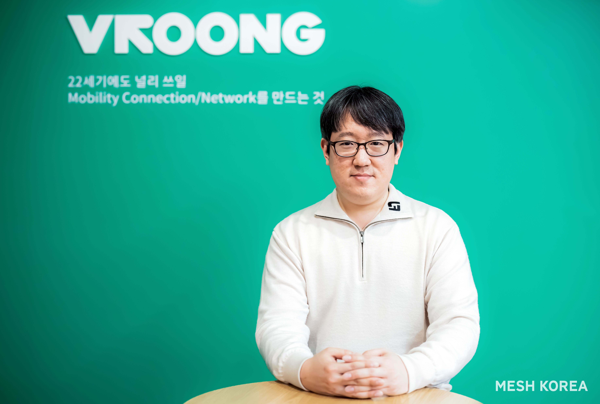

### - 빅데이터 기반 AI 물류 서비스 개발 및 확대 운영을 위해 김명환 CTO 선임
### - 물류 시스템 전반에 AI 기술을 적극 도입해 서비스 역량을 강화할 예정

물류 브랜드 ‘부릉(VROONG)’을 운영하는 종합 디지털 물류 기업 메쉬코리아(대표 유정범)가 인공지능(AI) 물류 시스템 확대를 위해 미국 스탠포드 대학 출신의 김명환 박사를 최고기술경영자(CTO, Chief Technology Officer)로 신규 선임했다고 24일 밝혔다.

메쉬코리아는 최근 폭발적인 성장세로 급변하는 배송 시장의 트렌드에 맞춰 주요 사업의 기능을 효율적으로 통합하는 한편, 적극적인 인사 개편으로 비즈니스 역량을 강화하는데 집중하고 있다. 이번에 메쉬코리아가 신설한 CTO직은 디지털 물류 시스템 기술 개발을 담당하는 책임자로서, 앞으로 빅데이터를 활용한 인공지능(AI) 물류 서비스를 개발 및 도입하는 전문가의 역할을 수행할 예정이다.

이를 위해 메쉬코리아는 미국 스탠포드 대학에서 빅데이터, 인공지능(AI), 소셜 네트워크 분야에서 박사 학위를 취득한 연구 개발 전문가인 김명환 헤드를 CTO직에 전격 선임했다. 김명환 CTO는 세계 최대의 비즈니스 인맥 사이트 ‘링크드인(Linkedin)’에서 친구 추천 서비스를 개발, AI 서비스 운영팀 리더를 거쳤으며 메쉬코리아 ‘Data & AI’의 헤드(Head) 직책을 역임했다.

메쉬코리아는 김명환 CTO가 가진 다수의 AI 기반 서비스 개발 경험과 운영 노하우를 통해 점차 복잡하고 빠르게 변화하는 배송 환경에 최적으로 대응할 수 있는 효율적인 디지털 물류 시스템을 구축하는 한편, 메쉬코리아가 제공하는 풀필먼트, 마이크로풀필먼트를 포함한 서비스 전반에 AI 물류 시스템을 적극 도입해 비즈니스 역량을 한층 강화할 계획이다.

메쉬코리아 김명환 CTO는 “비대면 트렌드가 불러온 배송 산업의 가파른 성장에 따라 빅데이터를 활용한 고도의 AI 기술이 물류 플랫폼의 경쟁력을 결정할 만큼 중요해지고 있다.”며 “배송 혁신을 불러온 메쉬코리아의 디지털 물류 솔루션과 AI 기술 서비스가 최적의 시너지를 낼 수 있도록 맡은 역할을 충실히 수행하겠다.”고 말했다.

메쉬코리아 유정범 대표는 “김명환 CTO의 선임은 메쉬코리아가 제공하는 디지털 물류 서비스에 독보적인 효율성을 더하는 계기가 될 것”이라며 “앞으로도 고객의 물류 고민을 해결해주는 든든한 메쉬코리아가 될 수 있도록 물류 기술 및 서비스 개발에 집중하겠다.”고 말했다.
