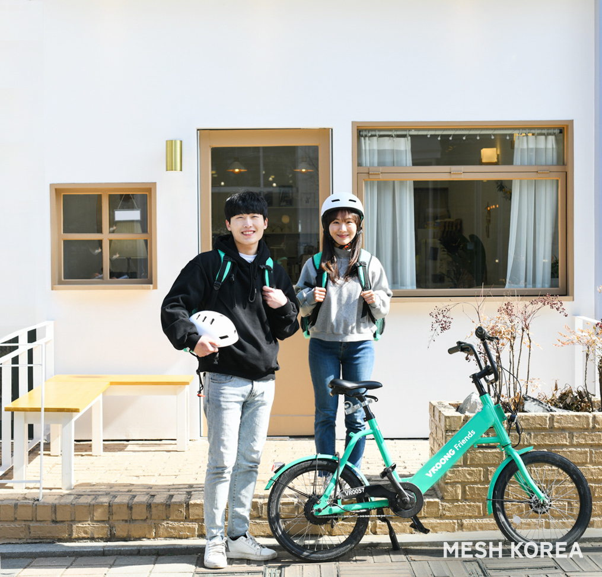

### - 합리적인 배송 거리 측정 시스템으로 개편해 배송 효율성 극대화
### - 운송 수단에 따라 배송 가능한 거리의 주문을 선별 배정해 배송 부담 감소

물류 브랜드 ‘부릉(VROONG)’을 운영하는 종합 디지털 물류 기업 메쉬코리아(대표 유정범)가 일반인 배송 전용 어플리케이션 ‘부릉프렌즈’의 시스템을 개편했다고 3일 밝혔다.

메쉬코리아가 지난해 선보인 어플리케이션 ‘부릉프렌즈’는 배송 경험이 없는 일반인들을 위해 자전거나 전동 킥보드로 원하는 시간에 자유롭게 일할 수 있도록 돕는 배송 플랫폼 서비스다. 직관적인 인터페이스와 부릉의 인공지능(AI) 추천 배차 서비스를 함께 적용해 일반인들도 누구나 손쉽게 상품을 배송할 수 있는 환경을 제공한다.

이번에 시스템이 개편된 부릉프렌즈는 출발지에서 도착지까지의 실제 주행거리를 기준으로 주문을 배정하여 프렌즈 배송 기사들의 배송 효율성을 더욱 높였다. 이는 직선 거리를 기준으로 배송 거리를 측정하는 다른 플랫폼에 비해 현실적이고 합리적인 시스템이 될 것으로 예상된다. 또한, 도보나 자전거, 전동 킥보드 등 운송 수단에 따라 실제로 배송 가능한 거리의 주문이 배정될 수 있도록 개편해 부릉프렌즈 배송 기사들의 배송 부담을 낮췄다.

부릉프렌즈 시스템 개편과 함께 최근 퇴근 후 배송 아르바이트를 하는 ‘투잡족’이 급증하면서 서울 전역에서 부릉프렌즈가 수행할 수 있는 주문량도 점차 확대할 예정이다. 음식뿐 아니라 뷰티, 패션, 편의점 등 간편한 생필품까지 다양한 배송 물품들이 배정된다.

메쉬코리아 유정범 대표는 “업그레이드된 부릉프렌즈는 시간과 장소에 얽매이지 않고, 자유롭게 일하고 싶은 직장인이나 대학생들의 부업 또는 아르바이트로 더욱 주목받을 것으로 기대한다.”며 “부릉프렌즈를 활용하시는 일반인 배송 기사들이 더욱 편리하게 이용할 수 있도록 앞으로도 시스템 개편을 지속할 계획”이라고 말했다.

한편, 부릉프렌즈는 배송 기사들이 오더부터 배차, 픽업 그리고 정산까지 어플리케이션을 활용해 손쉽게 확인할 수 있도록 설계된 부릉프렌즈 전용 배송 플랫폼 서비스로, 서울 전 지역에서 언제든지 배송 업무를 시작하고 종료할 수 있어 만 20세 이상의 다양한 연령층에서 가입자가 늘어나고 있다. 이에 메쉬코리아는 부릉프렌즈 배송 기사들이 안전하게 배송 업무를 수행할 수 있도록 업계 최초로 산재보험을 전액 지원하고 있다.
