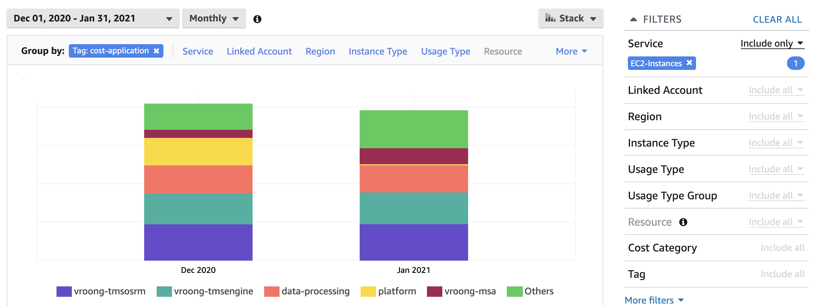
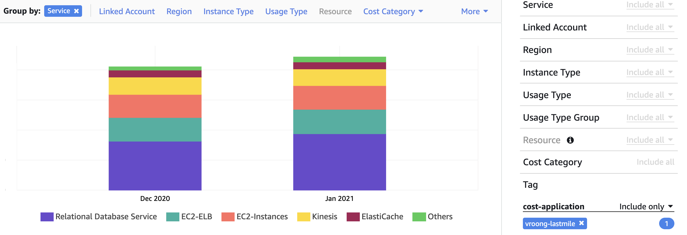
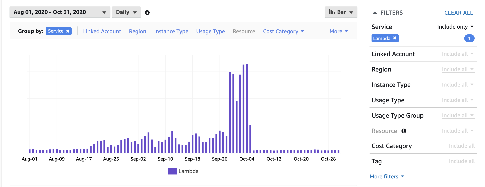
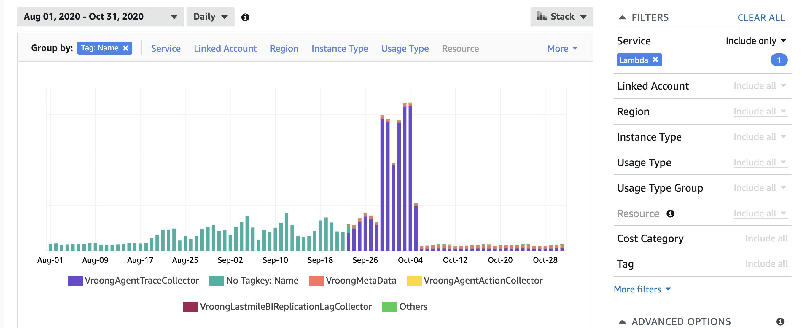
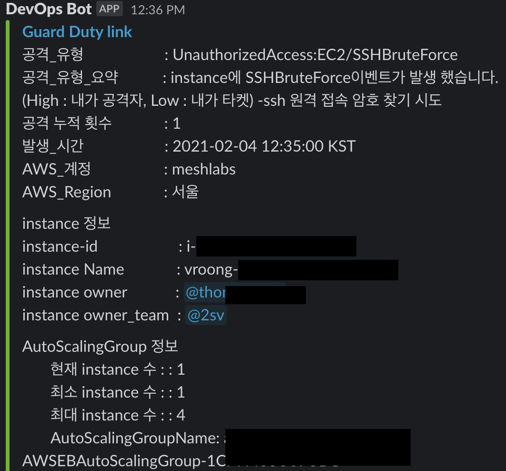
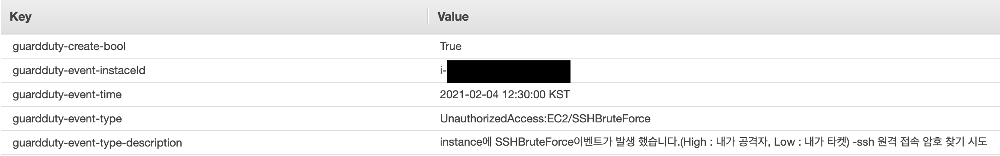
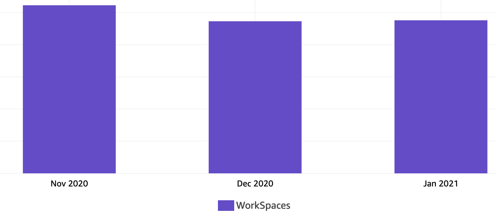

안녕하세요. 서비스개발본부 플랫폼실에서 DevOps를 담당하고 있는 백수현입니다.

지난 2월에 [AWS Tag 적용 가이드와 활용 - 1부](https://mesh.dev/20210217-dev-notes-003-aws-tag-01/ "AWS Tag 적용 가이드와 활용 - 1부")로 여러분을 찾아뵀었는데요. 오늘 드디어! 2부로 다시 찾아뵙게 되었습니다 :)

## 이번 글에서는

1부에서는 Tagging의 필요성과 Tagging 진행 방법에 관해서 이야기를 하였습니다. 그리고 많은 분이 "그래서 이걸 어떻게 활용할 수 있는 거야?" 라는 의문을 던지셨으리라 생각합니다. 그래서 이번 2부에서는 **Tagging 활용 사례** 위주로, 이와 같은 의문점들을 다뤄보는 시간을 가지려고 합니다!

- 비용 모니터링
- 업무 자동화

이렇게 크게 두 가지로 나누어서 살펴보고, **앞으로의 Tag 활용 방안**에 관해서도 이야기하겠습니다!

## 비용 모니터링

1. 비용 모니터링을 통한 이상 비용 탐지 및 제어

    기본적으로 비용은 Cost Explorer를 통해 확인할 수 있고, 주로 Service, Usage Type으로 비용을 분리해서 확인합니다. 이런 방식으로 확인하면 어려운 점이 발생하는데요.

    - Application 별 비용을 확인하기 어렵다.
    - 리소스 단위의 세분화된 비용을 확인하기 어렵다.
    - 환경(production, dev, qa 등) 별로 얼마만큼 비용을 사용하는지 확인하기 어렵다.
    - PoC 단계의 서비스에 대한 비용 확인이 어렵다.

    등이 있습니다. 이 외에도 custom하게 비용을 모니터링 해야 하는 경우 어려움이 발생하는데, 어떻게 비용을 모니터링 할지 정하고, Tagging을 함으로써 많은 문제를 해결할 수 있습니다.

    간단하게 대시보드에서 Tag를 활용해 검색하는 방법을 살펴보면

    - **Tag키로 Group by를 하고 서비스로 필터를 주고 파악**

        

    - **Application으로 필터를 주고 Group by를 service로 확인**

        

    이렇게 할 수 있습니다. Tag를 활용한 사례를 공유해 드리면 작년에 Lambda 사용량이 갑자기 폭발적으로 늘어나는 이슈가 있었습니다.

    

    약 8/18일 이후 비용이 증가하기 시작하다가, 9/29일부터 끔찍한 비용이 발생하기 시작했습니다. 저 차트만 보고는 어디서 비용이 발생하는지 추적이 너무 어려웠습니다. 그래서 Name Tag를 활용해 리소스 별 비용을 추적하기 시작했습니다.

    

    이렇게 Name Tag를 이용하면 비용 관련 이슈가 발생했을 때 피해 금액을 산정하기 수월해집니다. Lambda 외에도 S3, RDS 등 Name Tag를 이용하면 비용 추적이 아주 수월해집니다! 그 외에 활용 방법을 공유해 드리면

    - Team 별 사용량에 대한 비용 모니터링
    - Tag가 할당되지 않은 리소스의 비용 모니터링
    - 담당자별 사용패턴 모니터링

    등의 작업을 통해 다각도에서 비용을 확인할 수 있었습니다.

## 업무의 자동화

1. 보안 대응 자동화

    GuardDuty 서비스를 사용하면, 많은 이벤트가 발생하고, 실제로 보안팀에서 대응하기에는 서비스에 대한 영향도에 대한 파악이 어려운 게 현실입니다. 매번 이벤트가 발생하면 리소스 담당자를 수소문하는 과정에서 수많은 커뮤니케이션이 발생합니다. 결국 실제 대응 작업은 몇 분 걸리지 않지만 많은 작업이 커뮤니케이션 단계에서 소요되는 경우가 많습니다.

    - Tagging을 사용한 포인트!!

        우린 이 문제 또한 Tagging을 통해 해결했습니다. 간략하게 설명하면 GuardDuty 이벤트 발생 시 Slack에서 알림을 받는데 내용 구성은 아래와 같습니다.

        

        이벤트에 대한 간략한 설명과 함께 Tagging 기반으로 담당자에게 멘션을 보내, 대응할 수 있도록 구성하고, Instance의 경우 이슈 발생 범위를 쉽게 파악하기 위해 ASG 구성정보까지 같이 확인하고 있습니다. 또한, instance의 스냅샷을 자동으로 생성하고, 스냅샷에도 마찬가지로 아래와 같이 Tagging을 하고 있습니다.

        

        추후 사후분석을 위한 기반으로 스냅샷을 생성하고 어떤 이벤트 때문에 생성된 것인지에 대한 내용까지 같이 기입했습니다.

    - 효과

        보안 이벤트 발생 시 owner 및 application 등의 Tag를 통해 상황 파악하는 시간을 줄일 수 있었고 자동화된 조치를 통해 대응 시간 또한 많이 줄일 수 있었습니다.

2. WorkSpace 요금제 자동 변경

이번에는 custom Tag를 사용해서 구성한 예시를 보면, Workspace의 요금제는 AutoStop, AlwaysOn가 있습니다. AutoStop은 사용한 시간당 비용을 지급하고 AlwaysOn의 경우 월 단위로 비용을 지급합니다. 그래서 user가 접속하는 패턴으로 그에 맞는 요금제를 적용했고 이 작업은 매월 주기적으로 적용했습니다.

- Tagging을 사용한 포인트!!

    여기서 오랫동안 접속을 하지는 않았지만 내부에서 cron으로 작업하는 경우, AutoStop의 경우 부팅시간이 소요되기 때문에 빠른 대응이 필요한 사람들 등 여러 케이스가 자동으로 AutoStop으로 변경이 되면 안 됐습니다. 그래서 custom-workspace-autostop Tag를 config로 사용해서 예외 케이스를 구분했습니다.

- 효과!!

    아래 비용은 2020/11~ 2021/1월까지 발생한 WorkSpace 비용입니다.

    

    실제 비용은 크게 차이가 없어 보이지만 2020/11월 대비 2021/1월에는 사용량이 25% 증가했습니다. 적용하지 않았을 상황을 가정해 비용을 비교하면 약 30%의 비용 절감 효과가 있었습니다.

3.  서버 현황 관리

ISO, ISMS 인증 작업을 하면 운영하는 서버 현황을 보안팀에서 요구하는 경우가 많습니다. 그럼 지난번 조사했던 자료들을 토대로 신규 서버들을 다시 출력해서 보안 등급들을 다시 마킹하는 작업이 들어가고, 서비스 담당자를 다시 조사해야 합니다.

- Tagging을 사용한 포인트!!

    여기서 기본 정보들은 API를 통해 정리하고 그 외의 보안 등급, 담당자, 담당 부서 등의 데이터는 Tagging으로 관리했고, 업데이트된 내용에 대해서는 주기적으로 관리했습니다. 그 결과 리소스 현황을 출력하는 작업은 3분 이내에 완료할 수 있었습니다.

## 앞으로 Tag의 활용 방안

AWS SSO를 이용한 권한 제어

- AWS SSO는 현재 도입 검토 단계에 있는 서비스고, 서비스를 도입할 때 권한 제어를 Tag 기반으로 구성하면 팀별 리소스에 대한 권한을 조금 더 쉽게 구성을 할 수 있을 거라 기대하고 있습니다.

테스트 환경 자동 scaling

- Tag 기반으로 Auto Scaling Group의 instance count 조정 및 test instance stop 변경 작업을 통해 추가적인 비용 절감을 할 수 있을 것으로 기대합니다!

리소스 Naming Rule 정의

- Tag와 무관하다고 생각할 수 있지만 많은 값을 직접 Tagging을 할 때 Naming Role을 기반으로 Tagging을 하거나 자산 목록을 뽑을 때 Name만으로 리소스를 파악하기 훨씬 수월하고, 권한 관리, 가독성 등의 이점이 있습니다.

## 마치며

지금까지 총 2편에 걸쳐, 메쉬코리아에서 Tagging을 진행하며 얻은 경험과 Tagging을 사용하는 방법에 대해 공유해드렸습니다!

1부에서도 말씀드렸다시피 작업을 진행하면서 가장 어려웠던 점은 history를 파악하는 것이었습니다. 누가 알고 있는지 찾기 위해 열심히 수소문하다가 마지막에 `퇴사한 그분...` 이라는 말을 들을 때면 정말 막막하고 지치기도 했습니다. 하지만 이 과정을 통해 얻은 것이 더 크다고 확실하게 말씀드릴 수 있습니다! `어? 우리 이거 사용 안 하는데?` 하며 **정리한 리소스의 비용은 약 3,500 USD**였고, 그 덕에 **Tagging에 대한 성과는 물론 비용 절감 성과까지 가지고 올 수 있었습니다.**

앞서 소개해드린 방법 외에도 Tag를 활용하는 방법은 정말 많습니다. 초기 Tag 작업과 Tag 정책이 선행된다면 많은 작업을 효율적으로 할 수 있을 것입니다! 또한 제가 사용하는 방법이 정답은 아니므로,
읽어주신 분 모두 본인의 상황에 맞는 Tag 활용 전략을 짤 수 있으시기를 바랍니다 :) 부디 제 글이 Tag를 시작하는 분들에게 많은 도움이 되길 바라며, 다음에도 좋은 글로 찾아올 수 있도록 하겠습니다!

긴 글 읽어주셔서 감사합니다😄
