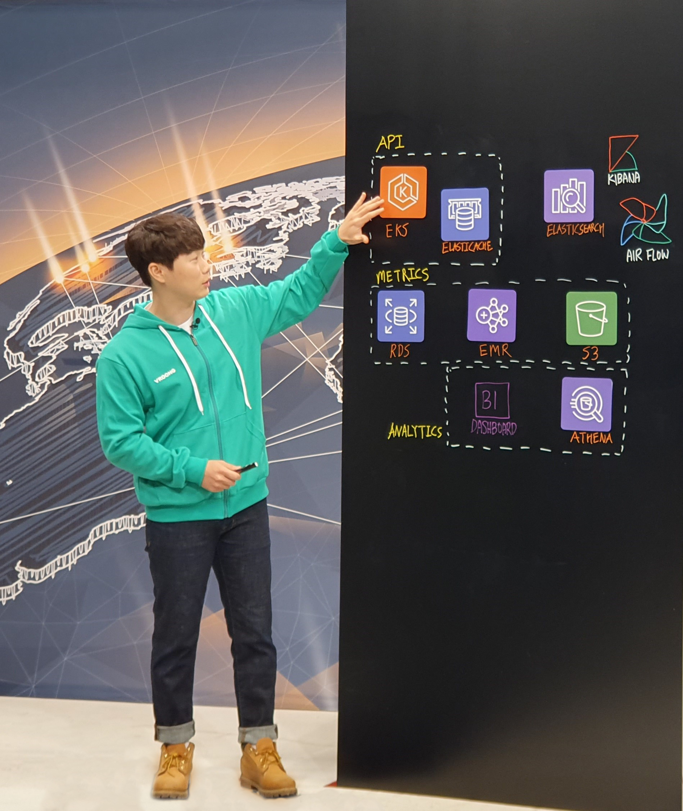

디지털 물류 BPO 기업 메쉬코리아가 스타트업계에서 눈에 띄는 행보를 보여주고 있습니다 👏 바로 **AWS의 ‘This is My Architecture’ 행사에서 Data Science실의 김경오님이 발표를 진행**하게 된 것인데요!

> ✔️ This is My Architecture 란?
>
> 매년 AWS 측에서 파트너사의 AWS Tech 이용 사례를 엄선하여, 발표를 진행하는 행사

해당 행사는 AWS를 대대적으로 사용하고 있는 Netflix, Airbnb와 같이 대외적으로 유명한 기업들이 발표를 해왔는데요.

🔔 **90여 명의 전담 개발 조직**을 갖춘 메쉬코리아는 **뛰어난 IT 기술력을 인정받으며** 국내 유수의 기업들과 어깨를 나란히 할 수 있었습니다!

## How Mesh Korea Built an A/B Test Platform on AWS

메쉬코리아 Data Science실 김경오님께서 ‘How Mesh Korea Built an A/B Test Platform on AWS’ 라는 주제로 발표를 하셨는데요.

- A/B Testing Platform에 대한 설명
- 어떻게 3주 만에 A/B Test Platform을 구축할 수 있었는가?
- 해당 Platform을 앞으로 어떻게 발전시켜나갈 것인가?

등 메쉬코리아에서 어떻게 데이터 플랫폼을 구축하고 활용하고 있는지에 대해 이야기해주셨습니다!

`youtube: [This is My Architecture](https://youtu.be/40dhk6OABJE)`

👉 [영상 바로가기](https://youtu.be/40dhk6OABJE "This is My Architecture")

발표를 마치신 경오님과 간단하게 이야기도 나누어보았는데요.
회사의 대표로서 발표를 진행한 소감, 메쉬코리아에서는 Data Science와 AI가 어떻게 활용되고 있는지 등 영상에서 들을 수 없었던 흥미로운 이야기를 전해주셨습니다!

### 1. AWS의 This is My Architecture에서 발표를 진행하신 소감이 어떠신가요?

정말 뿌듯했습니다! 원래 2020년 AWS Seoul Summit 에 선정되어 발표하기로 계획됐었는데, 코로나19로 인해 취소되어서 굉장히 아쉬웠었어요. 이번 This is My Architecture를 통해 발표할 수 있어 정말 다행이고, 제 발표가 많은 분께 도움이 됐으면 합니다!

### 2. 해당 행사에서 발표를 진행할 수 있었던 이유는 무엇이라고 생각하시나요?

Data Science에 필요한 기반 작업을 주로 진행했기 때문이라고 생각합니다. Data를 사용하고자 하는 많은 기업이 필요로 하는 내용이라, AWS 측에서도 고객사들에 많은 도움이 될 거라고 판단한 것 같아요.

### 3. 디지털 물류 기업 메쉬코리아에서는 Data Science와 AI가 어떻게 활용되고 있나요?

사용자에게 가치를 전달함과 동시에 서비스들의 성능을 높이는 데 도움을 줄 만한 AI 서비스를 만들고 있습니다. 예를 들어 기사님의 동선을 예측해서 추천 배차에 많은 도움을 주도록 하는 것이죠.

### 4. Data Science실에서는 A/B Test Platform 외에 어떤 서비스들을 개발하고 있나요?

정말 다양한 서비스들을 개발하고 있는데요. 몇 가지 말씀드리자면 추천 배차, TMS 엔진 개발, 프렌즈 분들을 위한 지역 추천, 배송 시간 예측, 동선 예측, 수요 예측 등의 서비스를 개발하고 있습니다.

### 5. 앞으로 어떤 분들과 함께 일하고 싶으신가요?

삶의 목표가 있으신 분들이요! 그런 분들은 꿈을 이루기 위해 자신을 성장시키면서 주변에도 긍정적인 변화를 주거든요. 이런 분들과 Data Science실에서 함께 일하고 싶습니다.

## 마치며

IT 및 Data와 관련된 혁신적인 플랫폼을 만들어가는 메쉬코리아는 이렇게 나날이 경쟁력을 입증하고 있습니다! 앞서 영상으로 보여드린 A/B Test Platform 외에도 추천 배차, TMS 엔진 개발, 프렌즈 분들을 위한 지역 추천 등 다양한 서비스들을 꾸준히 개발하며 지속적인 성장을 이뤄나가고 있는데요. 항상 최선을 다해주시는 구성원들이 있기에 끊임없이 발전할 수 있는 것이라고 생각합니다🙂

내일이 더 기대되는 메쉬코리아와 함께 성장을 이루어 나가고 싶으신가요? 그렇다면 주저하지 말고 지원해주세요! 메쉬코리아는 여러분을 기다리고 있습니다 :)

👉 [메쉬코리아(부릉) 합류하기](https://www.notion.so/VROONG-5c5458e75f9142f8b37272d7d146dffc "메쉬코리아 합류하기")
