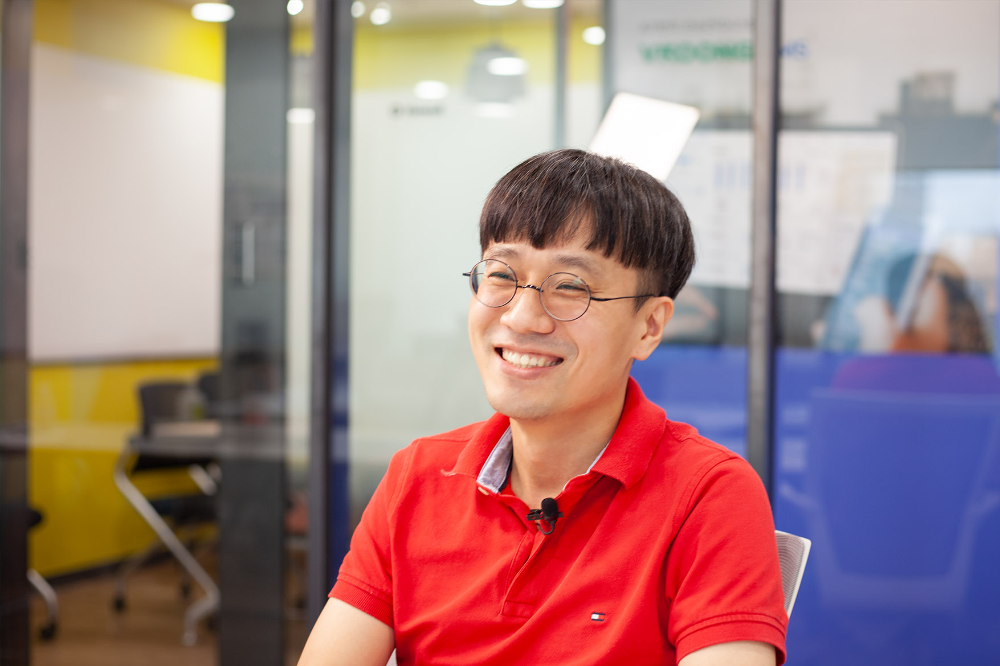
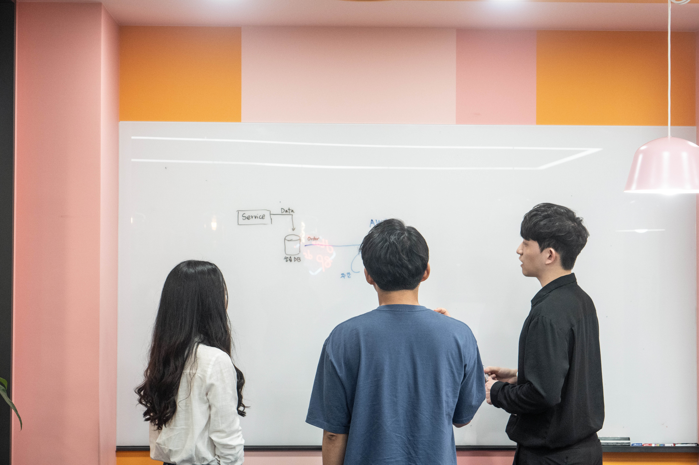
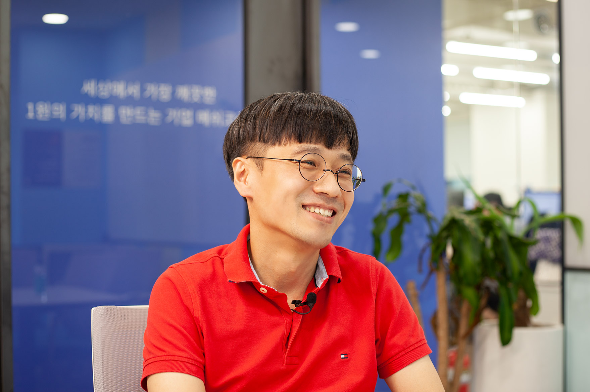

안녕하세요😄 오늘은 메쉬코리아 풀필먼트서버팀 김현웅 님의 이야기를 들어보려고 합니다.

메쉬코리아는 **스마트 물류 플랫폼 부릉(VROONG)을 운영하는 디지털 물류 BPO 기업**으로, **부릉 실시간 배송 서비스, 부릉 당일 배송 서비스, 클라우드 기반의 자동 배차 시스템 부릉 TMS, 주문부터 배송까지 하나의 채널로 통합한 주문관리 솔루션 부릉OMS 서비스를 제공**하고 있습니다.

오늘 만나볼 현웅님은 **풀필먼트 서비스의 서버 개발**을 담당하고 계신데요. 구체적으로 어떤 업무를 담당하고 계신지, 메쉬코리아 개발자로서 어떤 것들을 얻어갈 수 있을지 현웅님을 통해 하나하나 알려드리겠습니다!

### Q. 안녕하세요, 자기소개 부탁드립니다.

안녕하세요. 저는 메쉬코리아 당일배송 서비스의 서버 개발을 담당하고 있는 김현웅이라고 합니다.

### Q. 메쉬코리아는 어떤 서비스를 제공하고 있는 기업인가요?

메쉬코리아는 이륜차 기반으로 주문 즉시 물품을 받아볼 수 있는 ‘부릉 실시간 배송’ 서비스, 사륜차와 이륜차를 활용하여 주문 당일 상품을 배송받을 수 있는 ‘부릉 당일배송’ 서비스, 클라우드 기반의 자동배차 시스템인 ‘부릉 TMS’, 주문부터 배송까지 하나의 채널로 통합한 주문관리 솔루션인 ‘부릉 OMS’, 상품보관, 재고관리, 배송에 더하여 데이터·A.I.(인공지능) 기술을 활용한 통합 배송관리 서비스를 제공하는 ‘부릉 풀필먼트’ 등 직접 개발한 IT 솔루션을 활용하여 책임 배송하는 디지털 물류 BPO 기업입니다.

### Q. 메쉬코리아 풀필먼트서버팀에서 다양한 서비스에 대한 서버 개발을 맡고 계신다고 들었어요. 어떤 서비스이고, 구체적으로 어떤 일을 하고 계신가요?

풀필먼트서버팀에서는 ‘부릉 당일배송/새벽배송’, ‘부릉 TMS’, ‘부릉 풀필먼트’ 서비스에 필요한 서버 기능을 개발하고 있습니다. 조금 더 자세히 설명해 드리자면 여러 화주사로부터 요청받은 상품을 빠르고 효율적으로 배송하기 위한 배차 계획 수립, 수립한 배차 계획을 기사분들에게 전달하기 위한 요청 관리, 실시간 배송 현황에 대한 화주사 전달 등 당일배송/새벽배송 서비스 운영에 필요한 데이터를 생성, 관리, 전송하는 서버와 ‘VROONG TMS Engine’을 기반으로 클라우드 환경에서 물류 프로세스 통합 관제와 제어를 위한 다양한 정보를 생성 및 제공하는 서버를 담당하고 있습니다.

### Q. 현재 서비스 서버 개발 업무를 하실 때 가장 중요하게 생각하는 것은 무엇인가요?

서버 개발의 경우 서비스를 사용하는 고객과의 직접적인 만남이 적어요. 그렇다 보니 고객이 사용하는 언어나 사고와 동떨어진 시스템을 만들게 되는 경우가 많습니다. 잘못된 번역으로 인해 여러 오류가 발생할 수밖에 없죠. 이를 방지하기 위해 지속적인 노력이 필요합니다.

### Q. 현재 업무에 필요한 개발 역량은 어떤 건가요?

DDD(*Domain Driven Design)의 주요 개념을 기반으로 한 프레임워크를 사용하고 있다 보니 DDD의 기본 개념에 대한 이해와 관심이 있다면 많은 도움이 될 겁니다. 또한 AWS 사용 경험, 대용량 처리 시스템 구축 경험이 있으시다면 개발에 도움이 될 것 같습니다.

### Q. 현웅님이 많은 기업 중 부릉이라는 기업을 선택한 이유도 궁금합니다. 어떤 점에서 개발자가 일하기에 좋은 기업이라고 생각하셨어요?

부릉을 선택한 가장 큰 이유는, 인터뷰 중에 만났던 개발자분들이 함께 즐겁게 일하면서 성장할 수 있을 것이라는 인상을 주셨기 때문입니다. 입사 후에 만난 개발자분들도 모두 개발을 즐기고 아는 것을 서로 공유하고자 하는 분들이셨습니다.
함께 일하고 싶은 동료가 많은 곳이 개발자가 일하기 좋은 곳이 아닐까 생각합니다. 한편으론 고객과 라이더, 기업의 상생을 추구하는 회사의 목표에 공감이 가기도 했죠.

### Q. 직접 서비스 개발에 참여하는 입장에서, 메쉬코리아 서비스의 매력이나 장점은 무엇이라고 생각하세요?

메쉬코리아 서비스의 가장 큰 매력은 이륜 라이더 분들과 ‘경쟁’이 아닌 ‘상생’을 기반으로 새로운 서비스를 제공하고 있다는 것입니다.
부릉라이더는 추천배차 시스템을 통해 자동으로 주문을 배정 받고 있는데요. 다양한 AI 기법을 도입하여 생산성을 기존 대비 11% 증대했습니다. 또한 당일배송 서비스의 경우 사륜차와 이륜차가 가지고 있는 각 장점을 극대화해, 고객이 원하는 서비스를 합리적인 가격에 제공하고 있습니다.
메쉬코리아의 기술력 또한 빠질 수 없습니다. 자체 개발한 TMS(*Transportation Management System) 엔진의 경우, 그 우수성을 인정받아 국내외 유수의 기업에 제공하고 있는데요. 배차 요건을 현장의 필요에 따라 변경/적용할 수 있게 개발되었습니다. 덕분에 다양한 환경에서 최적 루트를 도출 할 수 있지요.
그 밖에도 깃발 추천, 부릉 OMS 등 다양한 서비스와 기술력을 통해 물류 체계 전반을 Digital Transformation하고 있습니다.

### Q. 풀필먼트서버팀에 대해서도 궁금합니다. 어떤 분들이 어떤 분위기에서 일하고 계신가요?

풀필먼트서버팀은 6명의 인원으로 구성되어 있습니다. 여러 서비스를 나누어 담당하고 있기 때문에 팀 미팅 때 여러 서비스에 대한 진행 상황을 서로 공유하고 의견을 나누며 일하고 있습니다. 다양한 연령대와 경험을 가지신 분들로 구성되어 개성들이 강하지만, 누구 하나 잘난 척하는 것 없이 서로를 존중하고 배려하고 있습니다.

### Q. 입사하시고 나서 가장 기억에 남는 일이 있다면 무엇인가요?

DDD 스터디를 진행했던 일이 가장 기억에 남습니다. 몇 년 동안 읽지 못했던 책을 함께 읽어 보자는 개인적인 목적에서 스터디를 시작했는데요. 당시 서버 개발자 전원이 참석하면서 개발자들이 DDD에 많은 관심을 가지고 있다는 것을 알게 됐어요. 스터디 리더로서 큰 책임감을 느끼게 되더라고요.
원활한 진행을 위해 스터디 책뿐 아니라 관련 서적과 자료를 찾아서 읽는 등 많은 노력이 필요했어요. 어려운 책이었지만, 1주일에 한 챕터씩 읽으며 거의 모든 인원이 끝까지 참석해 개발에 대한 많은 의견을 나눌 수 있었습니다. 많은 보람을 느꼈습니다. 스터디가 끝난 이후에도 계속 다른 스터디가 이어지고 있어 긍정적인 변화를 가져왔다고 생각합니다.

### Q. 그렇다면, 앞으로 함께 일하고 싶은 동료는 어떤 성향을 가진 동료인가요?

자신의 일을 즐기고 날마다 발전하는 동료, 나도 더 발전해야겠다고 자극받을 수 있는 동료, 나의 의견을 듣고 보다 건설적인 의견을 제시할 수 있는 동료와 일하고 싶어요.

### Q. 마지막으로, 메쉬코리아 개발자로서 일한다면 어떤 것들을 얻어갈 수 있을까요? 구직자분들께 소개해주신다면.

메쉬코리아는 서비스를 개발할 때 사용하는 기술에 대한 특별한 제한을 두지 않고 있습니다. 기술 사용에 대한 합리적인 근거를 제시할 수 있고, 해당 기술로 고객에게 더 큰 가치를 전달할 수 있다면 그에 맞는 기술 스택을 선택할 수 있어요.
새로운 기술을 사용하게 되면 이전에 겪어보지 못한 어려움을 만날 수 있지만 이로 인해 많은 경험을 쌓을 수도 있습니다. 코드 리뷰와 세미나, 스터디를 통해 새로운 기술에 대한 의견을 나눌 수 있는 훌륭한 동료들도 있어요. 좋은 동료와 함께 개발 경험을 쌓고 싶은 분들이라면 메쉬코리아를 추천합니다.

## 마치며

훌륭한 동료들과 함께 늘 성장 중이신 현웅님. 현웅님을 통해 디지털 물류 BPO 기업 메쉬코리아의 개발자들은 어떻게 일하는지, 어떤 동료들과 일하는지 알려드리고 싶었습니다.
여러분들은 어떤 기업에서 어떤 동료들과 함께 일하고 싶으신가요? 경쟁이 아닌 상생을 추구하는 기업에서 좋은 동료들과 함께하고 성장하고 싶으시다면 언제든지 메쉬코리아의 문을 두드려주세요! 메쉬코리아의 문은 언제나 열려있습니다. 감사합니다😄

👉 [김현웅님 잡플래닛 인터뷰 원문(영상 풀버전)](https://www.jobplanet.co.kr/contents/news-857 "인터뷰 원문")

👉 [메쉬코리아(부릉) 합류하기](https://www.notion.so/VROONG-5c5458e75f9142f8b37272d7d146dffc "메쉬코리아 합류하기")
