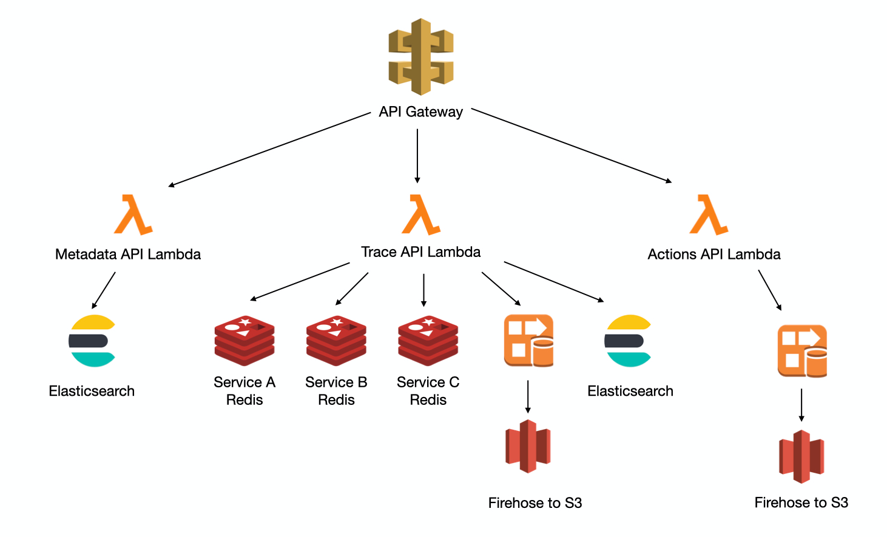
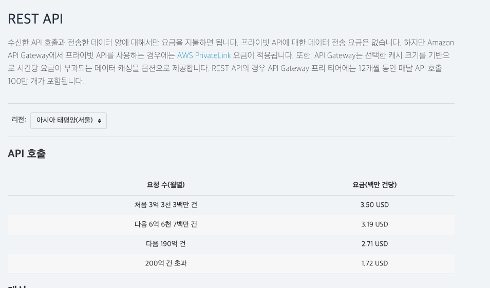
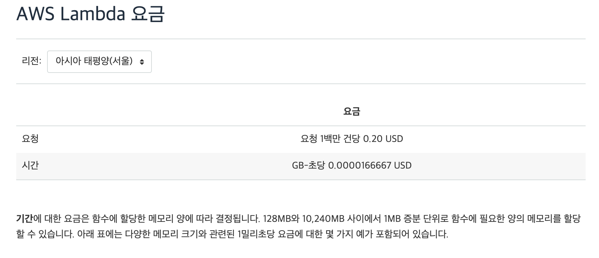
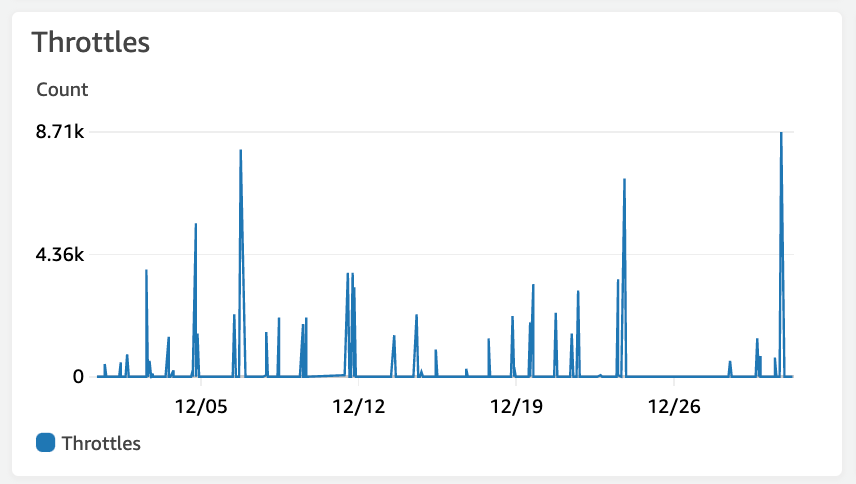
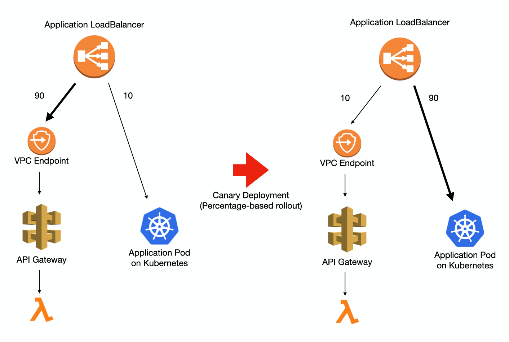
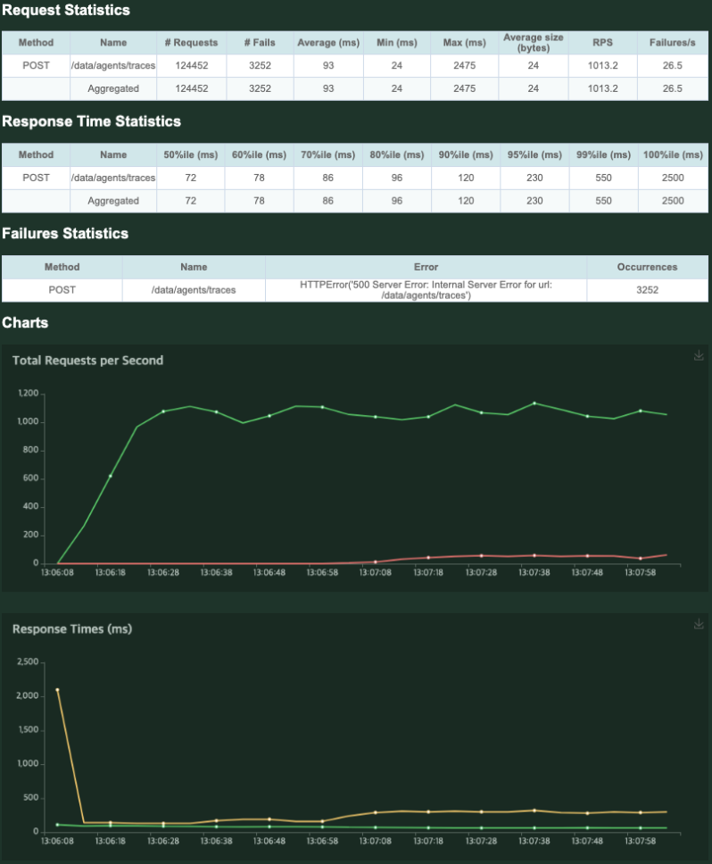
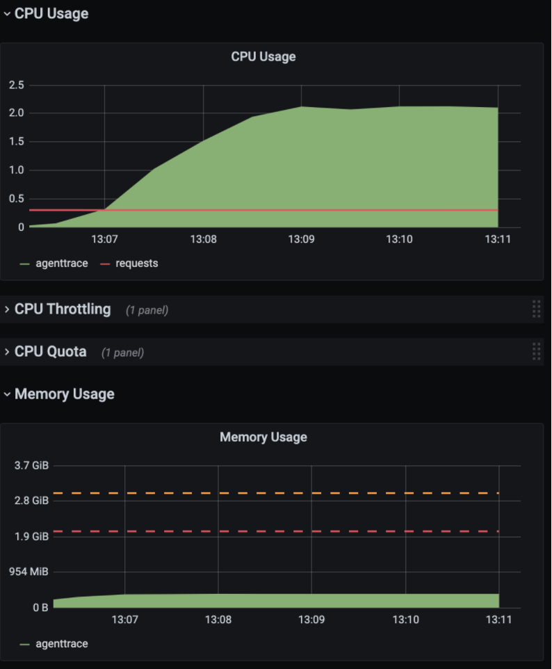
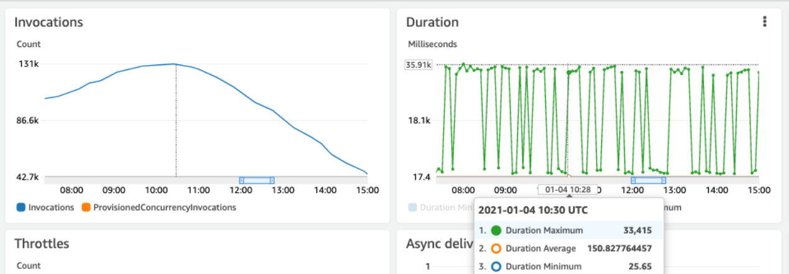
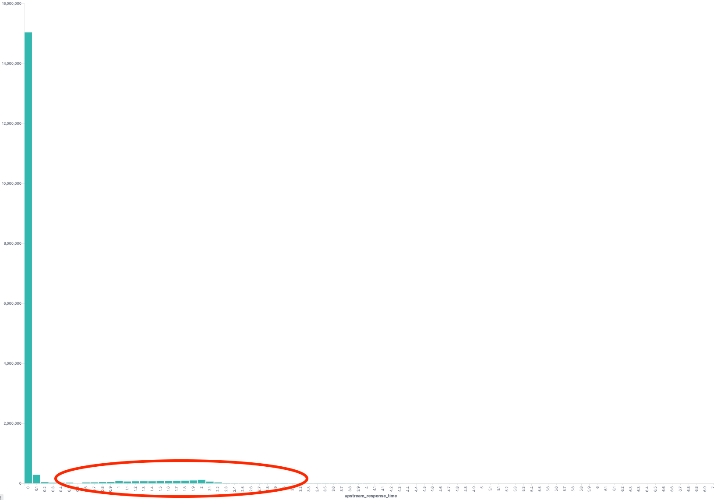

안녕하세요. 이번에 최근 진행했던 모바일 기기 데이터 수집 서버 개선 프로젝트에 대한 글을 쓰게 된 플랫폼실 김창규입니다😃

본 내용은 총 2부로 나누어서 풀어나가려고 하는데요. 이번 **1부에서는 서버 아키텍처 개선**에 관한 내용을 다루고, 2부에서는 성능 개선에 관한 내용을 다뤄보려고 합니다!

특히 오늘은 서버 아키텍처를 개선해야 했던 이유부터 개선 결과까지 모두 공유해드릴 예정이니, 끝까지 읽어주시면 감사하겠습니다!

들어가기에 앞서, 현재 메쉬코리아의 부릉 모바일 애플리케이션에서는 다양한 정보를 수집하여 웹서버를 통해 전송하고 있는데요.

- 기기의 위치 정보
- 배달 주문 주행 정보
- 중요 시스템 로그
등을 HTTP 프로토콜로 서버로 전송하고 있습니다. 이렇게 수집된 정보로 **해당 위치에서 수행할 수 있는 배달 주문을 노출하고, 머신러닝을 통해 주문을 추천하며 시스템 로그로 장애가 발생했을 때 디버깅 자료로 활용**합니다.

이 시스템은 2017년에 구축되어 2021년 현재까지 잘 사용되고 있는데요! AWS의 API Gateway와 Lambda를 사용하여 구현되고 있고, Lambda 구현체에 따라 실시간 서비스에 사용하기 위한 Redis, S3에 데이터를 적재하기 위한 Kinesis Firehose, 모바일 디버깅 자료를 조회하기 위한 Elasticsearch로 전송합니다.

  

API Gateway에 연결된 서비스

데이터 수집은 크게 세 가지 API를 통해 이루어집니다.

- Trace API
    - 모바일 기기의 GPS좌표를 수집
    - GPS좌표를 사용하는 서비스들의 Redis에 갱신
    - 머신러닝을 위한 학습데이터로 가공 후 Firehose를 이용하여 S3에 데이터를 저장
    - Business Insight를 얻기 위해 가공 한 뒤 Elasticsearch에 저장
- Actions API
    - 배달 수행 정보로부터 Insight 도출하기 위한 지표 수집
    - Firehose를 통하여 S3에 저장
- Metadata API
    - 모바일에서 일어나는 다양한 로그를 수집
    - ElasticSearch에 저장하여 디버깅 시 검색하여 사용

그렇다면 왜 서버 아키텍처를 개선해야할까요? 🤔

# 왜 개선을 해야할까?

## 과도한 서버 운영비용

첫 번째로 서버 운영비입니다.

이 시스템을 구성하는 API Gateway의 REST API와 Lambda는 데이터 수집과 같은 심플하지만 대용량 요청을 처리 해야 하는 시스템에서는 가성비가 매우 떨어집니다. 초기엔 큰 비용적인 부담이 없었지만, 17년부터 꾸준히 사업이 성장함에 따라 비용이 급격하게 증가하였습니다.

**API Gateway 비용분석**

API Gateway의 역할은 API Key를 체크하고 Lambda를 단순 호출합니다. 따라서 Lambda의 실행 횟수로 역산하여 각 API별로 호출량을 계산하였습니다. (API Gateway의 전체 호출량도 당연히 지표로 알 수 있다.)

API별 호출량은 다음과 같다.

- Trace API
    - 월간 500~600 M call
- Actions API
    - 월간 15~17M call
- Metadata API
    - 월간 800~1000 M call

약 월간 1.5B (15억) 회 API Gateway의 호출이 일어나고 있었고, API Gateway 타입 중 REST API를 사용하고 있었습니다.



API Gateway 중 REST API의 비용

이 호출량을 서울 리전 가격표에 대입해 보면

*(333 * 3.50) + (667 * 3.19) +( 500 * 2.71) = 4648.23*

약 5천불의 금액이 매달 청구되고 있었습니다.

REST API가 아닌, 일반 HTTP API로 변경했을 때에는 월간 $1,390 으로, 약 70% 를 절감 할 수 있고,

*(400 * 1.00) +  (1100 * 0.90) = 1,390*

Application Loadbalancer로 변환 시 월간 $22.84 으로, 99.5% 를 절감할 수 있습니다.

(Application Loadbalancer로 Lambda 를 실행할 수 있습니다.)

**Lambda 비용분석**

Lambda의 비용 구조는 (memory 크기 * 사용 시간) 과 요청에 따라 과금됩니다.



Lambda 비용

각 API별 사용량을 집계해 보았을 때 다음의 수치가 나왔습니다.

- Trace API
    - 요청량 비용 : 월 $113.98
    - 사용량 비용 : 월 $657.96
- Actions API
    - 요청량 비용 : 월 $3.38
    - 사용량 비용 : 월 $ 25.11
- Metadata API
    - 요청량 비용 : $ 166.04
    - 사용량 비용 : $ 689.08

총합 월 $1,655.55

위 금액이면, c5.xlarge(4core/8G mem) 인스턴스를 on-demand로 11.98 대 RI로 19대를 상시 운영 가능한 금액입니다.

## Lambda 쓰로틀링으로 인한 오류 방지



피크 시간이 아닐 때도 쓰로틀링이 발생할 수 있다.

lambda의 동시성(concurrency)에는 제약이 있습니다. 처음 500 동시성까지는 버스트 할당량으로, 제한 없이 사용이 가능하지만, 그 이상은 scaling 되는 속도가 분당 500으로 제한되어 있습니다. [[링크](https://docs.aws.amazon.com/ko_kr/lambda/latest/dg/invocation-scaling.html)] 만약 동시 실행 중인 요청이 500개 이상이고, 신규로 들어오는 요청이 scaling 속도보다 빠를 때 쓰로틀이 발생합니다.

갱신 주기가 겹쳐 우연히 초당 요청 수가 폭증할 할 때도 쓰로틀이 발생할 수 있지만, 더 치명적인 것은 연결되어 있는 다른 시스템의 Response Time이 조금이라도 증가해도 쓰로틀이 많이 발생할 수 있습니다. 다시 말하면, 처리 시간이 증가하여 완료되는 요청보다 새로 들어오는 요청이 더 많다면, 동시성이 증가하고, 이는 쓰로틀을 야기할 수 있습니다. 예를 들어, 연결된 Elasticsearch에서 Data node 중 하나가 이상이 생겨 Rebalancing이 일어나며 CPU 사용률이 증가하거나, JVM GC로 인해 Response time이 증가할 수 있습니다. 이 실행 시간이 늘어난 요청을 처리하는 중 새로운 요청이 들어오면 그만큼 많은 concurrency가 필요로 하게 되고, 쓰로틀링으로 이어집니다.

이 쓰로틀링은 API Gateway에 500 Error로 응답이 모바일로 전송이 되기 때문에 개선이 필요합니다.

# 어떻게 개선을 할까?

변경 목표는 명확했습니다. 먼저, API Gateway + Lambda를 Application Loadbalancer + Kubernetes Pod 서버로 변경하여 비용을 대폭 낮추고자 했습니다. 또한 Spring WebFlux 에 reactor-netty를 사용하여, Async / non-blocking 서버를 구현하고자 했습니다.

**Application Load Balancer**

API Gateway에서 한 Host로 path prefix에 따라 다른 환경(stage)으로 애플리케이션이 실행됩니다. Vroong이 공용으로 사용하는 쿠버네티스는 환경에 따라 클러스터와 포트가 분리되어 있기 때문에 Host 와 Path에 따라 다른 Target Group으로 트래픽을 전달해야 할 필요성이 있습니다. Application Loadbalancer는 L7 LB 로, HTTP의 header에 따라 routing이 가능하여, 환경별로 다른 클러스터를 바라보게 하는 것이 가능합니다.

또한 Application Loadbalancer는 동일한 요청이라도, weight 기반으로 여러 개의 Target Group으로 부하를 분산할 수 있습니다. 이 기능을 이용하여, 기존 API-Gateway + Lambda와 쿠버네티스의 워크로드간에 점진적 배포가 가능합니다.



ALB를 이용하여 기존의 API Gatway와 Kubernetes Pods 간 점진적 배포

**Kubernetes**

쿠버네티스는 Vroong 시스템에서 공용으로 사용하고 있는 서버 환경입니다. 쿠버네티스를 사용해야 하는 이유는 셀 수 없이 많지만, 가장 유효했던 이유는 공용으로 사용하기 위해 만들어진 CI / CD 파이프라인이 존재하여 빠르게 신규 서비스를 구축할 수 있었던 점과, 운영하기 전까지 트래픽을 얼마나 견딜지 예측할 수 없는 상황이었기 때문에 유동적으로 자원을 할당해 줄 수 있다는 점이 가장 컸습니다.

**Spring Webflux 와 reactor-netty**

데이터 수집 서버는 대부분의 요청이 Transform 이후 다른 시스템으로 전달하는 기능을 가지고 있습니다. 이때, 타 시스템과 Blocking IO를 한다면, 그 시간 동안 해당 쓰레드는 타 시스템의 응답을 기다리기 위해 기다리게 됩니다. 쓰레드의 수가 제한된다면, Lambda와 마찬가지로, Concurrency가 일정 이상 늘어나기 어렵습니다. 하지만 async/non-blocking인 webflux로 구현했을 때는 컴퓨팅 리소스가(cpu, memory, os limit) 허용되는 범위에서 수많은 요청을 동시에 처리할 수 있습니다.

다른 시스템에 연결할 라이브러리 또한 Webflux 사용에 상용 수준의 지원을 하고 있습니다. Webflux의 기존의 문제로 지적됐던 버전 호환성 문제가 시간이 지남으로써 많은 부분 해결이 되었습니다. AWS SDK 도 v2가 출시되면서 non-blocking을 지원하게 되었고, Redis를 연결하는 Lecttuce도 충분히 검증되었습니다. 아직 출시한 지 얼마 안 된 R2DBC 사용은 프로젝트가 RDB에 연결하지 않기 때문에 호환성 측면에서는 큰 걱정을 하지 않아도 되었습니다.

# 개선한 결과는 어떨까?

개발 환경에서 Webflux로 개발한 Agenttrace 서버 1대에 대해 부하 테스트를 진행하였습니다.

1000RPS (request per second) 정도를 기록하였고, CPU는 2core, Memory 500 MB 수준으로 기록되었습니다. 다만, 시간이 지난 이후 Error Rate가 올라오는 것을 확인할 수 있었습니다.





서버 로그를 확인하자, 다음과 같은 오류가 발생한 것을 확인할 수 있었습니다.

```
java.util.concurrent.CompletionException: software.amazon.awssdk.services.firehose.model.ServiceUnavailableException: Slow down. (Service: Firehose, Status Code: 500 ...
```

s3에 데이터를 기록하기 위해 사용했던 Firehose에서 Slow Down 이라는 메시지와 함께 500 error를 리턴한 것을 확인할 수 있었습니다. [Firehose의 제한사항](https://docs.aws.amazon.com/firehose/latest/dev/limits.html)을 확인해 보면, put record는 서울 리전에서 초당 1000회로 제한된다는 것을 알 수 있습니다. 따라서 RPS가 1000 이상 올라가지 않는 이유는 Firehose의 제약 사항으로, 서버 자체의 성능과는 무관했고, 1000RPS 까지는 충분한 성능을 보여준다고 평가할 수 있었습니다.

### 기존 상용 트래픽과의 비교



상용 서비스 Lambda의 분당 처리(rpm) 및 처리 시간(ms)

상용데이터는 피크 시간에 초당 500RPS, 평균 Response time이 150ms 정도 기록한다는 것을 알 수 있습니다. 새로 개편한 서버가 2코어 수준의 서버로 2배의 트래픽을 더 낮은 response time으로 처리할 수 있음을 알 수 있었습니다.

### 비용 증감 예측

2배의 트래픽을 처리하기 위한 성능이 2core 0.5GB 정도입니다. 실제 구동 환경은 Kubernetes에서 공용 서버 리소스로 함께 사용하여 정확한 계산은 어렵지만, EC2로 비교하면, c5.large 정도의 수준입니다. 해당 EC2인스턴스를 1달 동안 상시 유지했을 때 on-demand 기준 $69.12 , RI 기준 $40.32 으로, Lambda 비용 대비 97.5% 절감할 수 있고, HA구성을 위해 2대를 띄우더라도 95.1% 절감 가능합니다.

# 2부 미리보기

개선된 애플리케이션은 상용에 배포하고, 모니터링을 진행하였습니다. 큰 문제는 없었지만 종종 요청이 timeout이 기록되어 response time에 대한 통계를 내 보았습니다.



전체 API에 대해 response time histogram

99% 이상의 요청이 100ms 이내로 완료가 되었지만, 1% 미만의 요청이 1초 이상으로 response time이 튀는 현상이 지속적으로 발생하였습니다.

2부에서는 이 원인을 분석하기 위해 모니터링 지표를 추가하고 원인을 추적, 해결했던 과정을 소개해드리겠습니다!


# 마치며

이렇게 `모바일 기기 데이터 수집 서버 개선기 1부`가 마무리되었습니다🙂 이번 작업으로 인해 많은 것을 배울 수 있었는데요.

1. 큰 고민 없이 AWS 서비스를 사용했을 때, 큰 비용 낭비를 초래할 수 있다는 점
2. AWS 서비스 용량 제한으로 서비스 장애를 초래할 수 있다는 점

특히 큰 고민 없이 AWS 서비스를 사용했을 때, 얼마나 큰 비용 낭비를 초래할 수 있는지 확실하게 알게 되었습니다. Lambda에서 쓰로틀링이 많이 발생하며 오류 발생률이 높아지지 않았다면, 저 역시 이 레거시 시스템에 손을 대려고 하지 않았을 겁니다.

또한 AWS 서비스 용량 제한으로 서비스 장애를 초래할 수 있다는 점도 항상 유의해야 합니다! 우리 시스템에서는 Labmda의 동시성 scaling 속도 제한으로 인해 쓰로틀링을 겪었고, 요청량이 2배가 많았으면, Firehose 호출량 제한에 도달하여 높은 에러 발생률을 기록했을 것입니다.

AWS 서비스를 잘 사용하면 빠르게 서비스를 구축할 수 있지만, 성능과 비용을 최적화하려면 이 시스템이 적절한 구성을 가지고 있는지, 애플리케이션 구조를 개선할 수 있을지 끊임없는 고민과 노력이 필요하다는 것을 명심해야합니다!

이 글이 많은 분들께 도움이 되길 바라며, 조만간 성능 개선에 관한 내용을 다루는 2부로 다시 찾아뵐테니 많은 관심 부탁드립니다 :) 감사합니다!
