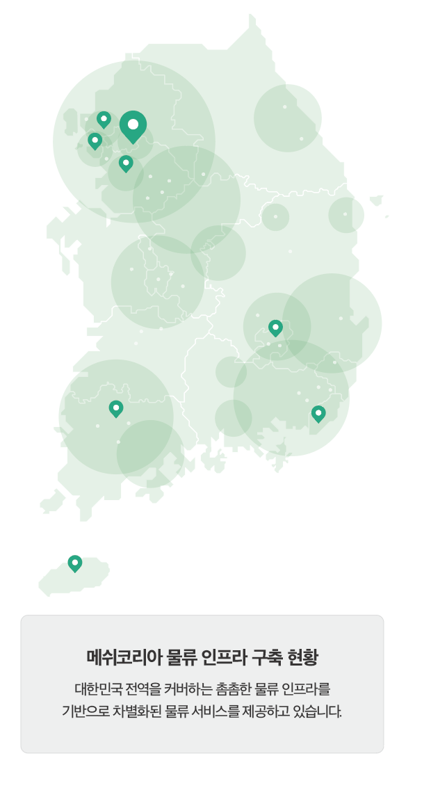

## 회사 소개 (About MESH KOREA)

### '고객친화적인 물류 · IT BPO파트너'로서 고객의 비즈니스 성공을 돕습니다.

메쉬코리아는 데이터와 인공지능(AI) 기술을 기반으로 로지스틱스(Logistics)를 통합하는 플랫폼 기업입니다. 상품보관과 재고관리, 배송 등 기존 3PL 물류 서비스에서 한발 더 나아가 빅데이터와 AI(인공지능) 기술을 접목한 5PL 통합 물류 서비스를 제공합니다. 이륜차와 소형차, 화물트럭뿐 아니라 자전거, 전동킥보드, 도보 등 다양한 이동 수단의 유기적인 활용과 더불어 6만6000여명 제휴 배송기사와 물류 핵심 인프라인 풀필먼트센터(FC), 마이크로풀필먼트센터(MFC)를 포함한 전국450여 곳의 거점 등 촘촘한 물류망을 토대로 자체 개발한 통합 물류관리 솔루션을 적용한 프리미엄 배송 서비스를 제공 중입니다.

---

## 핵심 경쟁력 (Core Competency)

직접 개발한 IT 솔루션을 활용하여 '책임' 배송하는 대한민국 유일의 디지털화된 종합물류기업입니다.

### 인프라· 네트워크
- 전국 350여개 물류거점, 센터 보유
- 숙련된 배송 기사 다수 보유

### R&D조직
- 국내 최고 수준의 IT개발 인력
- 80여 명의 전담 개발 조직

### 운영 역량 (Operation)
- 국내 유일 직계약 구조로 배송 전과정에서 서비스 품질 관리 가능

### IT 기술력(AI & Big Data)
- 커스터마이징이 가능한 TMS솔루션
- 머신러닝 기반의 데이터 학습모델

---

## 주요 지표 (Index)

### 국내 전역을 빠르게 연결하는 2・4륜 기사, 차량 인프라와 물류 거점을 확대하며 사업 역량을 강화하고 있습니다.

- 운영트럭수 : **200여대**
- 기사 수 : **42,200여명**
- 부릉 스테이션 거점 : **500여개**
- 법인 고객사 : **250여개**
- 가입상점 수(누적) : **67,000여개**
- 거래액(월) : **1,153억원**
- 매출(월) : **241억원**

---

## 회사 연혁 (History)

### 2021
- 물류 IT 스타트업 최초 국제 표준 정보보호 인증 3종 동시 취득
- 중소벤처기업부 주관 2020년 **벤처천억기업상** 수상
- 2020년 매출 2,565억원 달성, 디지털 물류 시대 본격화
- 부릉 상점주를 위한 '부가세 신고자료 조회 서비스' 오픈

### 2020
- ISMS 인증 획득
- 중소기업 규제혁신 대상, 중기부 장관상 수상
- KT와 AI 기반 물류 혁신을 위한 MOU 체결
- 블루보틀에 콜드체인 원두 배송 서비스 제공
- GS25 배송 전국 확대, 세븐일레븐 편의점 배송 서비스 시작
- CU에 부릉OMS를 통한 원스톱 배송 서비스 제공
- 코스토리와 화장품 당일배송 MOU 체결
- 프레시지와 도심물류 공동사업 MOU 체결

### 2019
- 업계 최초 크라우드 소싱 배송 서비스 '부릉 프렌즈' 시작
- 도심물류 플랫폼 확장을 위한 4륜차 배송 시작
- KTX특송 라스트 마일 배송 서비스 시작
- 원더플레이스와 당일배송 업무 협약 체결
- 상점주 전용 '부릉 사장님사이트' 오픈

### 2018
- 현대자동차, SK그룹, Mirae Asset으로부터 투자 유치
- CJ 올리브영과 당일배송 '오늘드림' 서비스 계약 체결
- 코레일-코레일네트웍스와 '도심 물류 활성화' 3자 MOU 체결
- 한국무역협회 '문재인대통령 싱가포르 경제사절단' 파견

### 2016-2017
- 네이버로 부터 240억 원 투자 유치
- GS리테일과 'VROONG TMS' 라이센스, 라스트마일 배송 서비스 공급 계약 체결
- 싱가포르 어니스트비, 티켓몬스터(TMON)와 'VROONG TMS' 엔진 공급 계약 체결
- 프리미엄 배달대행 서비스 'VROONG POS' 출시

### 2012-2015
- 이마트(emart)와 'VROONG TMS' 공급 계약 체결
- 신세계백화점, 이마트, 버거킹, BGF리테일(CU)과 배송 서비스 공급 계약 체결
- 국내 최대규모 시드라운드 약 13억 원 투자 유치
- (주)메쉬코리아 법인 전환 및 기관 투자 유치
