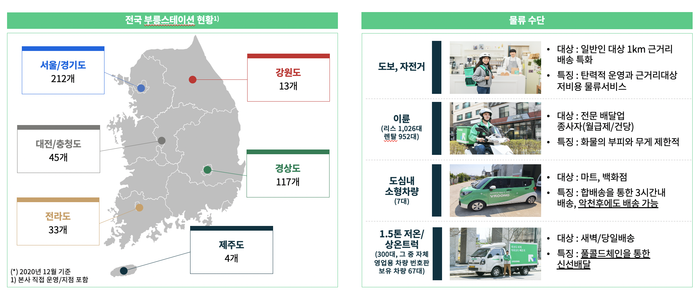
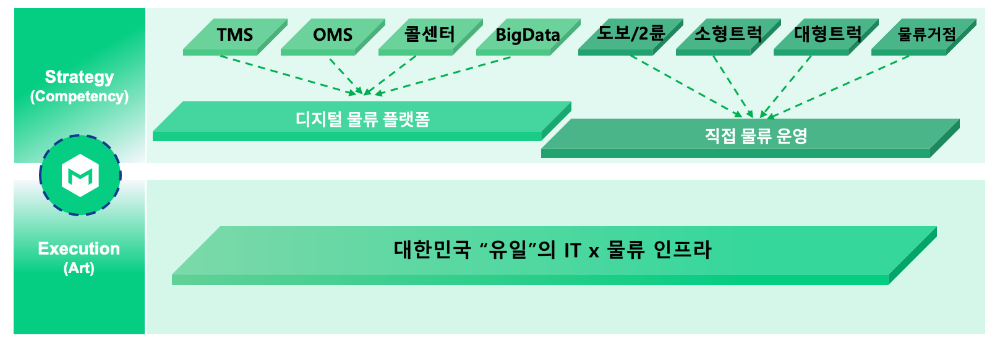
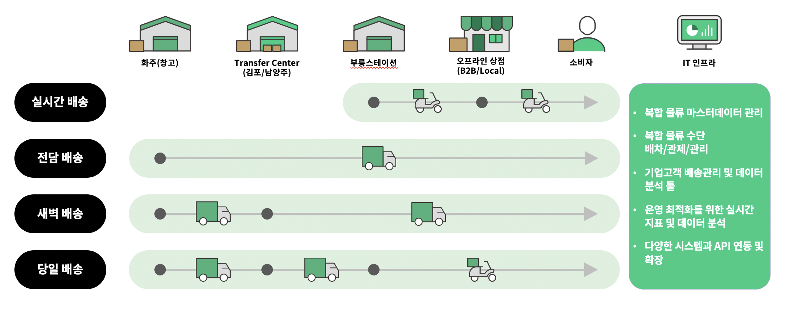
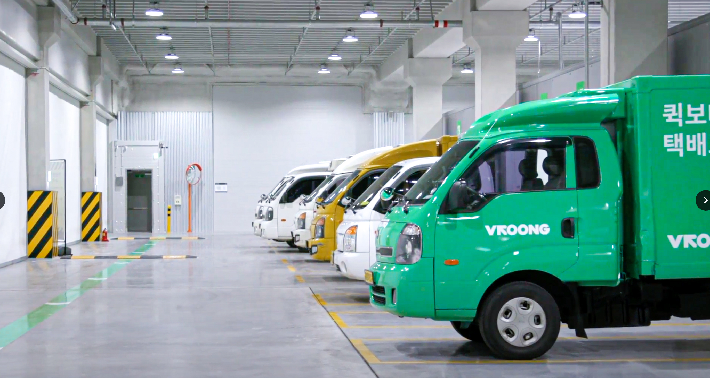
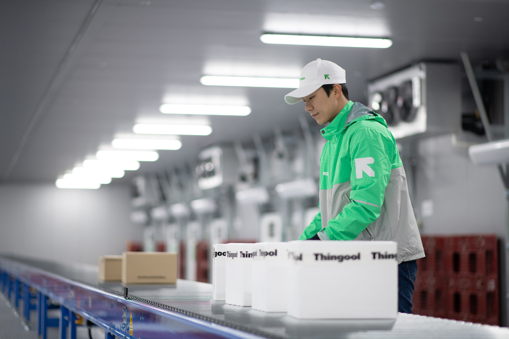

## 브랜드 소개 (About VROONG)

### “Data + IT + Logistics 기반”의 통합 물류 브랜드

`youtube: [통합 물류 브랜드 VROONG](https://youtu.be/2KuVSVhTGYs)`

👉 [영상 바로가기](https://youtu.be/2KuVSVhTGYs "메쉬코리아 부릉, 김포/남양주 물류센터 OPEN!")

부릉(VROONG)은 고객이 주문한 상품이 주문부터 수령까지의 모든 과정을 빅데이터와 AI를 활용하여 신속하고 정확한 디지털 물류 서비스를 제공합니다. 복잡한 물류 시스템을 통합하여 한눈에 쉽게 확인이 가능한 통합 시스템을 무상으로 제공하며, 모든 IT 기술은 부릉의 ICT 전문가들이 최적화해 서비스를 제공합니다. 부릉의 3PL 서비스는 실시간/당일/새벽/익일 풀필먼트 및 전담 배송을 합리적인 비용으로 제공하여 누구나 쿠팡과 마켓컬리 수준의 물류 IT와 로지스틱스(Logistics Service)를 경험할 수 있게 합니다. 부릉은 온라인 커머스 기업을 비롯, D2C 커머스, 라이브 커머스 기업들이 실제 데이터를 기반으로 마케팅, 브랜딩, 상품 소싱, 기획, 제조 등 본질적인 업무에만 집중할 수 있도록 돕는 유통-물류 비즈니스 파트너로서 역할을 수행하고 있습니다.

---

## 주요 사업소개 (Business Summary)

### 물류 인프라 (Logistics Infrastructure)

- **전국 network 현황과 물류 수단**

    

    전국에 25,813명의 Active 라이더 및 부릉스테이션 424개를 운영하고 있으며, 다양한 물류 수단을 활용하고 있습니다.

- **물류 거점 현황과 계획**

    

    김포 약 810평 규모, 남양주 약 460평 규모의 '풀 콜드 체인' Transfer Center(TC)를 구축하였으며, 도심내 100평-200평 규모의 도심물류센터(MFC)를 2021년 3월에 오픈 및 풀필먼트 센터(FC)는 2021년 2분기에 오픈 예정 등 물류 인프라 확장을 계획하고 있습니다.

### ICT 솔루션 (ICT Solutions)

"직접 만든 IT 솔루션"을 활용해 "직접 배송"하는 종합 디지털 물류 기업입니다.

### 배송 서비스 (Delivery Service)

메쉬코리아는 부릉이라는 통합 물류 브랜드를 운영하고 있으며, AI, 빅데이터 기술을 기반으로 기업 고객의 비즈니스 성공에 필요한 '맞춤 물류 서비스'를 제공하고 있습니다.

- **실시간 배송**

    

    실시간 배송은 이륜차 기반 배송 서비스로, 회사의 성장을 도모한 주력 사업부문입니다. 버거킹, 맥도날드, 올리브영 등 주요 B2B업체 뿐만 아니라, Local상점들을 포함한 다양한 고객군을 보유하며, 국내 유일한 본사 직접 운영구조로 고품질의 배송서비스를 제공합니다.

- **전담 배송**

    

    전담 배송은 직접 화주사 물류 센터에 진입하는 사륜차 기반 배송 서비스로, 주요 B2B고객사로는 SSG, ORGA, CU등으로 구성되어 있습니다.

- **새벽 배송**

    

    새벽배송은 사륜차 기반으로, 당일 22시까지 TC에 입고되는 배송 건에 대하여, 풀 콜드체인을 기반으로 소비자에게 배송하는 서비스입니다. 주요 고객처로는 식자재 유통업체인 쿠캣,띵굴 등으로 구성되어 있습니다.

- **당일 배송**

    

    당일 배송은 국내 최초 이륜 및 사륜차 혼합 기반으로, 당일 2회전 12시, 16시까지 TC입고 건을 기준으로 소비자에게 배송하는 서비스입니다. 이는 TC, 부릉스테이션을 거점으로 활용하며, 주요 고객처로는 ABC마트, 프레시지, 허닭 등으로 구성되어 있습니다.
