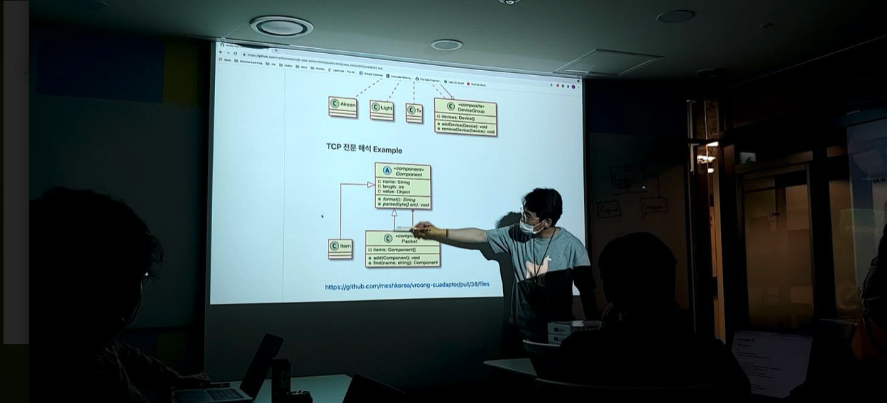
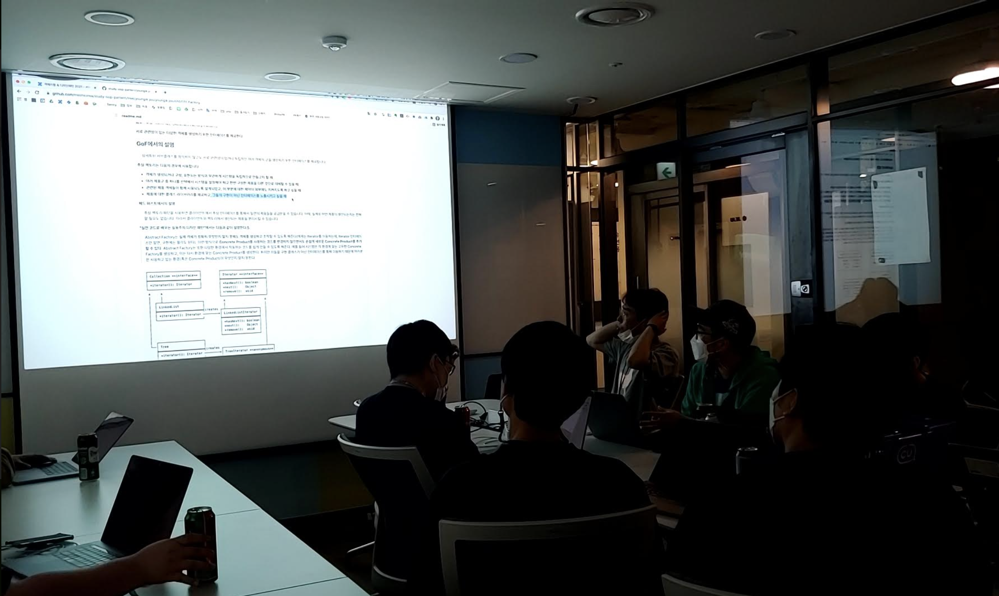
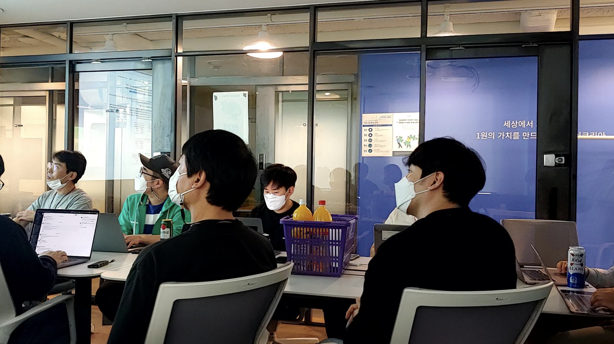
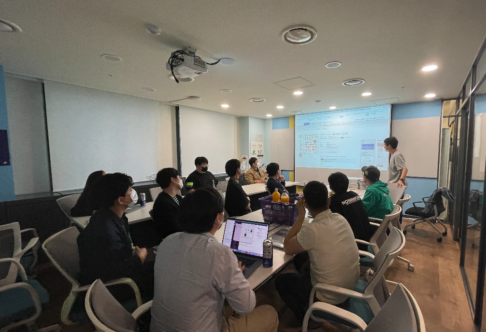
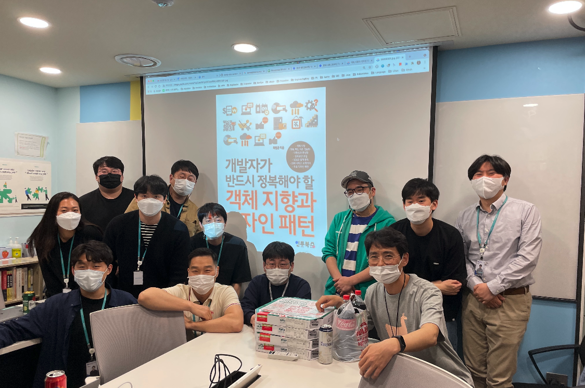

# 사내 스터디 그룹

라마 옷의 주원님을 중심으로 OOP 및 디자인 패턴에 대한 스터디가 한달 남짓 진행되었습니다.
 시니어/주니어 개발자, 사용하는 언어 및 소속된 팀을 가리지 않고, 사내 여러 개발자 분들 12명이 참여하였는데요,
 어느새 메쉬코리아의 하나의 문화로 자리잡은 사내 스터디는 개인의 발전 뿐만 아니라 팀이 함께 성장하는데 기여를 하고 있습니다.
 평소에는 업무적으로 겹치지 않으면 잘 만나지 못하는 동료들도 이런 모임을 통해 다른 동료들과 자연스럽게 얼굴을 익히고 소통할 수 있는 창이 열리고 있네요!

📌**라마 옷을 입고 열심히 발표 하시는 JW 님**

## 객체지향 & 디자인 패턴 스터디

**개발자가 반드시 정복해야할 객체지향과 디자인 패턴**이라는 교재로 매주 월요일 오후 6시에 스터디가 진행되었습니다.
 그날 발표자는 정리한 자료를 발표하고, 참여자들은 의견을 나누었고, 코로나 시국인 만큼 모두가 오프라인으로 만날 수 없는 때에는 온라인으로 참여하여 열의를 불태우셨습니다.

책의 주요 내용은 크게 다음과 같이 3가지로 나누어져 있었고, 부족한 내용은 유투브의 동영상 강의를 통한 보조교재와 함께 진행하였습니다.

  - 객체지향
  - 설계원칙 : SOLID
  - 주요 디자인 패턴

개발하는데 필요한 개념이지만 어쩌면 자주 잊고 개발하고 있었을 우리에게 기본을 되짚어보고 나아가 실무에 적용해 보는 재미가 있어 매우 뜻깊은 스터디였습니다.

📌**열공하는 메쉬코리안**

발표자는 재미있는(!) 사다리타기와 자원을 통해 사전에 정해졌고, 발표자가 아닌 멤버들 또한 스터디 분량을 개인적으로 공부하여 정리한 내용을 제출하는 방식이었습니다.

📌**경청하는 메쉬코리안**

스터디 마지막날은 스터디 벌금과 회사의 지원으로 얻은 피자와 음료수들을 옆에 두고 넘치는 식욕을 참으며 스터디를 마쳤습니다.
 모두 업무로 바쁘지만 시간을 쪼개어 숙제를 하고 스터디 참여를 하셨고, 그런만큼 아쉬운 점도 있었지만, 유익한 스터디였던 만큼 다음 스터디를 기대하시는 분들이 많았습니다.

자율적으로 스터디를 오픈하고 원하는 사람은 누구나 참여할 수 있는 분위기여서 저 또한 다음 스터디가 매우 기대가 되네요!
 공부하는 메쉬코리아인들에게 회사에서도 아낌없이 지원하고 있고, 무엇보다 장려하는 문화 중 하나이지요 ^^

📌**회고하는 메쉬코리안**

## 스터디 후기

📌**피자와 음료수(!)와 함께 유종의 미를 거둔 스터디 멤버**
>상점서버팀 김주원님
 저는 이 교재를 몇 년전에 구매했고, 세 번째 봅니다. 하지만 눈으로만 봤을 뿐 예제 코드를 짜본 것은 처음입니다. 예제 코드 구현을 통해 객체 지향과 디자인 패턴을 더 잘 이해할 수 있었던 기회였습니다. 실무에 설계 원칙과 디자인 패턴을 적용하려고 노력했고, 그간에 실무에 적용했던 예제들을 동료들과 공유할 수 있어서 뜻 깊은 자리였습니다.

>상점서버팀 이현석님
 그동안은 주로 혼자 공부를 해왔는데요. 이번에 동료들과 함께 스터디하면서, 내용도 내용이지만 깊게 탐구하는 모습에서도 많은 걸 배웠습니다. 다음 스터디엔 더 성실한 자세로 임할테니 또 껴주세요~

>상점서버팀 주영익님
 난이도가 높지 않다고 생각했으나 매 챕터마다 놓치고 있던 부분을 발견했습니다. 요점을 잘 설명한 책이라 생각합니다. 한 시간은 너무 짧다는 생각이 들었지만, 한편으론 집중력을 유지할 수 있어서 좋았습니다. 지루하지 않았어요. 성공적으로 끝난 경험으로 또 다른 스터디가 조직되길 기대합니다.

>풀필먼트서버팀 이승호님
 메쉬코리아에 입사해서 첫번째 스터디그룹을 참여해서 잘 마무리한 것 같습니다. 객체 지향, 디자인 패턴에 대해 좀더 알 수 있었고 같은 주제에 대한 동료들의 시각, 정리방법, 코드를 엿볼 수 있었습니다. 좀 더 열심히 했어야하는데 많이 부족했음을 느낍니다. 모두 고생 많으셨고 새로운 스터디모임이 기다려집니다.

>풀필먼트서버팀 이태훈
 혼자 공부 할 때는 막연하게 다가오던 디자인패턴들을 조금 더 구체적으로 시니어분들의 실무에서 겪으신 노하우와 경험들을 바탕으로 확실하게 이해해 볼 수 있어 좋은 경험이었습니다. 온라인, 오프라인을 떠나 좋은 커뮤니케이션 환경을 만들어주셔서 좋았습니다.

>풀필먼트서버팀 차광훈님
 디자인 패턴 공부를 해야지 해야지 하다가 미뤄왔었는데 스터디 참여 기회가 생겨 이번기회에 다른 개발자 분들과 공부해보자 해서 시작하게 되었습니다. 혼자 했으면 막막했을것 같기도 한데 객체 지향에 대해 다시 한번 생각해볼 기회가 되어서 좋았던것 같습니다. 앞으로도 객체지향적으로 사고하고 업무에도 적용해볼수 있는 노력을 해야할것 같습니다.

>기반서비스팀 이명선님
 코딩을 하지도 보지도 못한 시기가 점점 더 길어질수록 무엇가 허전했던거 같아요. 객체 지향과 패턴을 다시 한번 뒤돌아 볼수 있었던것 같아서 좋았네요. 누가 시키지도 않았는데 스스로 성장을 위해서 노력하시는 모습이 무척 좋았습니다.

>배송최적화팀 강윤석님
 작년에 스터디 교재를 포함해서 디자인 패턴 책을 두권을 샀었는데, 개발 경험이 거의 없는 상황에서 아무래도 내용이 크게 와닿지 않아서 금방 포기를 했었는데요. 이번 스터디를 통해서 꾸준히 공부를 할 수 있었고, 다른 분들의 의견을 들으면서 많이 배울 수 있었던 것 같습니다. 다들 수고 많으셨습니다!

 >라스트마일팀 신영철님
  디자인패턴이 ‘어떤 문제에 대해서 해결할 수 있는 여러 방법 중에 하나’ 정도로 생각을 하고 있고 그러다보니 패턴에 대해서 외우려고 하기 보다는 각 상황에 대해서 이렇게 해결해야지 정도의 경험만 있었던 것 같습니다. 이번 스터디를 하면서 각각의 패턴을 한번 더 정리해볼 수 있었고, 한편으로는 내가 중요시 하던 패턴의 이름이 다름 사람과 커뮤니케이션을 할 때 필요하겠구나 라는 생각도 들었습니다.

 >라스트마일팀 민희정님
  메쉬코리아에 입사하고 좋은 점이라고 생각했던 것 중에 하나가 스터디였습니다. 다들 바쁘실텐데도 시간을 쪼개어 각자 공부하고 함께 모여서 스터디를 하는 점이 회사의 좋은 문화라고 생각하였습니다. 디자인 패턴 스터디는 처음 해보았는데, 배운 패턴 중 템플릿 메서드 패턴을 최근 업무에 적용해 보았고, 패턴을 생각하면서 작성한 것은 처음인 것 같아 매우 재미있었습니다. 팀 분들이 코드 리뷰를 같이 해주시고 어떻게 하면 더 좋을지 제안도 해주셔서 좋았습니다.
