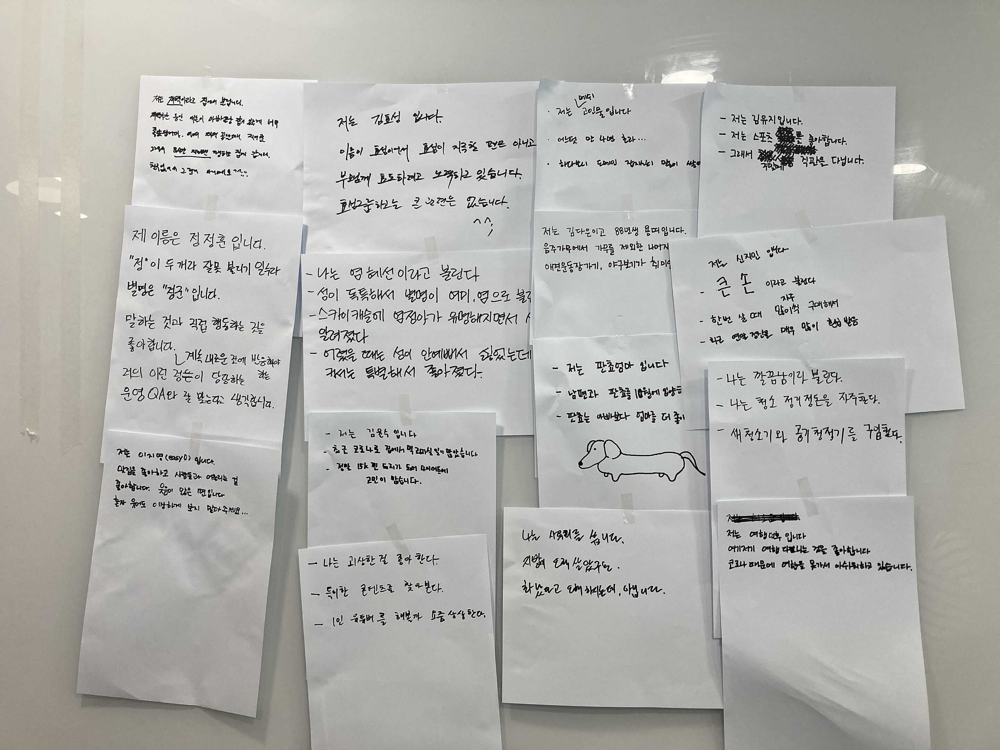
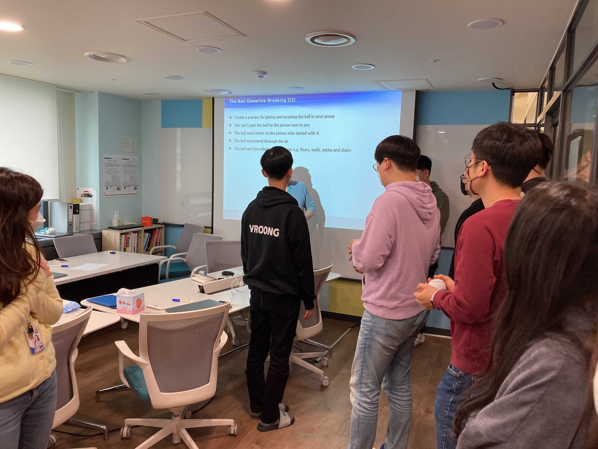
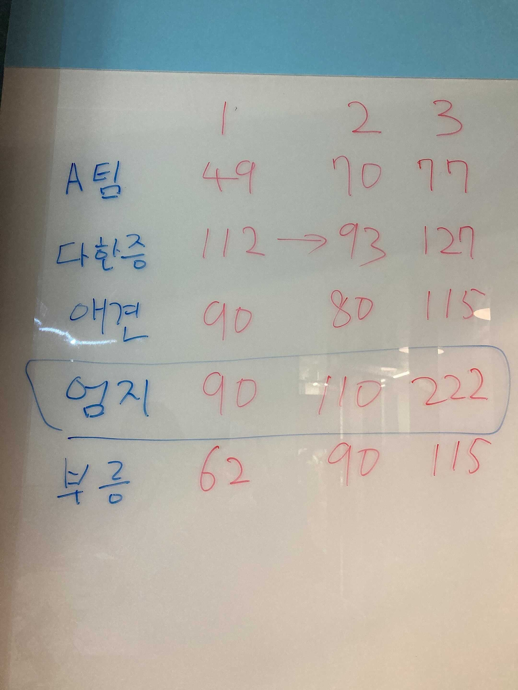
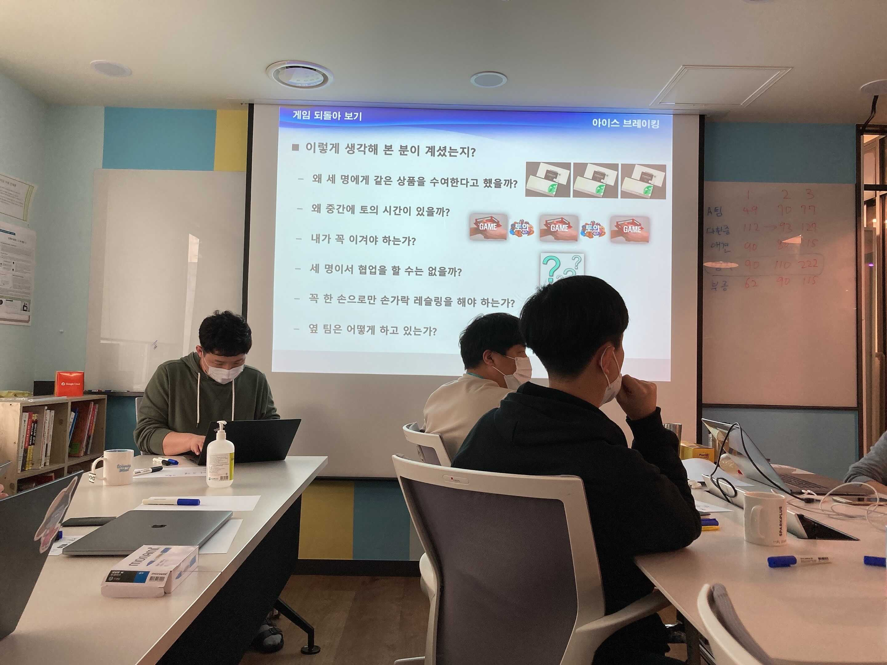
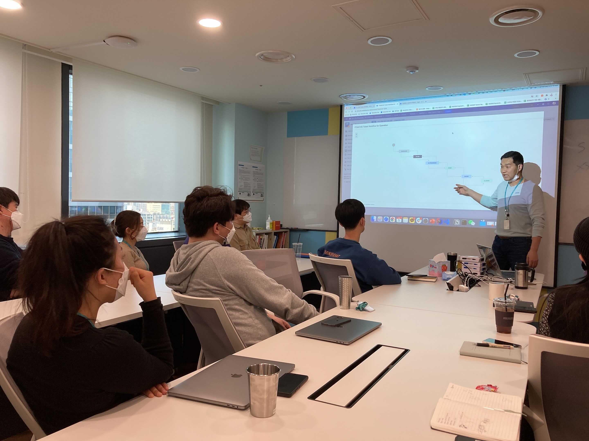
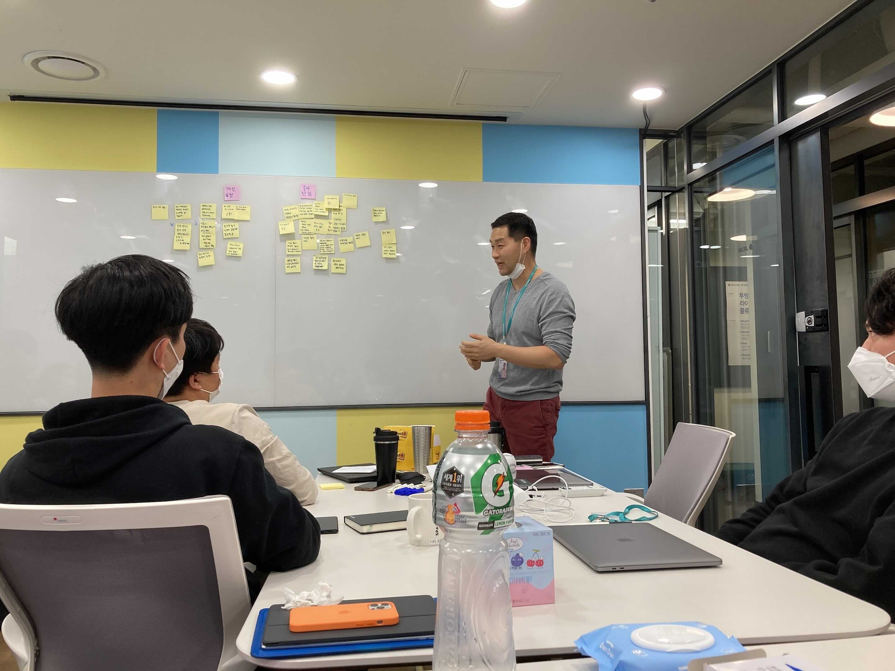

올해 3월 초, 서비스개발본부 구성원들을 대상으로 실제 사례 기반 Agile 도입 교육을 진행하였습니다!

최근 Agile이 조직 환경의 새로운 트렌드로 떠오르면서 여러 기업에서 Agile을 적용하고 있는데요. 메쉬코리아의 서비스개발본부는 그 이전부터 Agile을 도입하였고, 지금은 하나의 조직문화로 자리 잡고 있습니다!
또한 기존에는 Agile이 익숙하지 않으신 신규 입사자분들을 대상으로 Agile 교육을 진행했었는데요. 이번에 추가적으로 서비스개발본부 구성원을 대상으로 교육을 하게 되었습니다!

교육은 다양한 곳에서 Agile을 실천해오신 Engineering 실장님께서 진행해주셨는데요👏 교육 내용은 아래와 같습니다.

+ Agile이란 무엇인가?
  - Agile에 대하여
  - Scrum이란?

+ 실제 사례 및 경험 공유
  - 문제점
  - 해결 방법

+ 회고

## Ice breaking

본격적인 교육에 들어가기 전, **Ice breaking을 통해 Agile이 무엇인지 직접 경험**해보는 시간을 가졌습니다! Agile과 관련된 다양한 게임을 진행하며 구성원들끼리 아이디어를 공유하기도 하고, 실장님도 구성원들이 틀을 깨는 사고를 할 수 있게끔 지속적으로 옆에서 도와주셨는데요. 이런 방식으로 게임을 진행하면서 아래 사항들을 몸소 느낄 수 있었습니다.

- 개인이 아닌 팀으로 일한다.
- 서로 협동하면 이익이 극대화된다.
- 짧은 기간 동안 일하면서 중간에 토의하면, 일하는 방법을 개선할 수 있다.
- 고정관념에 얽매이는 것보다 상황에 따라 적응을 하는 것이 중요하다.

게임에서 Agile하게 협업하여 1등을 차지하게 된 엄지 팀! 1등 엄지 팀에겐 소정의 상품도 증정되었답니다🎁

그리고 게임뿐만 아니라 **Agile과 관련된 영상도 계속 보여주시면서 Agile에 대해 잘 모르시는 분들도 이에 대해 많이 이해할 수 있는 시간을 충분히 주셨습니다!**

## Agile 개론

Ice breaking 시간이 끝난 후, 본격적으로 Agile이 무엇인지 알아보는 시간을 가졌는데요.
Agile을 도입한 팀이 지켜야 할 **원칙**부터 **Agile과 [폭포수 모델](https://ko.wikipedia.org/wiki/%ED%8F%AD%ED%8F%AC%EC%88%98_%EB%AA%A8%EB%8D%B8 "폭포수 모델")과의 차이점**, Agile 방법론 중 하나인 **Scrum**이란 무엇인지, 그리고 **무엇이 Agile 실패를 불러일으키는지**에 관해서도 쉽고 자세하게 교육을 해주셨습니다.

Agile에 대한 전반적인 설명이 끝난 후에는 **실장님이 직접 경험하셨던 사례를 공유**해주셨습니다. 실장님은 그동안 약 40개의 Agile 프로젝트를 진행하셨는데요. 그중 결과가 좋지 않았던 프로젝트 사례도 함께 공유해주시면서 **무엇이 문제였는지, 이에 대한 해결방법은 무엇인지** 등 다양한 이야기들을 아낌없이 공유해주셨습니다! 실제 Agile 사례를 들을 수 있는 경험은 흔치 않은데, 이에 대해 재미있게 이야기해주셔서 귀에 쏙쏙 들어왔던 것 같습니다😊

정해진 시간 때문에 실장님의 사례 공유를 끝으로 아쉽게도 이번 교육을 마무리지어야 했는데요. 모든 교육이 끝난 후, 구성원들과 다 함께 이번 교육에 대해 회고하며 정리하는 시간을 가졌습니다.

## 좋았던 점들

- Ice Breaking Good👍 게임을 통해 Agile을 설명해주셔서 직접적으로 와닿았어요. 특히 ‘틀에 갇히지 말자’라는 메시지가 확실하게 전달되었어요.
- 적극적인 참여를 유도하는 방식 덕분에 다양한 생각을 공유할 수 있어서 좋았어요!
- 주니어도 이해하기 쉽게 설명해주셨어요 :)
- 실제 사례를 통해 설명해주셔서 이해하기 쉬웠어요.

## 보완해야 할 점들

- Agile을 도입했을 때 실제 경영 성과로 이어졌는지 궁금했어요. 추후에 교육하실 때 해당 사항에 대해서도 알려주시면 좋겠어요!
- 더 다양한 사례를 듣고 싶어요.
- 문제점에 대해 서로 더 논의할 수 있으면 좋을 것 같아요!

이렇게 다양한 의견을 들으며 서비스개발본부 구성원들을 위한 Agile 교육은 마무리되었습니다. 바쁜 업무 중에도 좋은 교육 준비해주신 실장님과 Agile에 많은 관심을 가지고 교육에 참여해주신 구성원들 덕분에 교육을 잘 마칠 수 있었습니다! **메쉬코리아 서비스개발본부는 좋은 조직문화를 수립하기 위해 항상 고민**하고 있습니다. 앞으로도 **건강하고 성숙한 메쉬코리아의 Agile 문화를 위해 끊임없이 노력하는 메쉬코리아가 되겠습니다** 😄

👉 [메쉬코리아(부릉) 합류하기](https://www.notion.so/VROONG-5c5458e75f9142f8b37272d7d146dffc "메쉬코리아 합류하기")
