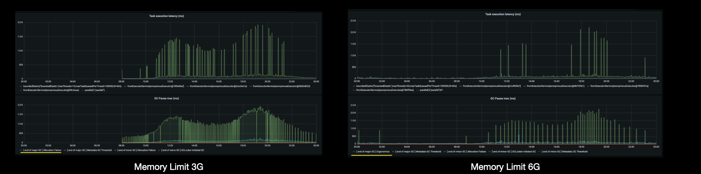
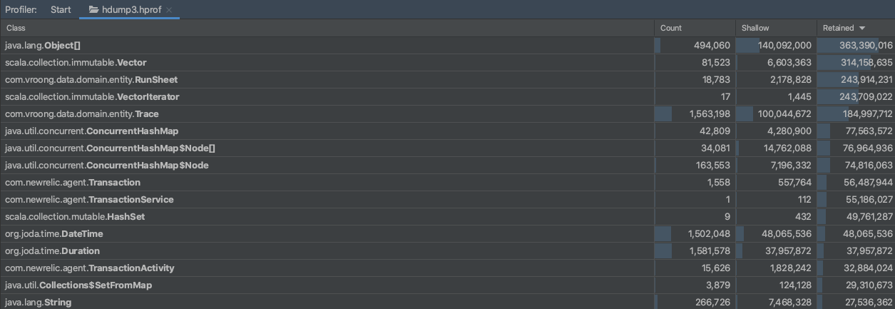

안녕하세요, 플랫폼실 김창규입니다. 🙂

지난 1부에서는 AWS서비스들을 이용하여 구축된 모바일 기기 데이터 수집서버가 가진 문제점을 분석하고, Spring WebFlux로 새롭게 개발하여, 비용절감과 성능향상의 효과를 거둔 이야기를 나눠 보았는데요.

개선한 애플리케이션의 배포 이후 며칠 간 응답시간을 확인 해 보니, 전체의 1% 미만의 요청이 1초 이상으로 기록되고 있었고, 특정 API가 아닌 모든 API에서 종종 발생하고 있었습니다. 영향을 받은 API 중에는 HealthCheck API도 있어,  이로 인해 서버 중 한 대가 Pod health check에 실패해 재시작되는 상황이었지요.


전체 API에 대해 response time histogram


API 응답시간이 100ms 가 초과하는 요청의 Histogram

특정 API 가 아닌 모든 API에 영향을 미친다는것은, 특정 로직이 시스템 전반적으로 영향을 미친다는 뜻이었고, 이 원인을 찾기 위해 Deep Dive  보았습니다.

이번 2부 에서는 이러한 API 성능개선을 위해 **AWS Java SDK 의 ClientSide Metrics**을 활용,  **Firehose 성능 개선**을 위한 재설계, **Spring WebFlux**를 이용한 개발 시 주의점을 다뤄 보겠습니다. 그 전에, 1부 내용을 다시 보고 싶으시면 아래 링크를 클릭하세요! 😉

 📍 [1부 다시 보기] ☞ [[클릭]](https://mesh.dev/20210419-dev-notes-005-mobile-data-collector-01/)

# Thread Pool Limit 증가

먼저 WebFlux를 구동시키는 Reactor의 지표를 확인하기 위해 [Micrometer에 Reactor Scheduler 메트릭을 활성화](https://github.com/reactor/reactor-core/blob/master/docs/asciidoc/metrics.adoc)하였습니다. Prometheus로 메트릭을 수집하고 Grafana를 통해 Dashboard를 구성하였는데요.


Server Reactor Executor Monitoring

먼저 Dashboard에서 눈에 띄는 점은 다음과 같았습니다.

- Threads per scheduler 그래프에서 Bounded Elastic용 Thread가 10개 이상 늘어나지 못해 평평한 그래프를 그리고 있음
- Task Execution Latency 가 1초 이상 Spike를 기록하고 있음

이에 Thread Pool이 모자라 API 응답 지연이 되었을 것이라는 가설을 세우고, 먼저 ThreadPool이 10개 이상으로 늘어나지 않은 원인을 조사해 보았습니다.

```java
/**
   * Default maximum size for the global {@link #boundedElastic()} {@link Scheduler}, initialized
   * by system property {@code reactor.schedulers.defaultBoundedElasticSize} and falls back to 10 x number
   * of processors available to the runtime on init.
   *
   * @see Runtime#availableProcessors()
   * @see #boundedElastic()
   */
  public static final int DEFAULT_BOUNDED_ELASTIC_SIZE =
      Optional.ofNullable(System.getProperty("reactor.schedulers.defaultBoundedElasticSize"))
          .map(Integer::parseInt)
          .orElseGet(() -> 10 * Runtime.getRuntime().availableProcessors());
```

BoundedElastic Scheduler에서는 최대 Thread 갯수를 설정 혹은 기본값으로 정하는데, 이때 기본값으로 Available Processor의 수 * 10 으로 기본값이 세팅되는데요. **저희 사례의 경우 별도의 Size를 지정 하지 않았기 때문에 기본값으로 자동 설정, 최대 10개로 제한이 되었던 것**이었습니다.

그렇다면 Available Processor가 1이었다는 말인데, 구동환경은 8 Core 쿠버네티스 노드였거든요. 도대체 어떻게 된 것일까요? 🤔

```yaml
...
resource:
  request:
    cpu: 300m
    memory: 1Gi
  limit:
    memory: 2Gi
...
```

먼저 Pod에 설정된 Resource 할당에 CPU 정보를 보면 request에 0.3Core이고 limit은 설정하지 않아 Burstable로 설정하였습니다. 하지만 JVM에서 Container Support가 활성화되면 Pod의 Limit을 기준으로 Available Processor가 설정이 되는데, 만약 limit이 설정이 되어 있지 않아 Burstable로 설정이 되었다면 request의 CPU를 Available Processor로 사용하는 것으로 확인하였습니다.

request는 0.3 Core로 설정이 되어 있고 Available Processor는 integer이어야 하기 때문에, 올림하여 1로 설정된 것을 찾을 수 있었습니다. 이에 그래프 상으로 보여졌던 Thread 부족을 방지하기 위하여 Limit CPU를 명시적으로 3으로 설정해보았는데요!

```yaml
...
resource:
  request:
    cpu: 1
    memory: 1Gi
  limit:
    cpu: 3
    memory: 2Gi
...
```

적용하고 서버 배포 후 피크시간을 모니터링 한 결과는 어땠을까요?


설정 변경 전 후 Reactor Executor Monitoring (좌측 2개의 피크는 적용 전 오른쪽 피크가 적용 후)

- ThreadPool은 최대 30개 까지 사용 할 수 있고, 비교적 여유가 있는 것으로 보임
- 전체적인 Latency는 감소하였음
- 단, 해결되리라 예상했던 Task Execution Latency 는 여전히 Spike를 기록하고 있음

위 사례를 통해 다음과 같이 결론을 정리해볼 수 있었습니다.

👉 Thread 부족이 Task Latency를 발생시키는 주요 원인은 아니다.

👉 하지만 전체적인 처리 지연을 발생시키고 있어, ThreadPool수를 늘려 전체적인 지연을 감소시켰다.


# JVM 메모리 증설

이어서 APM으로 메모리와 GC를 확인해보았는데요. Pod Memory가 Limit에 근접하게 가득 찼고, Mark & Sweep 이 지속적으로 발생하고 있어, 아래와 같은 가설을 설정해 보았습니다.

- 가설 : 메모리 부족에 의해서 GC가 발생 →  이러한 GC가 Reactor Scheduler에 영향을 주었을 것


NewRelic으로 측정한 JVM Metric


Pod의 CPU/Memory Metric

Memory 부족이 성능에 영향을 미쳤을 가능성을 배제하기 위해 Pod의 memory request/limit 을 기존 1Gi / 3Gi 에서 **3Gi/6Gi 로 3배 증가** 시켰습니다. JVM 은 Container Support 의 MaxRAMPercentage 옵션이 80%로 지정이 되어 있기 때문에 Pod의 Memory에 비례하여 HeapMemory도 자연스럽게 메모리가 증설됩니다.

```bash
#!/bin/sh

exec java ${JAVA_OPTS} -Djava.security.egd=file:/dev/./urandom \
  -javaagent:/home/agenttrace/newrelic/newrelic.jar \
  -XX:MaxRAMPercentage=80.0 \
  -jar "${HOME}/app.jar" "$@"
```

Memory를 세 배로 늘린 뒤, 하루 동안 모니터링 해본 결과는 어땠을까요?


변경 이후 측정한 JVM Metric


변경이후 JVM Metric

메모리를 증설한 뒤 JVM Heap은 증설된 만큼 많은 메모리를 사용하였고, 반대로 Mark&Sweep GC가 소폭 줄어들었습니다.


적용 이후(중간이후) Reactor Executor Monitoring

다음으로 Scheduler를 모니터링 해 보니 큰 변화가 있었습니다. Spike가 여전히 일어나긴 하지만, 그 빈도가 눈에 띄게 줄었습니다.


환경에 따른 Scheduler Metric 비교

더 확실한 비교를 위해 이전 설정을 적용했던 날과 동일한 시간대를 각각 비교해 보았는데요, 메모리를 3배 늘린 이후  Spike 횟수가 확연히 줄어든 것이 보이시나요? 👀

이어서 메모리와 Task Execution Latency와 JVM GC 간 상관관계를 파악해 보았습니다.



메모리 증설 전후의 GC와 Task Latency비교

확인 해 본 결과 GC의 원인은 증설 전후로 다른 것을 확인할 수 있었는데요,

- 증설 이전 : Allocation Failure로 Major GC가 무수히 많이 발생
- 증설 이후 : 여전히 Major GC가 발생, 하지만 Ergonomics로 힙이 가득 찰 때 쯤 자동으로 GC가 발생 +  GC Pause가 줄어 든 만큼 Task Latency Spike 횟수도 눈에 띄게 감소함

# AWS Firehose 성능 분석 및 개선

개발환경에서 부하 테스트를 진행했을 때 초반에는 성능이 잘 나오지만, 3분 이상 지속적으로 부하를 주었을 때 Response Time이 비약적으로 상승하는 것을 발견하였습니다.


개발환경에 trace 에 장시간 부하를 주었을때 성능 그래프

해당 API는 Firehose와 Redis로 메시지를 보내는데, [Firehose의 Quota 제한]()에 따르면 초당 최대 요청이 1,000개로 제한이 됩니다. 상용 데이터 기준 최대 초당 500 건 수준이었기 때문에, 큰 문제가 없다고 생각하여 Client요청이 들어올 때마다 Firehose 요청을 보내도록 만들어 두었습니다.

하지만 앞에서 확인 Task execution latency 문제 등으로 요청이 밀려 순간적으로 1000TPS 가 넘을 수 있을것 같고, 이로 인해 Task Latency가 발생할수도 있다는 가설을 세우고 검증을 해보기로 하였습니다.

### 가설 검증

Firehose에서 제공하는 Monitoring에서는 성능 저하의 원인을 찾을 수 없어 [AWS Java SDK v2의 메트릭 수집 기능](https://docs.aws.amazon.com/sdk-for-java/v1/developer-guide/generating-sdk-metrics.html)으로 Client Side Metric을 수집하여 분석하기로 하였습니다.


PutRecord의 초당 요청수 (분당 요청 수를 60으로 나눔)

먼저 Put Record의 초당 요청수를 확인하니 잠시나마 1,000TPS를 기록하였으나, 성능 지표에 따라 처리량이 떨어진 것을 볼 수 있었습니다. Firehose 최대 TPS에 한참 못미치는 수준이네요.


실행 중인 동시 요청수와 최대 동시 요청 수, 대기 횟수

다음으로는 Concurrency를 체크했습니다. SDK의 default max concurrency는 50으로 세팅이 되어 있고, TPS가 떨어졌을 때 Pending Concurrency Acquire가 높게 기록이 되어 있었습니다. Max Concurrency에 막혀 요청을 보내지 못했어요. 한마디로 병목현상이 발생했다는 뜻인데요.


PutRecord Response Time

이어서 Call Response Time을 확인해보니 평균 60ms 수준에 최대 8,000ms 까지 소요되고 있었습니다. VPC Endpoint를 사용한 것은 아니나, 동일한 AWS 네트워크 내에서 진행 된 테스트였기 때문에 20ms 수준의 빠른 response time을 기대했거든요. 하지만 부하가 없을 때 빠른 20ms 수준으로 기록하던 Response time은, Quota와 상관 없이 부하가 증가 했을 때 Response time이 증가하고 있었습니다.

산술적으로 계산했을 때 최대 Concurrency가 50일 때 1,000TPS 가 나오려면, 50ms의 Resposne Time으로 한순간도 쉬지 않고 요청을 보내야 가능합니다. 부하가 증가했을 때 Firehose 자체 Response time이 50ms 이상으로 증가했기 때문에, 오히려 Firehose Quota에 미치지 못하는 성능을 기록하였습니다.

### 조치

Firehose의 PutRecord 대신 PutRecordBatch 를 이용하여, Web Transaction과 별도의 백그라운드에서 여러 Record를 모아 한 번에 발송하도록 어플리케이션을 수정하였습니다.

웹 핸들러는 요청이 들어오면 백그라운드의 Queue에 Record를 쌓고, 백그라운드 Job은 아래의 로직으로 Batch 요청을 실행하도록 수정하였습니다.

1. interval에 한번씩 Queue 를 체크한다. (default 100ms)
2. Queue에 1개이상의 1개 이상의 Record가 있으면 배치작업을 시작한다.
3. Queue에 들어있는 Records를 설정된 batch size만큼 (default 300개) 분리하여 n 개의 PutRecordBatchRequest를 생성한다.
4. n개의 BatchRequest를 실행한다.
5. 최대 maxConcurrency만큼 작업이 실행되며, concurrency < maxConcurrency 일 때 1~5의 과정을 반복한다.

Webflux에서 주기적인 Job을 실행 시키기 위해 Flux interval을 사용하여 간단히 구현하였습니다.

```kotlin
// 어플리케이션이 시작 될 때 job을 시작한다.
val job = Flux.interval(initialDelay, interval) // interval 마다 tick을 발생한다
              .onBackpressureDrop() // 이후의 파이프가 busy 인 경우, tick을 무시한다.
              .publishOn(scheduler)
              .filter { this.hasMessage() }
              .flatMap({ this.putRecordBatch() }, maxConcurrency)
job.subscribe()
```

### 결과


동일한 컴퓨팅 리소스로 부하 테스트 결과

지난 테스트에서 동접 50명으로 진행했을 때에도 Response Time에 따라 심각한 성능 저하를 보이던 API가 동접이 2배 이상으로 늘어났음에도 100ms 이내의 성능을 보였습니다. 초 당 처리량이 1,200~1,500을 기록하여 Firehose Quota Limit보다 높은 TPS를 기록하고 있었는데요!

지난번과 달리 테스트에서는 CPU Limit의 100%를 사용하였는데, 기존에 설정한 3 Core CPU Limit을 늘리면 더욱 높은 TPS를 처리 할 수 있을 것으로 예상됩니다.

# Reactor Scheduler 병목현상 분석


health check api에 실패하여 pod의 liveness probe가 실패하고 있다

Firehose를 Batch로 처리하도록 수정한 이후에도 Health Check에 종종 실패가 발생하였습니다. 하지만, Scheduler 지표를 보았을 때에는 Blocking되는게 없어서 상세 분석을 해보기로 하였습니다.

Reactor에서 생성하는 Scheduler는 여러 종류가 있고, 기본 제공되는 Singleton을 사용하거나 별도의 Scheduler를 생성하여 사용 할 수 있습니다. Schedulers 에서 생성되는 scheduler는 `Schedulers.enableMetrics()` 으로 Micrometer를 통해 메트릭을 활성화 할 수 있는데요. (위 Scheduler  관련 그래프들이 이 설정으로 측정되었습니다.)

http health check가 간헐적으로 timeout이 발생함에도 수집된 metric에서는 특이사항을 찾을 수 없었습니다. 그러나 여러 정보를 확인하는 과정에서 Thread Dump를 통해 `reactor-netty` 라는 Thread가 존재하고, 이 Thread에서 Reactor Task가 실행됨에도 metric에서는 확인할 수 없었다는 점을 발견했습니다.

```bash
$ cat threaddump.json | jq -c ".threads[].threadName" | sort

....

"aws-java-sdk-NettyEventLoop-1-5"
"boundedElastic-1463"
"boundedElastic-1475"
"boundedElastic-1477"
"boundedElastic-1479"
"boundedElastic-1480"
"boundedElastic-1481"
"boundedElastic-1482"
"boundedElastic-1484"
"boundedElastic-evictor-1"
"boundedElastic-evictor-2"
"boundedElastic-evictor-3"
"boundedElastic-evictor-4"
"boundedElastic-evictor-5"
"boundedElastic-evictor-6"
"boundedElastic-evictor-7"
"boundedElastic-evictor-8"
"idle-connection-reaper"
"lettuce-epollEventLoop-12-1"
"lettuce-epollEventLoop-13-1"
"lettuce-epollEventLoop-14-1"
"lettuce-eventExecutorLoop-3-1"
"lettuce-eventExecutorLoop-5-1"
"lettuce-eventExecutorLoop-7-1"
"lettuce-eventExecutorLoop-9-1"
"lettuce-timer-4-1"
"lettuce-timer-6-1"
"lettuce-timer-8-1"
"parallel-1"
"parallel-2"
"parallel-3"
**"reactor-http-epoll-1"
"reactor-http-epoll-2"
"reactor-http-epoll-3"
"reactor-http-epoll-4"**
"sdk-ScheduledExecutor-2-0"
...
```

 `Schedulers.enableMetrics()` 으로 활성화 할 수 있는 Scheduler는 Schedulers에서 생성된 객체에만 해당됩니다. 하지만 TCP를 열어 HTTP요청을 받아서 Reactor에 이벤트를 발생시켜주는 `reactor-netty` 는 Schedulers를 통해 생성된 객체가 아닌, 해당 패키지 내에서 존재하는 schedulers 구현체를 직접 생성하여 사용합니다. 따라서 `enableMetrics()` 으로 metric이 활성화 되지 않아 확인할 수 없었습니다.

위의 이유로`reactor-netty` 내 어떤 Task에서 지연이 발생하는지  확실하게 알 수 없어, 복잡한 작업을 하는 Service들을 모두 publishOn을 이용하여  bounded elastic scheduler 으로 작업을 이동시켰고 병목작업은 모두 bounded elastic 으로 옮겨 health check가 실패하지 않도록 의도하였습니다.

```kotlin
fun handleActionRecords(request: ServerRequest): Mono<ServerResponse> {
    return request.bodyToMono(String::class.java)
            .publishOn(Schedulers.boundedElastic())
            .flatMap {
                val result = AgentActionSerializeHelper.readFromString(it)
                legacyAPIService.recordAgentActionData(JavaConversions.seqAsJavaList(result))
            }
            .then(ServerResponse.ok().bodyValue(APIOkView()))
}
```

위와 같이 무거운 작업들을 모두 이전을 했으나, 여전히 서비스 피크시간대에 health check API가 timeout이 발생하였고, Liveness Probe가 실패하여 서버가 재시작되었습니다. 원인을 찾고자 로컬에서 health chec가 처리 될 때 어떤 Scheduler를 사용하는지 확인해 보았는데요.


분명히 publishOn / subscribeOn 을 사용하지 않았기 때문에 reactor-netty 에서 빠르게 처리가 되어야 할 health check API 가 boundedElastic Thread에서 작동 중인 것을 발견하였습니다. 다른  API들은 publishOn / subscribeOn을 쓰지 않았을 때  모두 reactor-netty가 나오는데 health check만 boundedElastic에서 작동하고 있었습니다.

```java
@Override
public Mono<WebSession> createWebSession() {

  // Opportunity to clean expired sessions
  Instant now = this.clock.instant();
  this.expiredSessionChecker.checkIfNecessary(now);

  return Mono.<WebSession>fromSupplier(() -> new InMemoryWebSession(now))
      .subscribeOn(Schedulers.boundedElastic());
}
```

boundedElastic이 어디서 사용하는 지 추적해 보았더니, Spring Security에서 기본값으로 활성화 된 InMemorySessionStore 에서 reactor를 boundedElastic으로 변경하여 그 이후의 pipeline에서도 모두 boundedElastic을 사용하게 된 것을 알 수 있었습니다.

```kotlin
@Bean
fun springSecurityWebFilterChain(http: ServerHttpSecurity, authFilter: ApiKeyAuthWebFilter): SecurityWebFilterChain {
    return http.csrf().disable()
            .addFilterBefore(authFilter, SecurityWebFiltersOrder.AUTHENTICATION)
            // ... 중략
            .and()
            .requestCache().disable() // Session 비활성화
            .build()
}
```

데이터 수집 서버의 특성상 요청 하나하나가 Stateless하기 때문에 필요없는 Session기능을 비활성화 하여, health check가 reactor-netty 쓰레드에서 시작되고, 끝날 수 있도록 수정하였습니다.

그런데 한 가지 의문이 있습니다. 모든 요청에 Session Store 의 로직을 실행할 텐데, 왜 다른 API 는boundedElastic에서 처리가 되지 않고  reactor-netty에서 실행되었을까요? 🤔

테스트를 위해 샘플코드를 작성하여 Thread를 비교해보니 답은 `bodyToMono` 에 있었습니다. reactor-netty에서 http를 받고, sessionStore에서 boundedElastic으로 변경한 것은 모든 API가 동일했습니다. 하지만, 다른 API들은 body를 비동기로 읽어오는 `bodyToMono` 를 실행하였고, 그로 인해 boundedElastic에서 다시 reactor-netty로 이동하여, body를 읽었던 것이었습니다. 위에서 확인했던 thread name은 body를 읽어 온 이후에 확인을 했기 때문에 다시 reactor-netty로 표시되었습니다.

```kotlin
fun handleRequestWithBody(request: ServerRequest): Mono<ServerResponse> {
    // boundedEastic에서 실행 됨
    return request.bodyToMono(String::class.java)
              .doOnNext { println(it) /* reactor-netty에서 실행 됨 */ }
              .then(ServerResponse.ok().build())
}

fun handleRequestWithoutBody(request: ServerRequest): Mono<ServerResponse> {
    // boundedEastic에서 실행 됨
    return ServerResponse.ok().build()
              .doOnNext { println(it) /* boundedEastic에서 실행 됨 */ }
}
```

# Computing Intensive API 분리


health check를 제외한 모든 로직을 boundedElastic Scheduler로 옮기고 나니, reactor-netty 스케쥴러에  숨어 있던  Blocking 증상이 나타났는데요. 특이한 점은 Latency가 2초에 딱 맞춰져 있다는 것이었습니다.

가장 먼저 의심스러웠던 Agent Action API를 훑어 보았는데요. 다른 API들은 단순 변환작업으로 직접 구현했지만, Agent Action API에서는 아주 복잡한 로직을 통해 지표를 계산하는 로직이 존재하는 터라 이를 다시 구현하는 것은 힘들다고 판단, 기존 Scala로 구현되어 있던 로직을 그대로 이식했었기 때문입니다. 그런데 이 Scala 코드를 다시 한 번 훑어보니, 정확히 2초 동안 Latency가 발생하는 원인을 찾을 수 있었어요.

```scala
protected def calculateMetrics(...): RunSheet = {
    val deadline = 2.0.seconds.fromNow // 2초동안 무한루프를 돌며 알고리즘을 실행한다.
    while (deadline.hasTimeLeft) {
      val candidate = calculateSomething(...)
      if (candidate.isBetterThan(currentBest)) currentBest = candidate
    }
    currentBest
  }
```

위의 로직은 2초 간 무한 루프를 돌면서 Random에 기반한 답을 찾고 더 좋은 답을 찾아 나가는 알고리즘인데요, 무한루프를 돌기 때문에 i/o wait이나 sleep상태가 대부분인 blocking task와 달리 running 상태로 CPU를 사용하는 셈입니다.



피크시간의 heap dump 분석

피크 시간에 Memory GC가 빈번히 발생할 때 Heap Dump를 만들어 분석해 보았습니다. Actions API에서 사용한 Scala의 Vector객체와 RunSheet 객체가 객체가 많은 메모리를 점유하고 있는 것이 보이시나요? Major GC가 빈번하게 발생하는 이유는 바로 이 때 생성된 클래스들이 많은 메모리를 점유해서인데요.

하위 호환성을 지키기 위해 이식한 Scala 로직이 CPU와 메모리 전부를 포함, 다른 API에도 영향을 미쳤습니다. 상용환경에서 전체 호출 수가 크지 않고, 비즈니스에 큰 영향을 미치지 않는 API라서 안일하게 적용했던 것이 큰 패인이었던 것이죠. 😥

### 해결

데이터 수집 서버는 Kubernetes의 Nginx Ingress로 트래픽이 들어오기 때문에, 서비스에 중요한 trace API의 안정성을 위해 당장 통제 할 수 없는 로직인 actions API를 격리하였습니다.

먼저 동일하지만, 이름만 다른 deployment와 service 를 구성하고 Nginx ingress로 actions API 만 새로운 격리 서비스를 호출 할 수 있도록 ingress를 설정합니다. actions API에서는 병목으로 인한 오류가 반복되겠지만, 비지니스적으로 중요한 다른 서비스 API에 영향을 미치지 않도록 할 수 있는 가장 쉽고 빠른 방법입니다.

```yaml
apiVersion: networking.k8s.io/v1beta1
kind: Ingress
metadata:
  annotations:
    nginx.ingress.kubernetes.io/rewrite-target: /data/agents/actions
  name: agenttrace-actions-alias
spec:
  rules:
    - host: test.vroong.com
      http:
        paths:
          - backend:
              serviceName: agenttrace-actions-alias
              servicePort: 80
            path: /test/data/agents/actions
---
apiVersion: networking.k8s.io/v1beta1
kind: Ingress
metadata:
  annotations:
    nginx.ingress.kubernetes.io/rewrite-target: /$1
  name: agenttrace
spec:
  rules:
    - host: test.vroong.com
      http:
        paths:
          - backend:
              serviceName: agenttrace
              servicePort: 80
            path: /test/(.*)
            pathType: ImplementationSpecific
```

위 설정처럼 두개의 Ingress를 설정하면 Nginx Ingress의 [path 우선순위](https://kubernetes.github.io/ingress-nginx/user-guide/ingress-path-matching/#path-priority)에 따라 Actions alias부터 우선 라우팅되고 이외의 요청은 기존 서비스로 라우팅됩니다.

### 결과


분리 전후 task execution latency와 gc pause 비교

분리 이후 모든 Task Execution Latency가 사라졌고, 동시에 Major GC pause도 거의 사라졌네요! (y축을 보면 단위가 달라진게 보이시죠?)


trace API의 response time histogram과 throughput 그래프

비즈니스에 중요한 API인 trace 의 응답속도도 개선이 되었습니다. 이전엔 action에 의해 response time이 2초 이상이 많이 기록이 되었으나, 분리 이후 50ms 이내로 안정적인 response time을 기록하였습니다.

# 마치며

성능을 개선하기 위해 찾아낸 원인과 해결방법을 다시 한번 정리하면, 다음과 같습니다.

- **(원인 1) Firehose의 성능저하**

✔ Firehose는 피크시간 PutRecord 요청이 많아졌을 때 응답시간이 길어지는 문제가 있어 API 성능에 악영향을 주었습니다. 이를 비동기로 여러 요청을 모아 PutRecordBatch 요청으로 변경하였고, Firehose의 응답시간에 상관 없이 안정적인 API 성능을 확보할 수 있었습니다.

- **(원인 2)** **레거시 코드에서 그대로 이식한 코드**

✔ 레거시 코드에는 알고리즘을 수행하는 코드가 있는데, 이 코드의 CPU점유로 인해 다른 API 응답시간이 길어진데다가 메모리 점유로 잦은 Major GC를 유발하였습니다. 해결을 위해 이 API 호출을 별도의 서버로 격리, 비즈니스에 큰 영향을 주는 API에 영향을 미치지 않도록 하였는데요. 당장은 하위 호환성을 위해 그대로 코드를 도입했지만, 추후 이 API 자체를 제거하는 방향을 검토하고 있습니다.


위의 원인을 파악하는 과정에서 여러 모니터링 도구를 사용하였는데요.

먼저, APM과 NginX AccessLog로 기본적인 API 의 응답속도, Throughput 등을 측정하였습니다. Webflux는 APM에서 제공하는 기본 설정으로는 어느 구간에서 병목현상이 발생하는지 파악이 어려워, 추가적인 메타데이터를 추가 하는 작업이 필요했습니다.

Scheduler와 JVM내부 메트릭을 확인하고자 Reactor에서 제공하는 Micrometer 메트릭을 활성화하였고, Prometheus로 메트릭을 추출하여 Grafana를 통해 모니터링했습니다. metric으로 Scheduler별로 Task처리량과 지연을 확인 할 수 있었고, JVM Metric으로 GC 종류와 사유를 상세히 확인 할 수 있었습니다.

처음에는 Scheduler 모니터링이 제대로 이뤄지지 않았지만, reactor-netty의 구동방식을 이해하고 모니터링이 필요한 task들은 별도의 boundedElastic 이 아니더라도 Schedulers에서 생성된 공용/전용 스케쥴러를 통해 모니터링을 진행하였고요.

추가 가설을 검증하고자 JVM Thread Dump와 Heap Dump를 활용, 상용환경에서 문제가 발생할 때의 상황을 들여다 볼 수 있었습니다.

이번 성능 개선 경험을 통해 내/외부 모니터링 시스템을 잘 구축해야 좋은 어플리케이션을 구축 할 수 있다는 점을 크게 느낄 수 있었습니다. 또한 AWS서비스라고 무한 신뢰하는 것보다, 모니터링을 구축하여 요구 성능을 발현하는지 실제 점검의 필요성도 체감했고요.

이상으로 성능 저하의 원인이 복합적이고 복잡하여 원인을 찾아 해결까지 많은 우여곡절을 겪었던 개발일기였습니다. 이 글이 많은 분들께 도움이 되길 바랍니다. 긴 글 읽어주셔서 감사합니다. 😀

