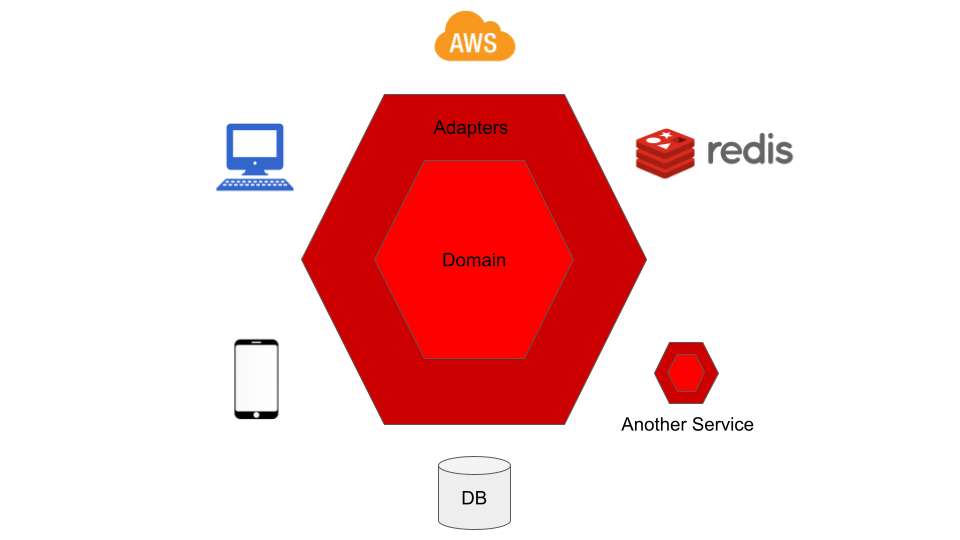
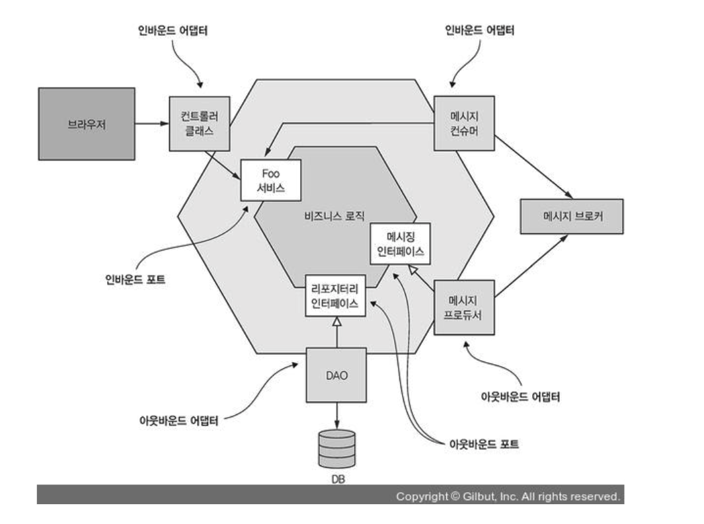
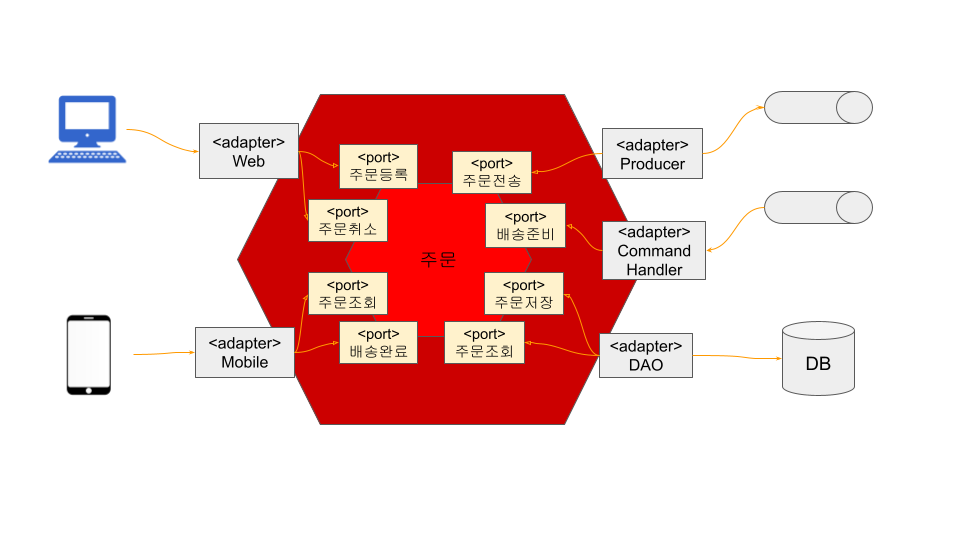

## 인사말
안녕하세요, 메쉬코리아 서비스개발본부에서 백엔드 개발을 하고 있는 이승호입니다. 👋 

이번 글에서는`헥사고날 아키텍처`란 주제를 통해, **메쉬코리아가 어떤 관점에서 아키텍쳐를 정의하고, 어떤 과정으로 개발하는지 공유**하고자 합니다!

- **아키텍쳐**(Architecture)**란?**
  - 비즈니스 요구 사항을 만족하는 시스템을 구축하기 위해서 구조를 정의한 것
  - 즉, 소프트웨어 응용 프로그램을 설계하기 위한 모델 또는 패턴을 의미


- **헥사고날 아키텍쳐**(Hexagonal Architecture)**란?**
  - 사전적 의미로는 ''육각형 건축물''을 뜻함
  - 레이어 간의 원하지 않는 종속성이나 비즈니스 로직으로 인한 사용자 인터페이스 코드의 오염과 같은 객체 지향 소프트웨어 설계의 알려진 구조적 함정을 피하기 위해 Alistair Cockburn에 의해 발명
  -  `포트 및 어댑터 아키텍처`라고도 불림



## 헥사고날 아키텍처의 장점
1. 아키텍처 확장이 용이합니다.
2. SOLID 원칙을 쉽게 적용할 수 있습니다.
3. 모듈 일부를 배포하는 게 용이합니다.
4. 테스트를 위해 모듈을 가짜로 바꿀 수 있으므로 테스트가 더 안정적이고 쉽습니다.
5. 더 큰 비즈니스적 가치를 갖고 더 오래 지속되는 도메인 모델에 큰 관심을 둡니다.

## 헥사고날 아키텍처의 구성

헥사고날 아키텍처는 `내부(도메인)`와 `외부(인프라)`로 구분됩니다.
- **내부 영역** - 순수한 비즈니스 로직을 표현하며 캡슐화된 영역이고 기능적 요구사항에 따라 먼저 설계
- **외부 영역** - 내부 영역에서 기술을 분리하여 구성한 영역이고 내부 영역 설계 이후 설계

### 포트와 어댑터
포트는 내부 비즈니스 영역을 외부 영역에 노출한 API이고 인바운드(Inbound)/아웃바운드(Outbound) 포트로 구분됩니다.
- **인바운드 포트** - 내부 영역 사용을 위해 노출된 API
- **아웃바운드 포트** - 내부 영역이 외부 영역을 사용하기 위한 API

어댑터는 외부 세계와 포트 간 교환을 조정하고 역시 인바운드(Inbound)/아웃바운드(Outbound) 어댑터로 구분됩니다.
- **인바운드 어댑터** - 외부 애플리케이션/서비스와 내부 비즈니스 영역(인바운드 포트) 간 데이터 교환을 조정
- **아웃바운드 어댑터** - 내부 비즈니스 영역(아웃바운드 포트)과 외부 애플리케이션/서비스 간 데이터 교환을 조정

결국 이 구조의 핵심은 비즈니스 로직이 표현 로직이나 데이터 접근 로직에 의존하지 않는 것입니다.

## 메쉬코리아의 헥사고날 아키텍처
이런 간단한 시나리오가 있다고 가정하겠습니다.

### 시나리오
1. 고객은 웹을 이용해 주문을 등록한다. (SUBMITTED)
2. 주문은 어떤(?) 처리 후 배송을 할 수 있는 상태로 변경된다. (READY)
3. 고객은 주문을 취소할 수 있다. (CANCELLED)
   단, 배송이 완료된 주문은 취소할 수 없다.
4. 기사는 배송준비 상태인 주문을 조회하고 배송한다. (COMPLETED)

먼저, 주문 도메인 모델을 살펴보겠습니다.
```java

@Getter
@Entity
@Table(name = "orders")
public class Order {

   @Id
   @GeneratedValue(strategy = GenerationType.IDENTITY)
   private Long id;

   @Type(type = "uuid-char")
   @Column(length = 45)
   private UUID orderId;

   @Convert(converter = OrderNumberConverter.class)
   @Column(name = "order_number")
   private OrderNumber orderNumber;

   @Enumerated(EnumType.STRING)
   private OrderStatus status;

   public void submit() {
      this.status = OrderStatus.SUBMITTED;
   }

   public void prepare() {
      this.status = OrderStatus.READY;
   }

   public void complete() {
      this.status = OrderStatus.COMPLETED;
   }

   public boolean cancel() {
      if (this.status != OrderStatus.COMPLETED) {
         this.status = OrderStatus.CANCELLED;
         return true;
      } else {
         return false;
      }
   }
}
```
간단하죠?

이제 내부 도메인 영역의 인바운드/아웃바운드 포트를 보겠습니다.  
```java
@Service
@RequiredArgsConstructor
public class OrderService {
   ...

   // DB를 위한 포트
   private final OrderRepository orderRepository;

   // 메세지 스트림 전송을 위한 포트
   private final MessageBroker messageBroker;

   @Transactional
   public OrderDto createOrder(CreateOrderRequestDto req) {
      Order order = createOrderRequestMapper.toEntity(req);
      order.submit();
      orderRepository.save(order);
      messageBroker.publish(order);
      return orderMapper.toDto(order);
   }

   @Transactional(readOnly = true)
   public OrderDto getOrder(UUID orderId) {
      Order order = orderRepository.findOneByOrderId(orderId);
      return orderMapper.toDto(order);
   }

   @Transactional(readOnly = true)
   public ListOrderResponseDto listOrders(Integer size, Integer page, OrderStatusDto orderStatus) {
      ...
   }

   @Transactional
   public void prepare(UUID orderId) {
      Order order = orderRepository.findOneByOrderId(orderId);
      order.prepare();
      orderRepository.save(order);
   }

   @Transactional
   public void complete(UUID orderId) {
      Order order = orderRepository.findOneByOrderId(orderId);
      order.complete();
      orderRepository.save(order);
   }

   @Transactional
   public void cancel(UUID orderId) {
      Order order = orderRepository.findOneByOrderId(orderId);
      if (order.cancel()) {
         orderRepository.save(order);
      }
   }
}
```
우선 OrderService는 구현체이지만 포트의 역할을 하고 있다고 볼 수 있는데요. Rest Controller 같은 어댑터에서 이 서비스를 호출하게 되지만 인터페이스로 정의하는 것은 오버엔지니어링일 수 있습니다. 
실제 구현된 코드는 좀 더 복잡하지만 이해하기 쉽게 보여드리기 위해 요약된 코드라고 봐주시면 되겠습니다. OrderRepository는 DB를 위한 포트이고 MessageBroker는 메세지 스트림 전송을 위한 포트입니다.

마지막으로 외부 영역의 어댑터를 함께 보시죠. 아래는 OpenAPIGenerate 도구로 생성된 RESTful API 어댑터 코드인데요.

```java
@Controller
@RequestMapping("${openapi.hexagonal.base-path:}")
public class OrderManagementApiController implements OrderManagementApi {

   private final OrderManagementApiDelegate delegate;

   public OrderManagementApiController(@org.springframework.beans.factory.annotation.Autowired(required = false) OrderManagementApiDelegate delegate) {
      this.delegate = Optional.ofNullable(delegate).orElse(new OrderManagementApiDelegate() {});
   }

   @Override
   public OrderManagementApiDelegate getDelegate() {
      return delegate;
   }
}
```
```java
public interface OrderManagementApiDelegate {

   default Optional<NativeWebRequest> getRequest() {
      return Optional.empty();
   }

   /**
    * POST /api/orders : 주문 등록
    * 주문을 등록 한다
    *
    * @param createOrderRequestDto  (optional)
    * @return Created (status code 201)
    *         or Bad Request (status code 400)
    *         or Not Found (status code 404)
    *         or Internal Server Error (status code 500)
    * @see OrderManagementApi#createOrder
    */
   default ResponseEntity<OrderDto> createOrder(CreateOrderRequestDto createOrderRequestDto) {
      getRequest().ifPresent(request -> {
         for (MediaType mediaType: MediaType.parseMediaTypes(request.getHeader("Accept"))) {
            if (mediaType.isCompatibleWith(MediaType.valueOf("application/json"))) {
               String exampleString = "{ \"orderNumber\" : \"orderNumber\", \"id\" : \"71f3764e-b4df-4a20-9194-1682beee0991\" }";
               ApiUtil.setExampleResponse(request, "application/json", exampleString);
               break;
            }
         }
      });
      return new ResponseEntity<>(HttpStatus.NOT_IMPLEMENTED);

   }
   ...

}
```
이 어댑터가 내부 포트와 인터페이스를 하게 됩니다.  

마지막으로 커맨드 핸들러 어댑터입니다. 주문을 배송 준비 상태로 변경할 수 있는 커맨드를 처리하게 됩니다.  
```java
@Service
@RequiredArgsConstructor
public class CommandHandler {

  private final OrderService orderService;

  public void execute(Command command) {
    orderService.prepare(command.getOrderId());
  }
  ...
}
```
이 외에도 이벤트 컨슈머, 로깅을 위한 Agent, AWS 관련 프로바이더 등 다양한 어댑터가 있을 수 있고 내부 포트와 인터페이스하게 됩니다.  

간략하게나마 설명드렸던 주문 도메인에 기반해 구현한 헥사고날 아키텍처입니다.  보시다시피, 의존의 방향이 중앙을 향하고 있으며 아키텍처 수준의 제어 역전 원칙(DIP)을 의미합니다.



## 마치며
이렇게 메쉬코리아에서 정의하는 헥사고날 아키텍쳐와 처리 과정에 대한 이야기를 마무리하겠습니다.

개인적으로 생각하기에 헥사고날 아키텍처는 어떠한 명확한 기준이 존재한다기보다는, 다소 추상적인 개념에 가깝다고 봅니다. 그럼에도 이번 콘텐츠는 인사이트를 가져갈 수 있는 좋은 정보라고 생각해요!

소프트웨어는 문제 해결을 위해 지속적인 확장과 변경을 필요로 하기에, 소프트웨어 개발자는 깔끔한 아키텍처와 설계가 무엇인지를 고민하고 장기적으로는 수익을 창출하는 시스템 마련을 위한 노력을 다해야할 것입니다. 

메쉬코리아 서비스개발본부 역시 분야와 영역을 막론하고, 우리에게 fit한 관점은 무엇이고 방식은 무엇인지 늘 고민하고 적용하며 더더욱 성장하도록 하겠습니다. 

마지막까지 이 글을 읽어주신 분들께 감사드립니다. 🙇‍♂️ 


