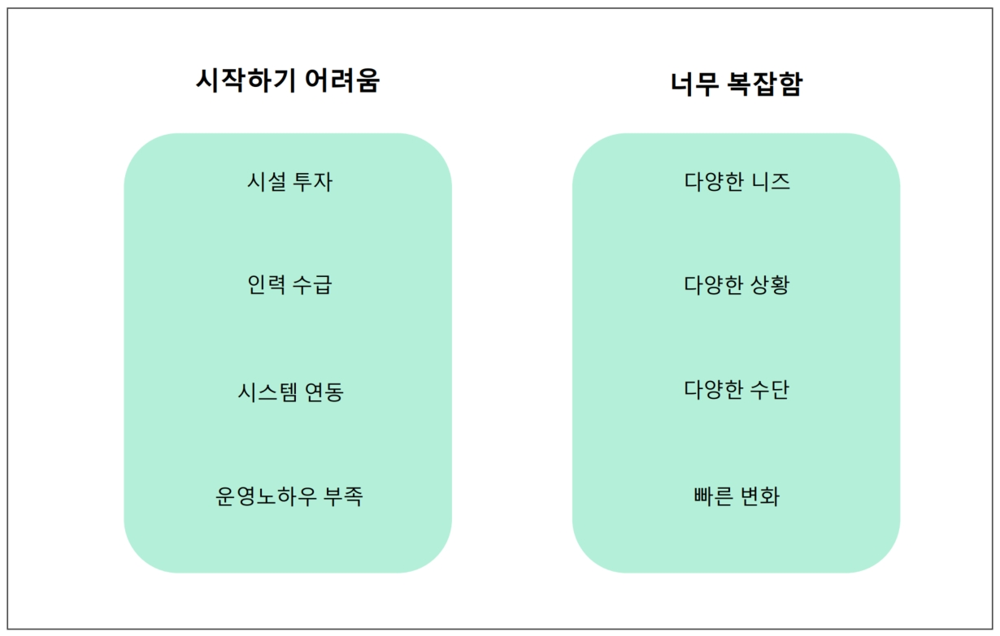
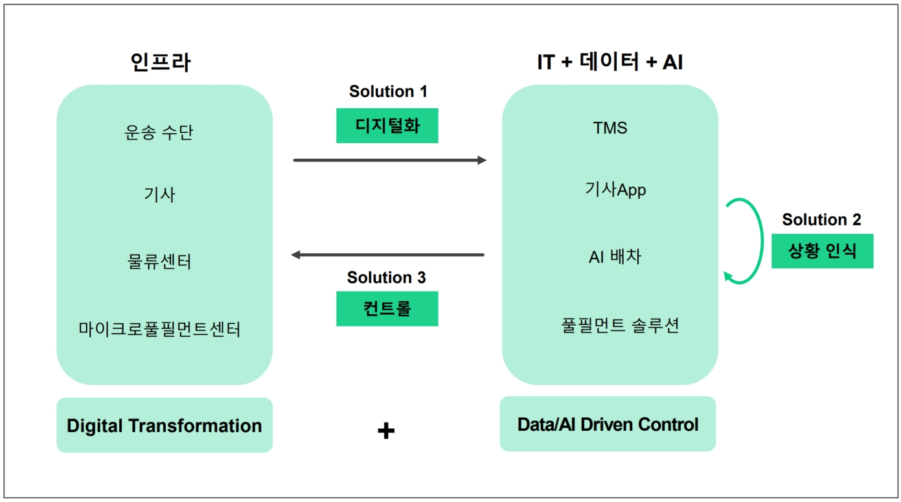
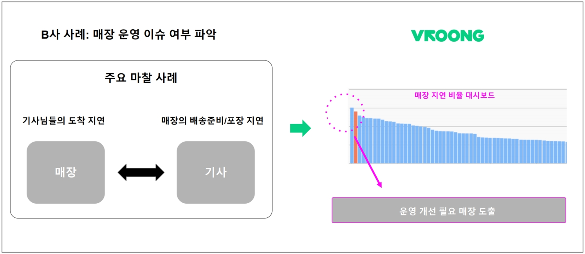
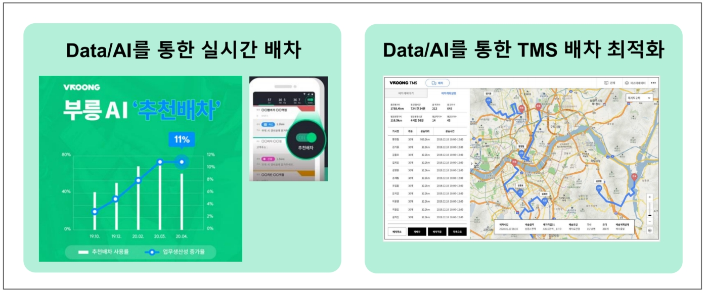

여러분은 ‘메쉬코리아’ 하면 무엇이 떠오르세요? ‘메쉬코리아’는 무슨 일을 하는 기업일까요?🤔

> 메쉬코리아 = VROONG = 배달대행 아닌가요?

대부분은 곧바로 VROONG을 떠올리시지만, 메쉬코리아가 실시간 배송 서비스를 많이 하고 있고 부릉 로고가 그려진 배달통이 많다 보니 배달 대행으로 인식하시곤 하는데요. 이 대답은  메쉬코리아의 극히 일부만 보여주는 것입니다!

위의 질문에 대한 답변을 드리기 위해, 이번 포스팅에서는 메쉬코리아가 무슨 일을 하는 기업이고, 고객들에게 어떤 가치를 제공하는지 소개하겠습니다. 👏

---

### **혁신 물류를 향한 장벽**

‘대량 생산’의 시대였던 20세기, 물류 산업에 있어 대량 유통 시스템의 구축은 무엇보다도 중요했습니다. 정기적인 노선과 표준화된 운영, 적절한 지리적 배치의 셋업이 핵심 요소였는데요. 21세기 이커머스의 등장 이후 물류 산업의 패러다임은 **소비자들에게 다양한 배송 서비스를 제공하여 고객 경험을 극대화하는 “혁신 물류”**로 바뀌었습니다.

하지만 이를 위해서는 시설과 인력을 위한 인프라 투자 등 수반되어야 할 진입 장벽이 높고, 자금이 해결된다 하더라도 시스템 연동이나 노하우 부족 등으로 혁신 물류를 구현하는 데에는 현실적 제약이 존재합니다. 물론 시스템을 갖춰 놓은 기업도 있겠지만, 데이터 관리나 연동에 많은 어려움을 겪는 등 변화의 속도를 따라가기 어려운 경우도 비일비재하지요.

그래서 VROONG은 이런 어려움을 겪고 있는 고객사들이 본연의 업무에 집중할 수 있도록, 다음과 같은 혁신 솔루션을 제공합니다.

---

### **VROONG의 혁신 솔루션 : Digital Transformation + Data/AI Driven Control**

* **Digital Transformation**

메쉬코리아는 이미 2륜과 4륜 등의 운송 수단, 라이더, 물류센터와 도심 내의 MFC의 인프라를 갖추고 있습니다. 여기에 더해, **이 인프라들의 운영을 모두 디지털화하여 데이터를 자동으로 연동**했는데요. 이는 생산자가  을 할 수 있게끔 돕고, 더 나아가 본사에서 파악하기 어려운 현장 이슈도 개선 할 수 있습니다. 실제로 메쉬코리아의 고객인 B사에서는 아래와 같이 매장과 기사님들 간 의견이 충돌한 사례가 있었는데요.

> 👨‍🍳 (점주) : 기사님들이 늦게 도착하셔서, 제품을 정성껏 만들어도 배송이 너무 늦어져요!
> 🛵 (기사님) : 저희가 일찍 가도, 바로 배송할 수 있게끔 제품이 준비 안 된 경우가 더 많아요!
> 🤦 (본사 담당자) : 대체 누구 말이 맞는거지? 왜 늦어지는거지?

본사 담당자는 매장에 항시 상주하지 않기에 누구의 말이 맞고 어떤 요소로 인해 배송이 늦어지는지를 파악하는데 한계가 존재합니다. 일종의 사각지대인 셈이죠. 

하지만 **Digital Transformation과 데이터를 통한 상황 인식을 통해 본사에서 파악하기 어려운 현장 이슈를 객관적으로 파악, 매장-기사님 간 오해를 줄이고 개선 방향을 쉽게 도출**할 수 있었습니다.

* **Data/AI Driven Control**

물류 과정에서는 다양한 데이터가 발생하게 되는데요. 이 방대한 양의 데이터를 그냥 쌓아놓기만 한다고 Data-Driven이라고 하긴 어렵습니다. 결국 **디지털화된 방대한 데이터의 패턴을 AI가 분석하고 학습해, 적절한 배차를 컨트롤하는 것이 핵심**인데요.

예를 들어 한 고객이 오후 6시 20분에 햄버거 세트를 주문했다고 가정해보겠습니다. 

대개 이 시간대는 퇴근 시간이라, 교통 상황이 좋지 않습니다.  물론 숙달된 프로 기사님의 경우는 스스로의 경험으로 도로 교통이 좋지 않을 것을 예상하고, 덜 막힌 길을 찾으실 수 있을 겁니다. 하지만 기사님들의 숙련도가 동일하지 않고, 처한 상황도 다르기 때문에 예측 가능한 변수를 줄일 수 있도록 Data/AI에 의한 컨트롤이 필요해요.

숙련된 기사님이 아니더라도 출퇴근 시간의 도로교통 상황을 AI가 학습해, 해당 시간대에 주문이 발생할 경우 교통 상황이 상대적으로 나은 곳으로 안내를 하는 것이죠.

위의 사례처럼 물류 과정에서 축적된 데이터를 기반으로 AI 배차와 TMS 시스템을 통한 운송 수단과 라이더를 적절하게 배치함으로서, 고객사 입장에서 생산성이 높아지는 효과를 거둘 수 있습니다.

---

### **고객의 완벽한 순간이 지속가능하도록**

VROONG 고객사들의 대부분은 제품 개발과 고객 만족이 핵심 가치이고, 물류는 그 가치를 전달하기 위한 수단입니다.

그렇기에 메쉬코리아는 **고객이 본연의 가치에 집중할 수 있도록 물류와 그와 관련된 종합 서비스를 제공하고, 고객의 완벽한 순간이 지속가능하도록 돕는 디지털 종합 물류기업(BPO)**입니다.

> **메쉬코리아 = 직접 만든 IT 솔루션을 활용해 직접 책임 배송하는 디지털 종합 물류기업**

더 나아가 VROONG은 수요 예측과 AI를 통해 재고 컨트롤이 가능한 풀필먼트와 MFC 서비스를 계획하고 있는데요. 이런 물류의 전 과정이 고도화가 되면, 언젠가 AI에 의해 자동으로 운영되는 정시배송의 시대도 머지 않아 도래하지 않을까요? 메쉬코리아는 바로 이런 물류 산업의 새로운 패러다임을 만드는 중심에 있겠습니다.

메쉬코리아가 만드는 혁신 물류에 대해 더 자세한 이야기가 궁금하시다면, 아래 영상을 참고해 주세요. 

감사합니다. 🙂

`youtube: [https://youtu.be/3gDn_0Dzc80?t=307](https://youtu.be/3gDn_0Dzc80?t=307)`

👉 [영상 바로가기](https://youtu.be/3gDn_0Dzc80?t=307)
