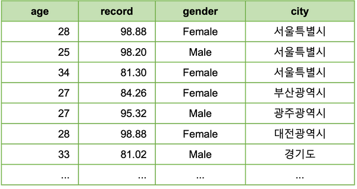
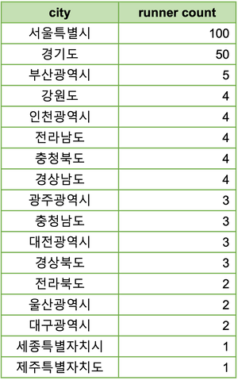
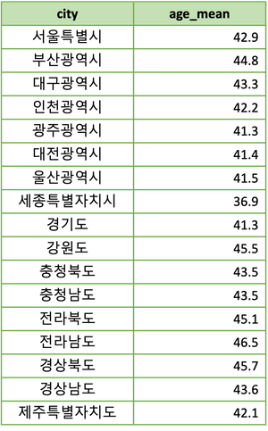
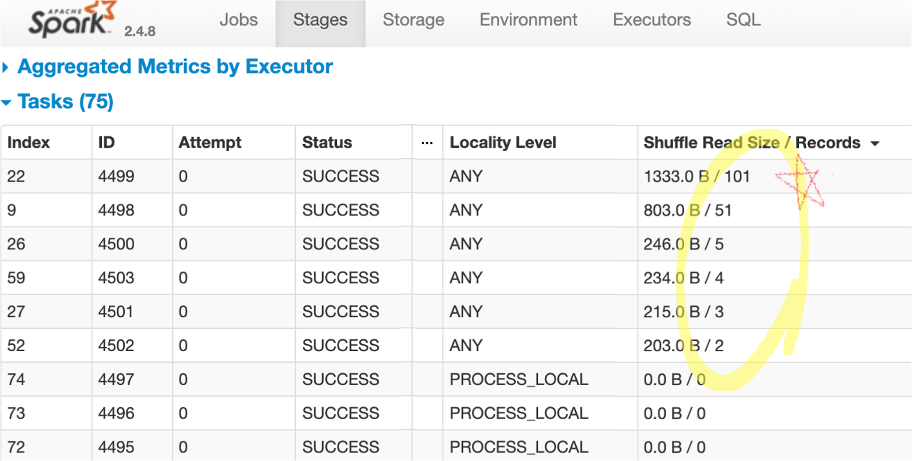
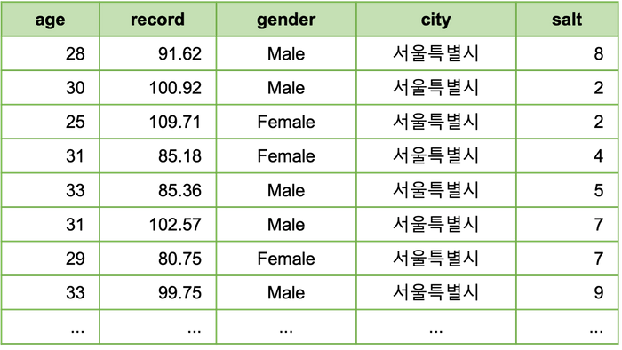
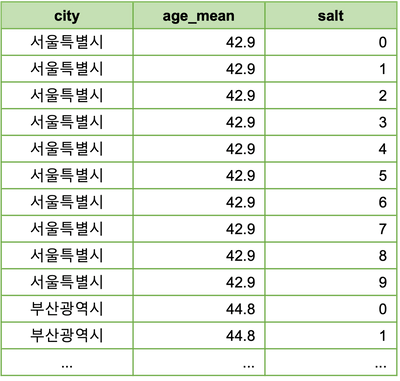
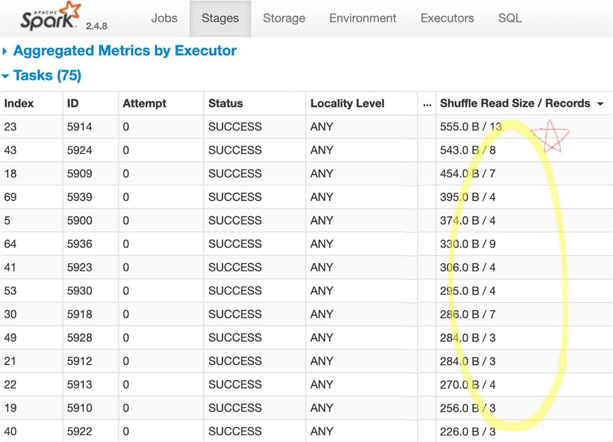
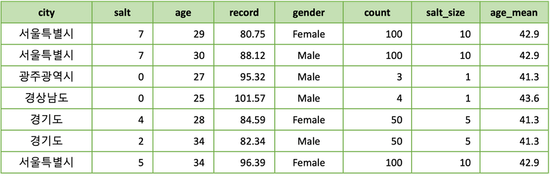

> 이 글에서는 salting 기법을 기본 버전, 심화 버전의 pyspark 코드로 보여드립니다.

데이터 엔지니어링 과정에서 두 개 이상의 데이터를 JOIN 할 때 특정 키(key)에 데이터가 집중되는 경우가
발생할 수 있습니다. 이런 것을 데이터 쏠림(skew)이라 합니다. 데이터 쏠림은 분산 처리의 효율을 떨어뜨리거나,
데이터 파이프라인 장애를 일으키는 주 원인중 하나로 알려져 있습니다.

Salting은 데이터 쏠림에 대한 대응책으로 자주 쓰이는 데이터 엔지니어링 기법입니다. salting이라는 용어는
말 그대로 소금뿌리기 정도로 이해하시면 좋습니다. 실제 구현을 보면 왜 그런지 이해가 가실 것입니다. 
이 글에서는 salting 기법을 기본 버전, 심화 버전의 pyspark 코드로 보여드립니다.
spark의 직관적인 API 덕분에 salting의 실제 구현 방식을 쉽게 확인하실 수 있으실 것입니다.
물론, salting 기법은 MapReduce에서도 동일한 방식으로 활용할 수 있습니다.

### 쏠림이 발생하는 데이터

서울에서 전국 달리기 대회를 개최했습니다. 총 190 여명의 선수가 참가했으며, 다음과 같은 선수 데이터가 만들어 졌습니다.



아무래도 서울에서 개최된 경기이다보니, 서울 근처에서 가장 많이들 참가하였습니다. 지역별 참가자 수는 다음과 같습니다.



모종의 데이터 분석을 위해, 여기에 각 지역의 평균 연령 데이터를 Join한다고 가정해 봅시다.



### 일반 Join

우선 salting 없이 그냥 JOIN하려면 다음과 같이 하면 됩니다. 

```python
joined_1 = runner.join(city, on='city', how='left')
```

코드에서 선수 데이터와 광역단체 데이터는, 각각 spark DataFrame `runner`와 `city`에 해당합니다.
이 코드는 대부분의 시스템에서 문제없이 돌아갈 것이나, 동작 과정을 분석해보면 데이터 쏠림으로 인해
대부분의 spark 파티션(partition)이 5개 이하의 데이터만 처리하는 동안에, 두 개 파티션이 대부분이 데이터를
처리하게 됩니다. spark UI를 통해 데이터 분산 처리 내역을 다음과 같이 확인할 수 있습니다.



이렇게 되는 이유는 선수들이 서울과 경기도에 몰려 있고 `city`를 key로 JOIN 할 경우 서울이나 경기도를
처리하는 JOIN 파티션에 이 데이터들이 전부 몰려가기 때문입니다.

현재 예로 사용중인 데이터는 작은 크기이기 때문에, 각 파티션이 동작하는 시간에는 거의 차이가 느껴지지 않습니다만,
데이터의 규모가 커지거나 각 데이터에 대한 계산 과정이 복잡해진다면, 이 정도의 쏠림은 충분히 문제가 됩니다.
데이터가 많이 모이는 파티션의 처리 시간은 전체 실행 시간의 bottleneck이 되며,
심하면 메모리 문제로 해당 파티션이 죽음으로써, 전체 앱이 실패할 수 도 있습니다.

### Salting Join - 기본 버전

이제 salting 기법을 이용해 데이터 쏠림을 완화해 보겠습니다. 우선 간단한 버전의 코드는 다음과 같습니다.

```python
salt_size = 10

runner_2 = runner.withColumn(
    "salt", (F.rand() * salt_size).cast(T.IntegerType())
)

@F.udf(T.ArrayType(T.IntegerType()))
def salt_array_udf(salt_size):
    return list(range(0, salt_size))

city_2 = city.withColumn(
    "salt", F.explode(salt_array_udf(F.lit(salt_size)))
)

joined_2 = runner_2.join(city_2, on=['city', 'salt'], how='left')
```

이 코드는 다음과 같은 일을 합니다.

1. 소금 크기(`salt_size`)라는 변수를 정의합니다.
2. `runner` 데이터에 소금(`salt`) 열(column)을 추가합니다. 이 열의 값은 0과 9사이의 랜덤 정수값입니다.
3. `city` 데이터에 소금(`salt`) 열을 추가합니다. 이 열의 값은 0에서 9까지 모든 정수 값입니다. 
  즉, 기존 데이터의 1개 행을 10개 행으로 복제하고, 각각 값이 0 ~ 9인 소금 열을 추가해 줍니다.
  이 과정에서 0 ~ 9값을 가지는 array 를 생성해주는 함수(`salt_array_udf`)를 활용합니다.
5. 소금(`salt`) 열이 추가된 두 개 데이터를 JOIN 하는데, key로는 `city`, `salt` 둘 다 사용합니다.

소금 열이 추가된 선수 데이터 `runner_2`는 다음과 같은 형태입니다.



소금 열이 추가된 지역데이터 `city_2` 는 다음과 같은 형태입니다. 각 행이 10개씩 복제되어 데이터 크기가 10배로 커졌습니다.



spark UI를 통해 JOIN 과정을 살펴보면, 데이터 쏠림이 상당히 완화된 것을 확인할 수 있습니다.



salting을 한마디로 말하면, 새로운 join key를 추가하여 데이터를 더 잘개 쪼개주는 것입니다.
그 새로운 join key가 소위 소금(`salt`)이며, 데이터를 얼마나 잘게 더 쪼갤지를 결정하는 것이
소금의 크기(`salt_size`)입니다.

salting은 마냥 좋기만 한 것은 아닙니다. 데이터가 쏠리는 파티션들이 줄어드는 대신,
한쪽의 데이터가 소금의 크기 만큼 복제되어야 하기 때문에, 그만큼의 네트워크 및 메모리 추가 소모를 일으킵니다.
이 때문에, `salt_size`를 적정한 수준으로 결정할 필요가 있습니다.

> salting을 한마디로 말하면, 새로운 join key를 추가하여 데이터를 더 잘개 쪼개주는 것입니다.

### Salting Join - 심화 버전

앞에서, 적절한 `salt_size`를 설정함으로서 salting은 꽤 효과적으로 동작할 수 있음을 앞에서 확인하였습니다만,
실무에서 이 적절한 소금 크기를 결정하는 것이 만만치 않은 경우도 있습니다.
예를 들어, 복제되어야 하는 쪽의 데이터가 매우 클 경우, 아무리 작은 `salt_size`라도 부담스러울 수 있습니다. 

이럴 때는 아예 `salt_size`를 데이터에 맞춰 동적으로 설정함으로써 데이터 복제 부하를 최소화 할 수도 있습니다.
이런 과정까지를 포함한 심화된 버전의 salting join 코드는 다음과 같습니다.

```python
aggregation_limit = 10

runner_count = runner.groupBy('city').count().filter(F.col('count') > aggregation_limit)

@F.udf(T.IntegerType())
def salt_size_udf(count):
    if count is None:
        return 1
    
    div = count // aggregation_limit
    rem = count % aggregation_limit

    if rem == 0:
        return div
    else:
        return div + 1

runner_3 = runner.join(
    F.broadcast(runner_count), on='city', how='left'
).withColumn(
    'salt_size', salt_size_udf('count')
).withColumn(
    "salt", (F.rand() * F.col('salt_size')).cast(T.IntegerType())
)

@F.udf(T.ArrayType(T.IntegerType()))
def salt_array_udf(salt_size):
    return list(range(0, salt_size))

city_3 = city.join(
    F.broadcast(runner_count), on='city', how='left'
).withColumn(
    'salt_size', salt_size_udf('count')
).withColumn(
    "salt", F.explode(salt_array_udf('salt_size'))
)

joined_3 = runner_3.join(city_3, on=['city', 'salt'], how='left')
```

이 코드는 다음과 같은 일을 합니다.

1. 하나의 JOIN key에 모여드는 데이터의 크기(`aggregation_limit`)를 정합니다. 
  여기서는 하나의 key 당 10명의 선수만 모여들게 하겠다는 의미가 됩니다.
2. 지역별 선수 숫자를 계산하여 `runner_count`에 담습니다.
3. 지역별 선수 숫자에 따른 소금 크기를 계산해주는 함수(`salt_size_udf`)를 정의합니다. 
  이 함수는 기본적으로 선수 숫자를 `aggregation_limit`로 나눕니다.
4. 선수 데이터에 지역별 선수 숫자 데이터(`runner_count`)를 join하고,
  그것을 이용해 각 선수별 소금 크기(`salt_size`)를 계산한 후, 
  그 소금 크기를 이용해 소금(`salt`) 열을 추가합니다.
5. 지역 데이터에 지역별 선수 숫자 데이터(`runner_count`)를 join하고,
   그것을 이용해 각 지역별 소금 크기(`salt_size`)를 계산한 후,
   그 소금 크기를 이용해 소금(`salt`) 열을 추가합니다.

최종 join 결과에서 각 지역마다 적절한 `salt_size` 가 사용된 것을 확인할 수 있습니다.



이 코드에서 두 가지만 추가로 언급하겠습니다.

첫번째로, `runner_count`를 생성하는 코드 뒤에 달린 `filter` 구문입니다.
이것은 지역별 선수 숫자 전체 데이터 에서 필요한 부분만 뽑아내서 크기를 줄임으로써,
뒤에 `runner_3`과 `city_3`에 join 될 때 broadcast join 방식이 가능하게 해 줍니다.
`salt_size_udf`는 널(null, None)일 경우 소금 크기를 최소(1)로 리턴하는 점을 이용한 것입니다.
그런데, 이런 방법을 일반적으로 아무 데이터에서나 사용할 수 있을까요?
이렇게 필터링한다고 항상 broadcast를 해도 될만큼 데이터가 작아질 수 있을까요?
답은 거의 대부분 그렇다 입니다. 쏠림이 발생하는 데이터는 대부분 그 분포가 파레토 법칙(Pareto Principle)을
따르기 때문입니다. 적절한 수준의 `aggregation_limit`가 주어질 경우,
key 카운팅 데이터는 원래 데이터 숫자 대비 로그스케일(Logscale)로 줄어들 수 있습니다.
개 수를 로그스케일로 줄여도 수백만이 되는 데이터는 현재 거의 없다고 봐도 무방합니다.

두번째로 언급할 것은 `runner_count`가 꼭 정확할 필요가 없다는 것입니다.
대략적인 패턴만 유지된다면, 과거 데이터를 기반으로 미리 계산해 놓은 것을 써도 별 문제가 안됩니다.
데이터 파이프라인 상에서 자주 실행되는 앱(application)의 경우,
카운팅 과정만 따로 떼어내서 그 빈도를 낮춰줌으로써, 추가적인 최적화가 가능합니다.

### 맺음말

이 글에서는 salting join 기법에 대해 살펴 보았습니다.
salting 기법은 데이터 쏠림이 발생하여 문제가 되는 상황을 해결하기 위한 기법으로, 기본적으로는
새로운 join key를 추가하여 데이터를 더 잘개 쪼개주는 것입니다. 이 새로운 join key를 소금(`salt`)이라고 부르며,
일정 법위의 정수 값 입니다. 이 값을 어떤식으로 뿌려줄 것인가에 따라 다양한 최적화가 가능합니다.
