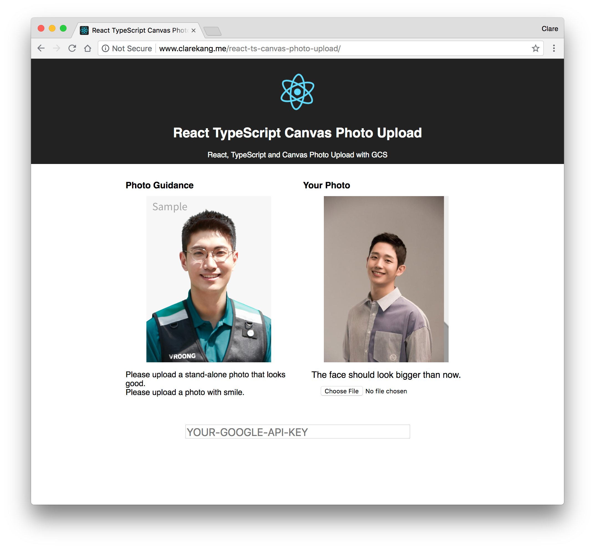

#### 들어가기에 앞서
인물사진을 등록하는 과제가 주어졌습니다. 여권 사진이나 증명사진처럼 어느 정도 여백이 있고 얼굴의 이목구비가 잘 드러나는 사진을 업로드해서 검증하는 과제입니다. 사진을 업로드하면 얼굴을 중심으로 이미지를 크롭하고 리사이징하며, 검사 조건을 충족하는지 확인합니다.

얼굴 인식의 검사 조건은 아래와 같습니다.
* 얼굴이 하나만 인식될 것
* 얼굴이 너무 작거나 너무 크지 않을 것
* 얼굴이 화면의 정중앙에 놓일 것
얼굴 인식 및 검사는 Google Cloud Vision API를 활용합니다. 이 기술을 적용해야 하는 회사 프로덕트는 React에 TypeScript가 적용되어 있기 때문에 예제도 해당 부분을 반영해서 작성합니다. 또한, PostCSS 대신 Styled-Components를 활용하므로 코드 내 이 부분이 반영되어 있을 수 있습니다.


## React-TypeScript 프로덕트에 HTML5 canvas와 Google Vision API를 활용한 인물사진 유효성 검사하기

### 1. Google Cloud Vision API 활용하기
Google Cloud Vision API를 활용해 얼굴 인식을 하려면 기본적으로 구글 콘솔을 통해 발급한 API 키가 필요합니다. 이 과정에 대해서는 따로 설명하지 않습니다. 아래 링크를 통해 Cloud Vision API 키를 발급받으세요.

> [Enable the Vision API](https://cloud.google.com/vision/docs/before-you-begin)

그 외 클라이언트에서는 따로 해줄 게 없습니다(처음엔 @google-api/vision 라이브러리의 설치가 필요한 줄 알아서 라이브러리를 설치했다가 호출에 실패하는 등의 시행착오를 거쳤습니다). API 호출은 fetch를 통해 이루어집니다. (물론 axios 같은 라이브러리를 활용해도 좋습니다)

또한, API 호출을 위한 데이터 모델은 [src/Photo.ts](https://github.com/ClareKang/react-ts-canvas-photo-upload/blob/master/src/Photo.ts)에 인터페이스를 따로 정의했으며, 인터페이스의 이름은 대부분 구글 API의 명세를 따랐습니다.

> 얼굴 인식에 관련된 구글 API의 명세는 아래와 같습니다.<br/>
[Detecting Faces | Cloud Vision API Documentation | Google Cloud](https://cloud.google.com/vision/docs/detecting-faces#vision-face-detection-gcs-protocol)

### 2. 사진 편집을 위해 HTML5의 canvas 도입
주어진 과제에는 사진 편집 기능이 들어갑니다. 얼굴을 화면의 중앙에 배치하며 지정된 배율로 잘라내고, 지정된 크기로 리사이징을 합니다. 이를 보다 쉽게 활용하기 위해 canvas를 도입했습니다. 대체로 canvas는 id를 부여하고 document.getElementById()를 통해 해당 element를 받아 처리하는 방식으로 사용하지만, React에서는 VirtualDOM을 활용한 렌더링을 하므로 위와 같은 사용 방식은 적절하지 않습니다. 다소 번거롭고 코드가 예쁘지 않지만 레퍼런스를 활용해 코드를 작성하게 되었습니다.

### 3. 진행 과정은 아래와 같습니다.
1. 지정된 파일 확장자만 업로드 가능한 파일 업로드 input 만들기
2. FileReader를 활용해 업로드한 이미지를 base64로 인코딩하기
3. 파일 업로드 시 Vision API를 통해 사진 검증받기
4. 검증 후 조건에 맞지 않는 오류가 있으면 오류 메시지 표시하기
5. 캔버스에 사진 크롭 및 리사이징해서 그려주기

#### 1. 지정된 파일 확장자만 업로드 가능한 파일 업로드 input 만들기
사실, 이 과정은 쉽습니다. HTML이 기본으로 제공하는 `<input type="file" />`을 활용하면 됩니다. App의 render에 input을 추가하고, file upload를 핸들 하는 함수를 App에 추가합니다.

````tsx
render() {
  return(
    ...
    <input
      type="file"
      name="photo"
      onChange={this.handleOnFileUpload}
      value={this.state.file.name}
      accept=".jpg,.png,.bmp,.jpeg"
    />
    );
  }

  ...

  private handleOnFileUpload = (e: React.ChangeEvent<HTMLInputElement>) => {
    if (
      e.target.files &&
      e.target.files.length > 0
    ) {
      this.setState({
        file: e.target.files[0]
      });
    }
  };
}
````
> input에는 `accept` attribute를 통해 지정된 파일 확장자만 업로드 가능하도록 합니다.

#### 2. FileReader를 활용해 업로드한 이미지를 base64로 인코딩하기
Vision API는 이미지 파일을 base64 인코딩 되어 받기를 원합니다. 그래서 우리는 방금 업로드한 이미지 파일을 base64로 인코딩하는 과정을 거쳐야 합니다. 이 과정은 FileReader를 통해 진행합니다.
handleOnFileUpload 함수에 FileReader와 관련된 내용을 추가합니다.

````ts
private handleOnFileUpload = (e: React.ChangeEvent<HTMLInputElement>) => {
  const reader = new FileReader();
  reader.onload = () => {
    const imageData = reader.result.split(",")[1];
  };
  reader.readAsDataURL(file);
};
````

reader가 onload 되면 여러가지 값을 가지게 되는데, 그중 `result` 값이 바로 base64로 인코딩된 값입니다. 다만 result에는 `data:image/png;base64`,와 같은 prefix가 붙기 때문에 이 부분을 제외하고 전달해야 합니다. 따라서 ","을 기준으로 split 한 다음 ","이후의 값만 전달하도록 합니다.

#### 3. 파일 업로드 시 Vision API를 통해 사진 검증받기
이제 fetch를 활용해 Vision API로 이미지를 데이터를 받아와 보겠습니다. API POST로 호출하기 때문에 Request body를 먼저 작성합니다. 구글 문서를 보며 body를 작성합니다. 우리는 얼굴 인식을 활용할 것이기 때문에 `features.type`는 "FACE_DETECTION"으로 작성합니다. 그리고 `image.content`에는 위에서 base64로 인코딩된 이미지 데이터를 넣어줍니다.

````ts
const body = {
  requests: [
    {
      image: {
        content: imageData,
      },
      features: [
        {
          type: "FACE_DETECTION",
        },
      ],
    },
  ],
};
````
그리고 fetch 또한 작성합니다.
아래 소스 코드의 "GOOGLE-CLOUD-VISION-KEY" 부분에 [1. Google Cloud Vision API 활용하기](#1-google-cloud-vision-api-활용하기)에서 발급받은 API 키를 입력합니다.

````ts
public uploadPhoto(body: AgentPhotoRequests): Promise<AgentPhotoResponses> {
  return fetch(
    `https://vision.googleapis.com/v1/images:annotate?key=${
      "GOOGLE-CLOUD-VISION-KEY"
    }`,
    {
      method: "POST",
      headers: new Headers({
        Accept: "application/json",
      }),
      body: JSON.stringify(body),
    },
  )
    .then(res => res.json())
    .catch(() => false);
}
````
이 소스코드를 실행해 보면 업로드된 사진을 분석한 데이터를 전달받게 됩니다. 절반쯤 왔군요. 이제부터는 수학과의 싸움입니다.

#### 4. 검증 후 조건에 맞지 않는 오류가 있으면 오류 메시지 표시하기
`getPhotoInfo`라는 함수를 작성해서 사진의 값을 분석하고 캔버스에 렌더링하도록 좌표를 계산해서 보내줄 겁니다. parameter로 Vision API의 response와 업로드한 이미지의 가로, 세로 값을 보내줍니다. 만약 검증 과정에서 오류가 있다면 오류 메시지만 리턴합니다.

* 먼저 얼굴이 하나만 인식되는지 확인해봅니다.
`response.responses.length` 가 0 혹은 1을 초과할 경우 오류 메시지를 표시합니다. 서로 오류 메시지가 다르므로 조건문을 분리해서 메시지를 보내도록 합니다.

````ts
private getPhotoInfo(data: AgentPhotoResponse, imgWidth: number, imgHeight: number) {
  // 얼굴이 인식되지 않은 경우
  if (data.responses.length === 0) {
    return { message: "얼굴이 인식되지 않습니다." };
  }
  // 얼굴이 두 개 이상 인식된 경우
  if (data.responses.length > 1) {
    return { message: "얼굴이 하나인 사진만 승인됩니다." };
  }
}
````

* 이제 얼굴 한 개의 좌표를 구합니다. 아마 최대값으로 보내줄 것이라고 예상하지만, 혹시 모르니 각 꼭짓점의 최대값을 구하도록 합니다. 이 값을 통해 우리는 얼굴이 사진에서 차지하는 너비 및 우리가 기대하는 이미지의 크기를 얻을 수 있습니다.

````ts
// 얼굴을 구성하는 각 꼭짓점의 최댓값 구하기
const faceDetection = data.responses[0].faceAnnotations[0];
let topBound: number = 0;
let bottomBound: number = 0;
let leftBound: number = 0;
let rightBound: number = 0;
faceDetection.fdBoundingPoly.vertices.forEach((vertice: Vertice) => {
  if (!topBound || vertice.y < topBound) {
    topBound = vertice.y;
  }
  if (!bottomBound || vertice.y > bottomBound) {
    bottomBound = vertice.y;
  }
  if (!leftBound || vertice.x < leftBound) {
    leftBound = vertice.x;
  }
  if (!rightBound || vertice.x > rightBound) {
    rightBound = vertice.x;
  }
});

const faceWidth = rightBound - leftBound;
const cropWidth = Math.round(faceWidth / {얼굴이 전체 사진에서 차지하는 비율} * 100);
const cropHeight = Math.round(cropWidth / {사진의 가로세로 비율});
````
* 얼굴이 전체 사진에서 차지하는 비율은 0-100사이로 입력합니다. 얼굴이 전체 사진에서 40%를 차지하도록 하고 싶다면 40으로 입력하면 됩니다.
* 사진의 가로 세로 비율은 (가로 / 세로) 값을 사용하면 됩니다. 만약 가로 300픽셀 세로 400픽셀의 결과값을 원한다면 0.75가 됩니다.
* `cropWidth`는 사진이 크롭 될 경우 기대하는 너비 값이 되고, `cropHeight`는 크롭 될 경우 기대하는 높이 값이 됩니다.
* 그리고 크롭 된 이미지의 가로가 최소로 기대하는 가로 값보다 작으면 오류 메시지를 리턴합니다. 만약 400픽셀 이상의 이미지를 원하는데 크롭 된 이미지가 300픽셀이라면 아래 메시지가 표시될 것입니다.
````ts
if (cropWidth < {최소로 기대하는 가로 값}) {
  return { message: "지금보다 얼굴이 크게 보여야 합니다." };
}
````
* 이제 크롭 된 이미지의 좌표를 계산합니다.
````ts
const top = Math.round(topBound - cropHeight * facePositionTop);
const bottom = top + cropHeight;
const horizontalCenter = leftBound + Math.round(faceWidth / 2);
const left = horizontalCenter - cropWidth / 2;
const right = left + cropWidth;
````
faceWidth의 중심 값인 `horizontalCenter`를 구합니다. 이를 바탕으로 `left`값과 `right`값을 구합니다.

* 마지막 검증 과정을 작성합니다. 얼굴 좌표가 캔버스를 벗어나게 되면 이 사진은 우리가 원하는 결과에 적합하지 않은 사진이 됩니다.

````ts
if (left < 0 || top < 0 || right > imgWidth || bottom > imgHeight) {
  return {
    info: {
      x: left,
      y: top,
      width: cropWidth,
      height: cropHeight,
    },
    message: "얼굴이 화면 정중앙에 놓여야 합니다.",
  };
}
````
* `imgWidth`, `imgHeight`는 각각 실제 업로드된 이미지의 가로와 세로에 해당합니다. 만약 실제 이미지를 초과한 값이 발생하면 이것 역시 결과에 적합하지 않은 이미지가 됩니다.

모든 검사 조건을 통과했다면, 이미지를 캔버스에 그릴 수 있도록 메시지와 함께 좌표값을 리턴합니다.

````ts
return {
  info: {
    x: left,
    y: top,
    width: cropWidth,
    height: cropHeight,
  },
  message: "사진이 등록되었습니다.",
};
````

#### 5. 캔버스에 사진 크롭 및 리사이징해서 그려주기
드디어 캔버스의 차례가 왔습니다. 다만, 캔버스에 사진을 렌더링 하는 과정은 통과 여부와 상관없이 진행됩니다. 왜냐하면 오류가 있는 것 또한 시각적으로 표시해줘야 하기 때문입니다.

* 일단 캔버스를 render에 추가해볼까요? canvas는 앞서 말했듯, 레퍼런스로 관리됩니다. 그렇게 작동하기 위해서는 아래와 같이 코드를 작성합니다. canvas 변수를 App 상단에 선언하고, render에 canvas element를 작성합니다. 그리고 마지막으로 this.canvas가 canvas element를 가리킬 수 있도록 refCanvas를 작성해줍니다. 그러면 앞으로 우리는 this.canvas를 통해 canvas element에 접근할 수 있게 됩니다.

````tsx
private canvas: HTMLCanvasElement;
...
public render() {
  return (
    ...
    <canvas
      ref={this.refCanvas}
      width={canvasWidth}
      height={canvasHeight}
    />
  );
}
...
private refCanvas = (canvas: HTMLCanvasElement) => {
  this.canvas = canvas;
};
````
* `canvasWidth`, `canvasHeight`는 사진을 렌더 할 캔버스의 크기를 나타냅니다.
* 위에서 `getPhotoInfo` 함수를 통해 가져온 값을 활용해 캔버스에 이미지를 렌더 합니다. 하지만 그전에 검증 과정에서 통과 못해 메시지만 보낸 경우가 있었으니 그것부터 처리를 해줍니다. 결과값을 result라는 파라미터로 전달합니다. 그리고 메시지가 있는지 확인하고 메시지가 있는 경우 setState를 통해 메시지를 state에 저장합니다. drawInCanvas 함수를 통해 캔버스에 사진을 그립니다. result 중 메시지는 캔버스 렌더링과 무관하므로 좌표값을 포함한 `result.info` 값만 넘겨줍니다.

````ts
if (!!result.message) {
  this.setState({
    message: result.message,
  });
}
this.drawInCanvas(result.info!);
````
대망의 캔버스 렌더링입니다. `getContext("2d")`를 사용해 캔버스의 컨텍스트를 가져갑니다. 만약 위의 result에서 메시지만 넘어오고 info(좌표값)가 넘어오지 않았을 경우 사진 이미지는 원본 그대로 렌더링하도록 합니다. result에서 좌표가 올바르게 넘어왔을 경우 사진을 좌표값에 맞게 렌더링 합니다.

````ts
private drawInCanvas = (photoInfo: PhotoInfo) => {
  const ctx = this.canvas.getContext("2d");
  if (!!ctx) {
    // 시작에 앞서 canvas에 렌더링 된 데이터를 삭제합니다.
    ctx.clearRect(0, 0, canvasWidth, canvasHeight);
    if (!!photoInfo) {
      const { x, y, width, height } = photoInfo;
      const ratio = canvasWidth / width;

      // 조건을 충족하지 못해 사진이 부족할 경우 오류를 시각적으로 표시하기 위해 오류 배경을 먼저 캔버스에 채웁니다.
      ctx.drawImage(this.errorBackground, 0, 0, canvasWidth, canvasHeight);

      // 그리고 만약 배경이 투명한 이미지를 올릴 경우 배경과 분리되어 보이지 않을 가능성이 있어 하얀색 사각형을 먼저 배경에 그려줍니다.
      ctx.fillStyle = "#fff";
      ctx.fillRect(
        x * -1 * ratio,
        y * -1 * ratio,
        this.img.width * ratio,
        this.img.height * ratio,
      );

      // 이제 업로드된 이미지를 캔버스에 렌더링 합니다.
      ctx.drawImage(
        this.img,
        x,
        y,
        width,
        height,
        0,
        0,
        Math.round(width * ratio),
        Math.round(height * ratio),
      );
    } else {
      // 좌표값이 없을 경우 (0, 0)부터 이미지를 렌더링 합니다.
      ctx.drawImage(this.img, 0, 0, this.img.width, this.img.height);
    }
  }
};
````

간단하게 끝날 줄 알았는데 생각보다 긴 과정이 되었네요. 이 예제를 통해 Vision API를 활용하는 법이나 React로 이루어진 프로덕트에 canvas를 활용할 수 있도록 도움이 되면 좋을 것 같습니다.

---



**이 예제의 DEMO 페이지가 있습니다.**<br/>
페이지 하단에 위치한 input에 구글에서 발급받은 API 키를 입력하고,
구글 콘솔을 통해 `www.clarekang.me` 도메인에서 접근할 수 있도록 허용해야 합니다.

[DEMO - React TypeScript Canvas Photo Upload](http://www.clarekang.me/react-ts-canvas-photo-upload/)

<small>이 예제에 활용된 소스코드는 Github에서 확인 가능합니다. (예제의 오류 메시지는 영문으로 표기되어있습니다.)<br/>
<https://github.com/ClareKang/react-ts-canvas-photo-upload>
</small>

