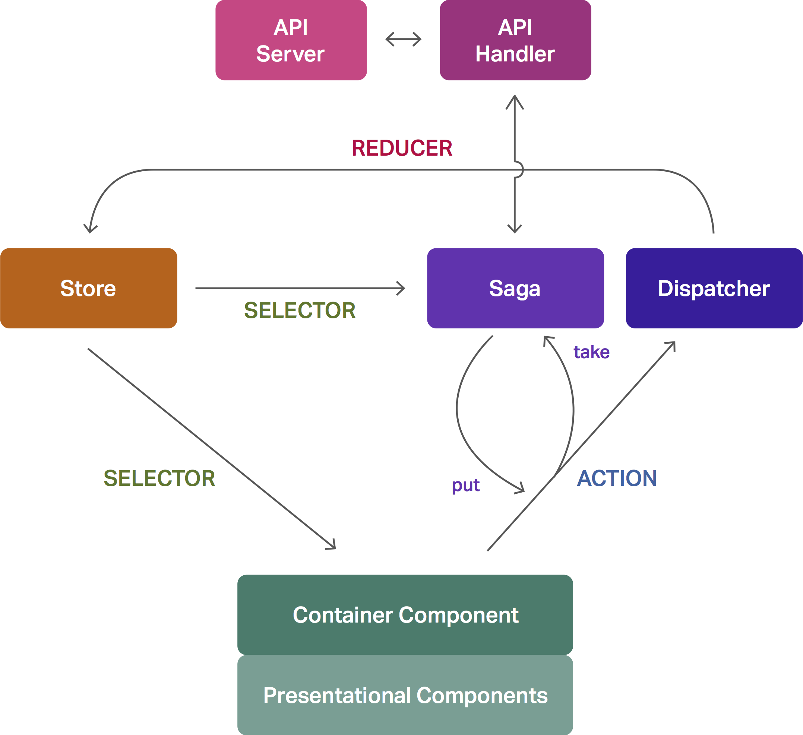

이 글의 내용은 메쉬코리아 x 레이니스트 기술교류 세미나에서 같은 주제로 발표되었습니다. 아래 영상에서 프레젠테이션과 함께 확인하실 수 있습니다.

<iframe width="560" height="315" src="https://www.youtube.com/embed/gvWbVkT_d7Q" frameborder="0" allowfullscreen></iframe>

필자는 최근 8개월간 VROONG TMS의 첫 번째 패키징을 제작하고 있었다. 이중 '매니저웹'이라 불리는 관리자 페이지는, 보통 어드민 페이지 치고는 복잡한 기능들이 많이 들어가있는 편이었다. 실시간 기사 위치 관제, 구간별 인센티브 설정, 엑셀로 오더 추가, 배차 결과 엑셀로 내보내기, 페이지별 권한 설정... 현장에서 요구하는 기능이 꽤 많았다. 기능들을 그때그때 추가하고, 복잡한 설정들을 저장하고 여러 페이지에서 참조해야 했다. React와 Redux가 없었다면 아마 꽤 힘들었을 것이다.

여기서 문제가 생긴다. 복잡한 기능이 많이 들어있고, 많은 페이지가 있는 SPA(Single Page Application)를 어떤 폴더 구조로 만들어야 할까? 정답은 없는 문제다. 여기서 필자는 우리가 어떤 구조로 SPA를 만들었으며, 어떤 이유로 이렇게 했는지 소개하고자 한다.

### TL; DR
* `app/` 폴더 안에 설정을 제외한 모든 것을 다 넣었다.
* 페이지 및 모듈은 `app/modules` 폴더에 넣고, 레이아웃 컴포넌트는 그 아래에 `components/` 폴더를 만들어 넣었다.
* 여러 페이지 및 모듈에서 공유되는 기능은 `app/` 폴더 바로 아래에 넣었다.

## 시작: react-boilerplate
우리는 [react-boilerplate](https://www.reactboilerplate.com)로 프로젝트를 시작했다. [create-react-app](https://github.com/facebookincubator/create-react-app)을 사용하지 않은 이유는, react-boilerplate가 제공하는 기술 스택이 매력적이었기 때문이다. React-boilerplate가 제공하는 기술 스택을 보자.

* React (당연히..)
* Redux
* Reselect
* Redux-saga
* ImmutableJS
* React-intl
* React-router

보일러플레이트 치고 너무 기술이 많은 것 아닌가 하는 비판을 제기할 수도 있다. 하지만 이건 그야말로 어드민 페이지 만들기 너무 좋은 기술 스택이다. 폴더 구조를 짜기 위해서는 저 라이브러리/프레임워크들이 어떤 기능을 하는지 알아야 할테니, 아주 짧게 소개해보도록 하겠다.

### React
자세한 설명은 생략한다.

### Redux + Reselect
하나의 Unified된 스토어를 이용해 flux 아키텍쳐를 구현해준다. [Flux](https://facebook.github.io/flux/) 아키텍쳐는 Action - Dispatcher - Store - View가 uni-direction으로 연결되는 구조다. View는 Action을 실행하고, Action은 Dispatcher에 전달되며, Dispatcher는 Store를 업데이트(Redux에서는 업데이트를 담당하는 파일을 'reducer'라고 부른다.)해주고, Store는 View에 데이터를 전달(Reselect는 이 부분을 selector로 만들어 사용한다.)한다.

### ImmutableJS
데이터를 가공해서 렌더링하는 것이 바로 컴포넌트가 할 일이다. 그런데 만약 `Array.prototype.sort` 함수 한 번에 스토어에 저장된 배열이 레퍼런스를 타고 수정된다면? 그야말로 uni-direction 구조를 정면으로 거스르는 문제가 아닐까? 이런 문제를 ImmutableJS는 훌륭하게 막아줄 수 있다.

~~당신이 그 불친절한 문서를 읽고 ImmutableJS를 마스터할 수 있다면 말이다.~~

### Redux-saga
우리가 사용하는 아키텍쳐의 꽃. 대충 소개하자면, React-saga는 라우터 레벨에서 추가시켜주는 미들웨어로, **액션이 일어나는 것을 감지**해 제너레이터 함수를 실행시킨다. reselect로 만든 셀렉터들을 가져올 수도 있고(`take`), 거꾸로 액션을 실행(`put`)시킬 수도 있다. 액션 감지를`throttle`할 수도 있다. 제너레이터를 사용하기 때문에, [co](https://www.npmjs.com/package/co)를 사용하는 것처럼 콜백 없이 비동기 함수들을 순차적으로 실행시킬 수 있다.

API를 부를 때 Redux-saga의 역할은 도드라진다. Flux 아키텍쳐는 액션이 실행되지 않으면 데이터의 변화 자체가 일어날 수 없다. 하지만 API 요청의 응답이 언제 도착할 지 누가 알겠는가? 도착한다면 누가 액션을 실행시켜줘야 한단 말인가? 원래라면 뷰가 이벤트를 통해 호출하는 것이 액션인데, API 응답에서 뷰가 끼어들 공간이 없다. 이럴 때, 액션을 실행시켜주는 것이 바로 saga의 역할이다. 이를 도식화하면 아래와 같다.



### React-intl
우리의 목표는 글로벌 대응이다. 한글을 컴포넌트에 박아넣으면 언제 다 수정할 것인가? 따라서 모든 텍스트는 다른 파일에 객체 형태로 넣을 필요가 있고, 그걸 로케일 설정에 따라 적절하게 렌더링해야 한다. 그 역할을 React-intl이 한다.

### React-router
프론트엔드 차원에서의 Browser History, Hash History 등을 담당한다. 우리는 4가 나오기 전에 프로젝트를 시작하는 바람에, 아직 3.0.0 버전을 사용하고 있다.

## 무슨 파일들이 폴더에 담기는가
자, 이정도면 js 파일들은 대강 정리가 된다. 하나의 기능은 다음 파일들을 만들어댈 것이다.

* 작은 단위로 쪼개진 기능별 React 컴포넌트들
* 페이지 레이아웃 React 컴포넌트
* `actions.js`: Redux 액션 (액션은 여러개 있을 거다.)
* `reducer.js`: Redux 리듀서 (리듀서는 하나다.)
* `selectors.js`: Reselect 셀렉터 (스토어에 저장되는 프로퍼티 개수만큼 셀렉터가 생긴다.)
* `sagas.js`: Redux-saga 사가(side effect가 필요한 수만큼 제너레이터가 생긴다.)
* `messages.js`: React-intl 메시지
* 액션과 셀렉터, 그리고 레이아웃 컴포넌트를 연결(`connect`)할 컨테이너 컴포넌트
* API 서비스 함수를 담을 파일
* 그 외, form validation 등의 기능들도 한자리씩 해먹을 거다.
* 여기에 테스트까지 들어갈 것이다.

자, 이렇게 엄청나게 많은 파일들이 만들어진다는 것은 알았다. 그렇다고 우리가 벽돌을 다시 발명할 필요는 없다. 이런 기술 스택을 위해 만들어진 보일러플레이트인데, 이들도 폴더 구조에 대해 고민을 많이 해보지 않았을까? 맞다. 기본적으로 react-boilerplate는 다음과 같은 폴더 구조를 제공한다.

* `app/`: 개발에 필요한 모든 파일들
	* `components/`
	* `containers/`
	* `tests/`
	* `translations/`
	* `utils/`
* `internals/`: plop 제너레이터, 웹팩 세팅, 테스팅 설정 등
* `server/`: hot-reload 서버

개발할 때 신경써야 할 코드는 `app` 폴더에, 제너레이터나 테스트 및 빌드에 사용되는 코드는 `internals`에 분리돼있다. `components`에는 presentational 컴포넌트들, 그리고 `containers`에는 redux에서 사용하는 파일들 및 container 컴포넌트가 들어간다. 여기까지는 나이스했다. 하지만 곧 문제가 생긴다. 꽤 많이.

1. 페이지 레이아웃 컴포넌트는 어디에 있어야 하는가?
	* 만약 `containers` 폴더에 있다면, 컴포넌트 파일들과 selector, reducer, saga 파일이 마구마구 섞이지 않는가?
	* 만약 `components` 폴더에 있다면, 한 기능을 위해 똑같은 이름의 폴더를 마구 만들어야 하나?
2. public asset은 어디서 관리해야 하는가?
	* 컨테이너에서?
	* 앱 전체에서?
3. API 핸들링 함수는 어디에 있어야 할까?
	* 이 친구들은 재활용 가능성이 높으니, 다른 폴더 안에 있는 게 맞지 않을까?

결국 우리는 2달간의 1차 개발을 마친 다음, 폴더 구조 리팩토링을 단행할 수밖에 없었다. **2주에 걸쳐.** ~~문제는 2차 개발 기간이 겨우 4주로 잡혀있었다는 것. 덕분에 우리는 개발 기간을 연기해야 했다.~~

## 문제 해결하기
다시 한 번 우리가 느꼈던 문제들을 정리해보자.

1. 페이지 레이아웃 컴포넌트
2. public asset
3. API 핸들링 함수

이제 이 문제들을 하나씩 해결해보자.

### 1. 페이지 레이아웃 컴포넌트
React-boilerplate는 레이아웃 컴포넌트를 `containers` 폴더 안에 넣으며, 이 파일들이 아주 난잡하게 섞인다. 우리는 이걸 잠시동안 `components` 폴더에 분리했었다. 이런 식으로.

* `App/`
	* `components/`
		* `SamplePage/`
	* `containers/`
		* `SamplePage/`

그리고 난리가 났다. 두 개의 폴더를 오가면서 작업하는 일은 결코 즐겁지 않았다. 게다가 `index.js`가 너무 많이 생겼다. 내가 지금 편집하는 `index.js`가 컴포넌트인지 컨테이너인지조차 알 수가 없었다.

<div class="image-wrapper"></div>
<p class="image-caption">컨테이너인지 컴포넌트인지가 궁금한데 마지막 폴더명만 알려주면 어떻게 하니...</p>

결과적으로, 우리는 기능별로 레이아웃 컴포넌트가 있어야 한다는 결론을 내렸다. `components/` 폴더는 여러 기능에서 재사용 가능한 기능 컴포먼트만 남기기로 했다. 그리고, 컨테이너 안에 컴포넌트 폴더를 두고 그 안에 컴포넌트를 추가했다. 그 결과 이런 구조가 나왔다.

* `app/`
	* `components/`
		* form 등 여러 기능에서 재사용 가능한 라이브러리성 컴포넌트
	* `containers/`
		* `SamplePage/`
			* `components/`
				* `SamplePage.js`: 레이아웃 컴포넌트. 이 폴더 내에서 자유롭게 분할 가능.
			* `index.js`: `connect`를 쓰는 컴포넌트
			* `actions.js`, ...

그리고 우리는 고민했다. 컨테이너란 무엇인가? Dan Abramov는 애당초 'smart component'와 'dumb component'라는 이름으로, 데이터를 처리하는 컴포넌트와 데이터를 받아 보여주기만 하는 컴포넌트를 분리하자고 제안했었다. 그 글을 쓴지 한참 후에 각각 'container component'와 'presentational component'라는 이름을 지어준 거다.

자, 그렇다면 `containers` 폴더에 들어가는 파일들은 정말 컴포넌트가 맞긴 한걸까? 아니다. redux에서 사용하는 파일들, react-intl 메시지, 그리고 redux-saga는 컴포넌트와 거리가 멀다. 그래서 우리는 이 폴더에 새로운 이름을 붙여주기로 했다. 고민 끝에, 우리는 그 새로운 이름을 `modules`로 정했다. 보통은 `pages`로 정의하는 경우가 많지만, 우리는 독립된 route를 사용하고 스토어를 따로 사용하는 모달들이 꽤 있었기 때문에. 그 페이지들을 위해 페이지가 아니라 모듈이라는 이름을 사용했다.

이렇게 만들고 보니, `index.js`가 컴포넌트이면 어색한 상황이 만들어졌다. 우리는 이를 바로잡기로 했다. 이렇게.

* `app/modules/`
	* `SamplePage`
		* `components/`
			* ...
		* `index.js`: 다른 모듈에서 사용할 셀렉터, 액션, 그리고 라우터에서 쓸 컨테이너를 `export`한다.
		* `container.js`: 컨테이너 컴포넌트
		* ...

이렇게 정리하고, 우리는 다음 eslint 규칙을 추가했다.

```javascript
"import/no-internal-modules": [
  2,
  {
    "allow": [
      "modules/*",
      "components/*",
      "models/*", // enums
      "services/*", // api
      "utils/*",
      "resources/*",
      "redux-saga/effects"
    ]
  }
],
```

이제 우리는 폴더 구조가, 파일명이 어떻게 바뀌든지간에 `index.js`에서 export만 잘 해주면 import에 문제가 없는 구조를 만드는 데 성공했다. 이 모듈에서 어떤 액션, 어떤 셀렉터가 export되는지 한 눈에 확인할 수 있게 된 점은 덤이다.

### 2. public asset
보통 웹개발에서 사용하는 애셋들은 생각보다 몇 없다. 이미지, 폰트, CSS 파일 등. 우리는 사실 레이아웃을 만드는 데 이 파일들을 **단 하나도 사용하지 않았다.** 진짜로. 폰트는 CDN에서, 아이콘은 전부 SVG로 제작해 컴포넌트화했고, CSS는 [styled-component](https://www.styled-components.com)를 사용했기 때문에 CSS 파일이 만들어질 일이 없었다.

그래도 우리는 유저가 편집할 샘플 XLSX 파일 등을 다운로드 형태로 제공할 필요가 있었다. 가끔 지도에서 마커 등을 위해 이미지를 써야 할 때도 있었다. 그럴 경우를 위해 다음과 같은 원칙을 세웠다.

* 한 기능과 밀접하게 연결돼, 뗄레야 뗄 수 없다: `app/modules/` 폴더에 `assets/` 폴더에 넣는다.
* 두 개 이상의 기능에 사용되는 파일이다: `app/assets/` 폴더에 넣는다.

여기까지 하고 나니, 이런 구조가 만들어진다.

* `app/`
	* `assets/`: 로고, 폰트 등 재사용 가능한 assets
	* `modules/`
		* `ModuleName`
		* ex) `WarehouseFormPage/`: 물류센터 수정 페이지
			* `assets/`
				* `index.js`: export용
				* `ZoneSample.xlsx`: 물류센터에 엑셀로 우편번호 권역 추가시 사용될 엑셀 파일 샘플
			* (각종 컴포넌트, redux 파일, 셀렉터, ...)
			* `validations.js`: Form validation 규칙
			* `processBatchFile.js`: 엑셀 -> js array 변환 함수
	* ...

### 3. API 핸들링 함수
여기까지 왔으면, 이번 문제는 앞서 했던 문제들에 비해 훨씬 간단한 문제라고 볼 수 있다. 이미 우리에게는 이런 원칙이 있다. **여러 모듈에서 사용하면 app/ 밑에, 한 모듈에서만 사용할 것이면 app/modules/*/ 밑에.** 이 원칙대로 하면 된다.

VROONG TMS API 서버는 akka로 작동하며, (비록 쿠키에 토큰을 넣긴 하지만) RESTful API에 가깝다. API 엔드포인트는 DB 모델별로 열려있을 것이므로, 우리는 API 엔드포인트가 페이지 모듈과 100% 일치할 리 없다는 것을 쉽게 추측할 수 있다. 결론적으로, 우리는 `services/` 폴더를 `app/` 폴더에 넣었고, 여기서 API와 WebSocket 바인딩을 추가했다.

이 원칙에 맞춰, 필요한 폴더를 몇 개 더 만들어 나온 최종 결과는 이렇다.

* `app/`
	* `assets/`: 이미지, 엑셀 등
	* `components/`: 공용 컴포넌트
	* `models/`: enum 코드와 스트링 매칭
	* `modules/`: 모듈
	* `routes/`: React-router가 너무 비대해져 객체 형태로 따로 라우터를 빼냄
	* `services/`: 서버 통신 wrapper
		* `api/`
		* `ws/`
	* `tests/`: 테스트
	* `translations/`: 다국어 번역본 json 모음
	* `utils/`: 유틸리티 함수

## 결론
React로 만들어진 SPA를 어떤 폴더 구조로 만들었나 소개하는 글은 정말 무수히 많았다. 이 글도 그 중 하나일 뿐이다. 일단 우리는 이 구조에 굉장히 만족하고 있다. 물론, 이것보다 더 나은 구조는 당연히 있을 수 있다. 조금 다른 스택을 쓴다면 다른 구조를 만들어야 할 것이다. (일례로, Next.js는 `pages` 폴더가 일종의 라우터 역할을 하기 때문에, 저 구조와 다른 구조가 강제된다.)

많은 사람들이 더 나은 구조, 그리고 다른 구조를 공유했으면 좋겠다. `create-react-app`이 만들어주는 허허벌판에서 사람들이 더이상 헤매지 않도록 말이다.
